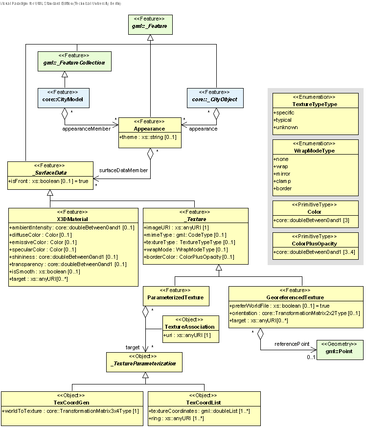
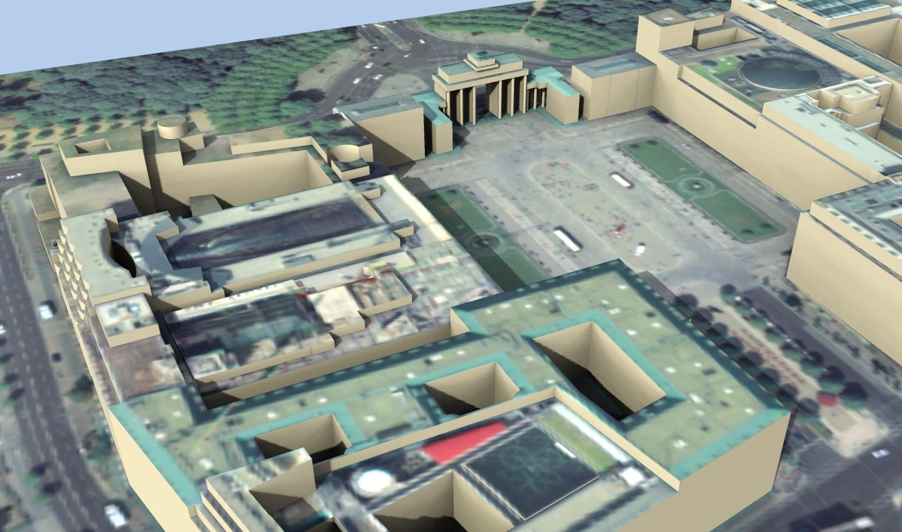
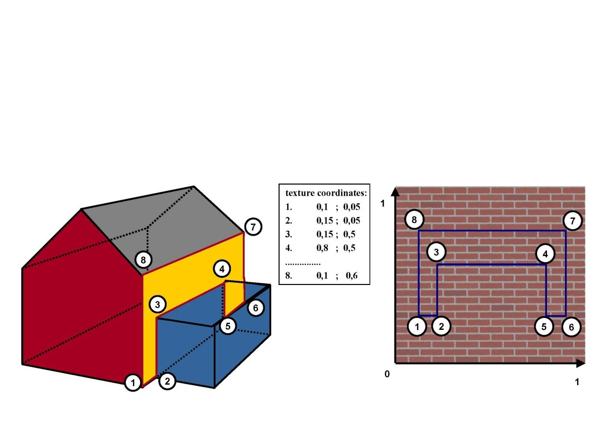

[[bp_appearance]]
== Appearance Model

In addition to spatial properties, CityGML features have appearances – observable properties of the feature’s surface. Appearances are not limited to visual data but represent arbitrary categories called themes such as infrared radiation, noise pollution, or earthquake-induced structural stress. Each LOD can have an individual appearance for a specific theme. An appearance is composed of data for each surface geometry object, i.e. surface data. A single surface geometry object may have surface data for multiple themes. Similarly, surface data can be shared by multiple surface geometry objects (e.g. road paving). Finally, surface data values can either be constant across a surface or depend on the exact location within the surface.

CityGML’s appearance model is defined within the extension module Appearance (cf. chapter 7). The UML diagram of the appearance model is illustrated in Fig. 14, for the XML Schema definition see annex A.2. 

[[figure-14]]
.UML diagram of CityGML’s appearance model. Prefixes are used to indicate XML namespaces associated with model elements. Element names without a prefix are defined within the CityGML Appearance module.

In CityGML’s appearance model, themes are represented by an identifier only. The appearance of a city model for a given theme is defined by a set of Appearance objects referencing this theme. Thus, the Appearance objects belonging to the same theme compose a virtual group. They may be included in different places within a CityGML dataset. Furthermore a single CityGML dataset may contain several themes. An Appearance object collects surface data relevant for a specific theme either for individual features or the whole city model in any LOD. Surface data is represented by objects of class _SurfaceData and its descendents with each covering the whole area of a surface geometry object. The relation between surface data and surface geometry objects is expressed by an URI (Uniform Resource Identifier) link from a _SurfaceData object to an object of type gml:AbstractSurfaceType or type gml:MultiSurface.

A constant surface property is modelled as material. A surface property, which depends on the location within the surface, is modelled as texture. Each surface geometry object can have both a material and a texture per theme and side. This allows for providing both a constant approximation and a complex measurement of a surface’s property simultaneously. An application is responsible for choosing the appropriate property represen-tation for its task (e.g. analysis or rendering). A specific mixing is not defined since this is beyond the scope of CityGML. If a surface geometry object is to receive multiple textures or materials, each texture or material requires a separate theme. The mixing of themes or their usage is not defined within CityGML and left to the application.

*XML namespace*

The XML namespace of the CityGML Appearance module is identified by the Uniform Resource Identifier (URI) http://www.opengis.net/citygml/appearance/2.0. Within the XML Schema definition of the Appearance module, this URI is also used to identify the default namespace.

=== Relation between appearances, features and geometry

Despite the close relation between surface data and surface, surface data is stored separately in the feature to preserve the original GML geometry model. Instead of surface data being an attribute of the respective target surface geometry object, each surface data object maintains a set of URIs specifying the gml:ids of the target surface geometry objects (of type gml:AbstractSurfaceType or gml:MultiSurface). In case of a composite or aggregate target surface, the surface data object is assigned to all contained surfaces. Other target types such as features, solids, or gml:AbstractSurfacePatchType (which includes gml:Triangle) are invalid, even though the XML schema language cannot formally express constrains on URI target types. For the exact mapping function of surface data values to a surface patch refer to the respective surface data type description.

The limitation of valid target types to gml:AbstractSurfaceType and gml:MultiSurface excluding gml:Abstract-SurfacePatchType is based on the GML geometry model and its use in CityGML. In general, GML surfaces are represented using subclasses of gml:AbstractSurfaceType. Such surfaces are required to be continuous. A gml:MultiSurface does not need to fulfill this requirement and consequently is no gml:AbstractSurfaceType (cf. 8.1). Since captured real-world surfaces often cannot be guaranteed to be continuous, CityGML allows for gml:MultiSurface to represent a feature’s boundary in various places as an alternative to a continuous surface. To treat such surfaces similarly to a gml:CompositeSurface, surface data objects are allowed to link to gml:Multi-Surface objects. gml:AbstractSurfacePatchType is no valid target type since it is not derived from gml:AbstractGMLType. Thus, a gml:AbstractSurfacePatchType (which includes gml:Triangle and gml:Rectangle) cannot receive a gml:id and cannot be referenced.

Each surface geometry object can have per theme at most one active front-facing material, one active back-facing material, one active front-facing texture, and one active back-facing texture. If multiple surface data objects of the same category and theme are assigned to a surface geometry object, one is chosen to become active. Multiple indirect assignments due to nested surface definitions are resolved by overwriting, e.g. the front-facing material of a gml:Polygon becomes active by overwriting the front-facing material of the parental gml:CompositeSurface. Multiple direct assignments, i.e. a surface geometry object’s gml:id is referenced multi-ple times within a theme, are not allowed and are resolved implementation-dependently by choosing exactly one of the conflicting surface data objects. Thus, multiple direct assignments within a theme need to be avoided.

Each _CityObject feature can store surface data. Thus, surface data is arranged in the feature hierarchy of a CityGML dataset. Surface data then links to its target surface using URIs. Even though the linking mechanism permits arbitrary links across the feature hierarchy to another feature’s surface, it is recommended to follow the principle of locality: Surface data should be stored such that the linked surfaces only belong to the containing _CityObject feature and its children. “Global” surface data should be stored with the city model. Adhering to the locality principle also ensures that CityObjects retrieved from a WFS will contain the respective appearance information.

The locality principle allows for the following algorithm to find all relevant _SurfaceData objects referring to a given surface geometry object (of type gml:AbstractSurfaceType or gml:MultiSurface) in a given _CityObject:

----
___________________________
  function findSurfaceData
  in: gmlSurface, cityObject
  out: frontMaterial, frontTexture, backMaterial, backTexture
___________________________
  1: frontMaterial := empty
  2: frontTexture := empty
  3: backMaterial := empty
  4: backTexture := empty
  5: flip := false
  6:
  7: while (gmlSurface) { // traverse the geometry hierarchy from inner to outer
  8:   cObj := cityObject // start from the innermost cityobject
  9:
  10:   while (cObj) { // traverse the cityobject hierarchy for the current geometry object 11: // search all surfaceData objects in all appearance containers
  12:     foreach (appearance in cObj) {
  13:       foreach (surfaceData in appearance) {
  14:         if (surfaceData refers to gmlSurface) { // if a surfaceData object refers to the geometry object, check its category
  15:           if (flip) { // consider flipping
  16: // only pick the first surfaceData for a particular category
  17:             if (surfaceData is frontside material AND backMaterial is empty) {
  18:               backMaterial := surfaceData
  19:             }
  20:             if (surfaceData is frontside texture AND backTexture is empty) {
  21:               backTexture := surfaceData
  22:             }
  23:             if (surfaceData is backside material AND frontMaterial is empty) {
  24:               frontMaterial := surfaceData
  25:             }
  26:             if (surfaceData is backside texture AND frontTexture is empty) {
  27:               frontTexture := surfaceData
  28:             }
  29:           } else {
  30:             // only pick the first surfaceData for a particular category
  31:             if (surfaceData is frontside material AND frontMaterial is empty) {
  32:               frontMaterial := surfaceData
  33:             }
  34:             if (surfaceData is frontside texture AND frontTexture is empty) {
  35:               frontTexture := surfaceData
  36:             }
  37:             if (surfaceData is backside material AND backMaterial is empty) {
  38:               backMaterial := surfaceData
  39:             }
  40:             if (surfaceData is backside texture AND backTexture is empty) {
  41:               backTexture := surfaceData
  42:             }
  43:           }
  44:
  45:           // shortcut: could stop here if all 4 categories have been found
  46:         }
  47:       }
  48:     }
  49:     cObj := cObj.parent // this also includes the global CityModel
  50:   }
  51:   gmlSurface := gmlSurface.parent // this also includes a root gml:MultiSurface
  52:   if (gmlSurface isA gml:OrientableSurface AND gmlSurface.orientation is negative) {
  53:     negate flip
  54:   }
  55: }
----
.Listing 1: Algorithm to find all relevant _SurfaceData objects referring to a given surface geometry object (of type gml:AbstractSurfaceType or gml:MultiSurface) in a given _CityObject.

The evaluation of the isFront property of a _SurfaceData object needs to take gml:OrientableSurfaces into account, as those can flip the orientation of a surface. Assume a gml:OrientableSurface os, which flips its base surface bs. A front side texture t targeting bs will appear on the actual front side of bs. If t targets os, it will appear on the back side of bs. If t targets both os and bs, it appears on both sides of bs since it becomes the front and back side texture.

XLinks influence the hierarchy traversal in the pseudocode. In general, the separation of surface data and geome-try objects requires the reevaluation of the surface data assignment for each occurrence of a geometry object in the context of the respective _CityObject. Stepping up the (geometry or _CityObject) hierarchy in the algorithm takes XLinks into account, i.e., for the purpose of this algorithm, referenced objects are conceptually copied to the location of the referring XLink. In particular, this applies to ImplicitGeometry objects. If an ImplicitGeome-try object contains GML geometry (in the relativeGMLGeometry property), the surface data assignment needs to be reevaluated in the context of each referring _CityObject. Thus, the appearance (but not the relative geometry) of a given ImplicitGeometry can differ between its occurrences. A consistent appearance results if all required surface data objects are placed in Appearance objects and the latter are stored either

. in the _CityObject containing the original ImplicitGeometry with XLinks referencing the same Appear-ance objects in all _CityObjects that refer to the ImplicitGeometry or
. in the global CityModel.

=== Appearance and SurfaceData

The feature class Appearance defines a container for surface data objects. It provides the theme that all contained surface data objects are related to. All appearance objects with the same theme in a CityGML file are considered a group. Surface data objects are stored in the surfaceDataMember property. They can be used in multiple themes simultaneously as remote properties.

The feature class _SurfaceData is the base class for materials and textures. Its only element is the boolean flag isFront, which determines the side a surface data object applies to. Please note, that all classes of the appearance model support CityGML’s ADE mechanism (cf. chapters 6.12 and 10.13). The hooks for application specific extensions are realized by the elements “_GenericApplicationPropertyOf…”.

==== AppearanceType, Appearance, AppearancePropertyType

NOTE: insert UML

==== appearanceMember, appearance

NOTE: insert UML

The definition of appearanceMember allows for an arbitrary or even mixed sequence of _CityObject features and Appearance features within a CityModel feature collection (cf. chapter 10.1).

In order to store appearance information within a single _CityObject feature, the corresponding abstract class _CityObject of the core module is augmented by the property element appearance. The additional property appearance is injected into _CityObject using CityGML’s Application Domain Extension mechanism (cf. chapter 10.13). By this means, each thematic subclass of _CityObject inherits this property. Thus, the Appear-ance module has a deliberate impact on each extension module defining thematic subclasses of _CityObject.

==== AbstractSurfaceDataType, _SurfaceData, SurfaceDataPropertyType

NOTE: insert UML

=== Material

Materials define light reflection properties being constant for a whole surface geometry object. The definition of the class X3DMaterial is adopted from the X3D and COLLADA specification (cf. X3D, COLLADA specifica-tion). diffuseColor defines the color of diffusely reflected light. specularColor defines the color of a directed reflection. emissiveColor is the color of light generated by the surface. All colors use RGB values with red, green, and blue between 0 and 1. Transparency is defined separately using the transparency element where 0 stands for fully opaque and 1 for fully transparent. ambientIntensity defines the minimum percentage of dif-fuseColor that is visible regardless of light sources. shininess controls the sharpness of the specular highlight. 0 produces a soft glow while 1 results in a sharp highlight. isSmooth gives a hint for normal interpolation. If this boolean flag is set to true, vertex normals should be used for shading (Gouraud shading). Otherwise, normals should be constant for a surface patch (flat shading).

Target surfaces are specified using target elements. Each element contains the URI of one target surface geome-try object (of type gml:AbstractSurfaceType or gml:MultiSurface).

==== X3DMaterialType, X3DMaterial

NOTE: insert UML

=== Texture and texture mapping

The abstract base class for textures is _Texture. Textures in CityGML are always raster-based 2D textures. The raster image is specified by imageURI using a URI and can be an arbitrary image data resource, even a prefor-matted request for a web service. The image data format can be defined using standard MIME types in the mimeType element.

Textures can be qualified by the attribute textureType. The textureType differentiates between textures, which are specific for a certain object (specific) and prototypic textures being typical for that object surface (typical). Textures may also be classified as unknown.

The specification of texture wrapping is adopted from the COLLADA standard. Texture wrapping is required when accessing a texture outside the underlying image raster. wrapMode can have one of five values (Fig. 15 illustrates the effect of these wrap modes):

. none – the resulting color is fully transparent
. wrap – the texture is repeated
. mirror – the texture is repeated and mirrored
. clamp – the texture is clamped to its edges
. border – the resulting color is specified by the borderColor element (RGBA)

In wrap mode mirror, the texture image is repeated both in horizontal and in vertical direction to fill the texture space similar to wrap mode wrap. Unlike wrap, each repetition results from flipping the previous texture part along the repetition direction. This behaviour removes the edge correspondence constraint for wrapped textures and always results in a seamless texture.

[[figure-15]]
.A texture (a) applied to a facade using different wrap modes: (b) none, (c) wrap, (d) mirror, (e) clamp and (f) border. The border color is red. The numbers denote texture coordinates (image: Hasso-Plattner-Institute).
image::figures/Figure_15.png[]

==== AbstractTextureType, _Texture, WrapModeType, TextureTypeType

NOTE: insert UML

_Texture is further specialised according to the texture parameterisation, i.e. the mapping function from a loca-tion on the surface to a location in the texture image. CityGML uses the notion of texture space, where the texture image always occupies the region [0,1]² regardless of the actual image size or aspect ratio. The lower left image corner is located at the origin (some graphics APIs may use other conventions and require texture coordi-nate conversion). The mapping function must be known for each surface geometry object to receive texture.

[[figure-16]]
.A georeferenced texture applied to ground and roof surfaces (source: Senate of Berlin, Hasso-Plattner-Institute).

The class GeoreferencedTexture describes a texture that uses a planimetric projection. Consequently, it does not make sense to texture vertical surfaces using a GeoreferencedTexture. Such a texture has a unique mapping function which is usually provided with the image file (e.g. georeferenced TIFF) or as a separate ESRI world file1. The search order for an external georeference is determined by the boolean flag preferWorldFile. If this flag is set to true (its default value), a world file is looked for first and only if it is not found the georeference from the image data is used. If preferWorldFile is false, the world file is used only if no georeference from the image data is available.

Alternatively, CityGML allows for inline specification of a georeference similar to a world file. This internal georeference specification always takes precedence over any external georeference. referencePoint defines the location of the center of the upper left image pixel in world space and corresponds to values 5 and 6 in an ESRI world file. Since GeoreferencedTexture uses a planimetric projection, referencePoint is two-dimensional. orien-tation defines the rotation and scaling of the image in form of a 2x2 matrix (a list of 4 doubles in row-major order corresponding to values 1, 3, 2, and 4 in an ESRI world file). The CRS of this transformation is identical to the referencePoint’s CRS. A planimetric point  T x, y in that CRS is transformed to a point  T s,t in texture
space using the formula:

NOTE: insert equation

with M denoting orientation, PR denoting referencePoint., w the image’s width in pixels, and h the image’s height in pixels. This transformation compensates for the difference between the image coordinate system used in ESRI world files (origin in upper left corner, positive x-axis rightwards, and positive y-axis downwards) and texture space in CityGML (origin in lower left corner, positive x-axis rightwards, and positive y-axis upwards).

If neither an internal nor an external georeference is given the GeoreferencedTexture is invalid. Each target surface geometry object is specified by an URI in a target element. All target surface geometry objects share the mapping function defined by the georeference. No other mapping function is allowed. Please note, that the gml:boundedBy property inherited from gml:AbstractFeatureType could be set to the bounding box of valid image data to allow for spatial queries. Fig. 16 shows a georeferenced texture applied to the ground and all roof surfaces.

==== GeoreferencedTextureType, GeoreferencedTexture

NOTE: insert UML

The class ParameterizedTexture describes a texture with target-dependent mapping function. The mapping is defined by subclasses of class _TextureParameterization as a property of the link to the target surface geometry object. Each target surface geometry object is specified as URI in the uri attribute of a separate target element. Since target implements gml:AssociationAttributeGroup, it allows referencing to a remote _TextureParameterization object (using the xlink:href attribute), e.g. for sharing a mapping function between targets or textures in different themes. The mapping function can either use the concept of texture coordinates (through class TexCoordList) or a transformation matrix from world space to texture space (through class TexCoordGen).

[[figure-17]]
.Positioning of textures using texture coordinates (image: IGG Uni Bonn).

Texture coordinates are applicable only to polygonal surfaces, whose boundaries are described by gml:LinearRing (e.g., gml:Triangle, gml:Polygon, or a gml:MultiSurface consisting of gml:Polygons). They define an explicit mapping of a surface’s vertices to points in texture space, i.e. each vertex including interior ring vertices must receive a corresponding coordinate pair in texture space (for the notion of coordinates, refer to ISO 19111). These coordinates are not restricted to the [0,1] interval. Texture coordinates for interior surface points are planarly interpolated from the vertices’ texture coordinates. Fig. 16 shows an example.

Texture coordinates for a target surface geometry object are specified using class TexCoordList as a texture parameterization object in the texture’s target property. Each exterior and interior gml:LinearRing composing the boundary of the target surface geometry object (which also might be a gml:CompositeSurface, gml:MultiSurface, or gml:TriangulatedSurface) requires its own set of texture coordinates. A set of texture coordinates is specified using the textureCoordinates element of class TexCoordList. Thus, a TexCoordList contains as many textureCoordinate elements as the target surface geometry object contains gml:LinearRings. textureCoordinate’s mandatory attribute ring provides the gml:id of the respective ring. The content is an ordered list of double values where each two values define a  T s,t texture coordinate pair with s denoting the horizontal and t the vertical texture axis. The list contains one pair per ring point with the pairs’ order corresponding to the ring points’ order in the CityGML document (regardless of a possibly flipped surface orientation). If any ring point of a target surface geometry object has no texture coordinates assigned, the mapping is incomplete and the respective surface cannot be textured. In case of aggregated target geometry objects, mapping completeness is determined only for leaf geometry objects.

NOTE: combine figures 18

[[figure-18]]
image::figures/inwork/figure_18_a.jpg[]
.Projecting a photograph (a) onto multiple facades (b) using the worldToTexture transformation. The photograph does not cover the left facade completely. Thus, the texture appears to be clipped. Texture wrapping is set to “none” (source: Senate of Berlin, Hasso-Plattner-Institute).
image::figures/inwork/figure_18_b.jpg[]

Alternatively, the mapping function can comprise a 3x4 transformation matrix specified by class TexCoordGen. The transformation matrix, specified by the worldToTexture element, defines a linear transformation from a spatial location in homogeneous coordinates to texture space. The use of homogeneous coordinates facilitates perspective projections as transformation, e.g. for projecting a photograph into a city model (cf. Fig. 18). Texture coordinates  T s,t are calculated from a space location  T x, y, z as    T T s,t  s q,t q with    T T s,t,q M x, y, z,1 . M denotes the 3x4 transformation matrix. Compared to a general 4x4 transformation, the resulting z component is ignored. Thus, the respective matrix row is omitted. Additionally, the worldToTexture element uses the gml:SRSReferenceGroup attributes to define its CRS. A location in world space has to be first transformed into this CRS before the transformation matrix can be applied.

The following construction results in a worldToTexture transformation that mimics the process of taking a photograph by projecting a location in world space (in the city model) to a location in texture space:

NOTE: insert transformation matrix

In this formula, f denotes the focal length; w and h represent the image sensor’s physical dimensions; r

, u

, and
d

define the camera’s frame of reference as right, up and directional unit vectors expressed in world coordinates;
and P stands for the camera’s location in world space. Fig. 19 sketches this setting.

[[figure-19]]
.Projective texture mapping. All points on a ray R starting from the projection center P are mapped to the same point T in texture space (image: Hasso-Plattner-Institute, IGG TU Berlin).
image::figures/figure_19.png[]

Alternatively, if the 3x4 camera matrix MP is known (e.g. through a calibration and registration process), it can easily be adopted for use in worldToTexture. MP is derived from intrinsic and extrinsic camera parameters (interior and exterior orientation) and transforms a location in world space to a pixel location in the image. Assuming the upper left image corner has pixel coordinates (0,0), the complete transformation to texture space coordinates can be written as (widthimage and heightimage denote the image size in pixels):

NOTE: insert formula

Please note, that worldToTexture cannot compensate for radial or other non-linear distortions introduced by a real camera lens.

Another use of worldToTexture is texturing a facade with complex geometry without specifying texture coordinates for each gml:LinearRing. Instead, only the facade’s aggregated surface becomes the texture target using a TexCoordGen as parameterization. Then, worldToTexture effectively encodes an orthographic projection of world space into texture space. For the special case of a vertical facade this transformation is given by:

NOTE: insert formula

[source,MathML]
----
<math display="block">
  <mrow class="MJX-TeXAtom-ORD">
    <mover>
      <mi mathvariant="normal">&#x2207;</mi>
      <mo stretchy="false">&#x2192;</mo>
    </mover>
  </mrow>
  <mo>&#xD7;</mo>
  <mrow class="MJX-TeXAtom-ORD">
    <mover>
      <mi>F</mi>
      <mo stretchy="false">&#x2192;</mo>
    </mover>
  </mrow>
  <mo>=</mo>
  <mrow>
    <mo>(</mo>
    <mfrac>
      <mrow>
        <mi mathvariant="normal">&#x2202;</mi>
        <msub>
          <mi>F</mi>
          <mi>z</mi>
        </msub>
      </mrow>
      <mrow>
        <mi mathvariant="normal">&#x2202;</mi>
        <mi>y</mi>
      </mrow>
    </mfrac>
    <mo>&#x2212;</mo>
    <mfrac>
      <mrow>
        <mi mathvariant="normal">&#x2202;</mi>
        <msub>
          <mi>F</mi>
          <mi>y</mi>
        </msub>
      </mrow>
      <mrow>
        <mi mathvariant="normal">&#x2202;</mi>
        <mi>z</mi>
      </mrow>
    </mfrac>
    <mo>)</mo>
  </mrow>
  <mrow class="MJX-TeXAtom-ORD">
    <mi mathvariant="bold">i</mi>
  </mrow>
  <mo>+</mo>
  <mrow>
    <mo>(</mo>
    <mfrac>
      <mrow>
        <mi mathvariant="normal">&#x2202;</mi>
        <msub>
          <mi>F</mi>
          <mi>x</mi>
        </msub>
      </mrow>
      <mrow>
        <mi mathvariant="normal">&#x2202;</mi>
        <mi>z</mi>
      </mrow>
    </mfrac>
    <mo>&#x2212;</mo>
    <mfrac>
      <mrow>
        <mi mathvariant="normal">&#x2202;</mi>
        <msub>
          <mi>F</mi>
          <mi>z</mi>
        </msub>
      </mrow>
      <mrow>
        <mi mathvariant="normal">&#x2202;</mi>
        <mi>x</mi>
      </mrow>
    </mfrac>
    <mo>)</mo>
  </mrow>
  <mrow class="MJX-TeXAtom-ORD">
    <mi mathvariant="bold">j</mi>
  </mrow>
  <mo>+</mo>
  <mrow>
    <mo>(</mo>
    <mfrac>
      <mrow>
        <mi mathvariant="normal">&#x2202;</mi>
        <msub>
          <mi>F</mi>
          <mi>y</mi>
        </msub>
      </mrow>
      <mrow>
        <mi mathvariant="normal">&#x2202;</mi>
        <mi>x</mi>
      </mrow>
    </mfrac>
    <mo>&#x2212;</mo>
    <mfrac>
      <mrow>
        <mi mathvariant="normal">&#x2202;</mi>
        <msub>
          <mi>F</mi>
          <mi>x</mi>
        </msub>
      </mrow>
      <mrow>
        <mi mathvariant="normal">&#x2202;</mi>
        <mi>y</mi>
      </mrow>
    </mfrac>
    <mo>)</mo>
  </mrow>
  <mrow class="MJX-TeXAtom-ORD">
    <mi mathvariant="bold">k</mi>
  </mrow>
</math>
----

This equation assumes n  denoting the facade’s overall normal vector (normalized, pointing outward, and being parallel to the ground), F denoting the facade’s lower left point, and widthf and heightf specifying the facade’s dimensions in world units. For the general case of an arbitrary normal vector the facade orientation matrix assumes a form similar to the camera orientation matrix:

NOTE: insert formula

==== ParameterizedTextureType, ParameterizedTexture, TextureAssociationType

NOTE: insert UML

==== AbstractTextureParameterizationType, TexCoordListType, TexCoordGenType

NOTE: insert UML

=== Related concepts

The notion of appearance clearly relates to the generic coverage approach (cf. ISO 19123 and OGC Abstract specification, Topic 6). Surface data can be described as discrete or continuous coverage over a surface as two-dimensional domain with a specific mapping function. Such an implementation requires the extension of GML coverages (as of version 3.1) by suitable mapping functions and specialisation for valid domain and range sets. For reasons of simplicity and comprehensibility both in implementation and usage, CityGML does not follow this approach, but relies on textures and materials as well-known surface property descriptions from the field of computer graphics (cf. X3D, COLLADA specification, Foley et al.). Textures and materials store data as color using an appropriate mapping. If such a mapping is impractical, data storage can be customised using ADEs. A review of coverages for appearance modelling is considered for CityGML beyond version 2.0.0.

Appearance is also related to portrayal. Portrayal describes the composition and symbolisation of a digital model’s image, i.e. presentation, while appearance encodes observations of the real object’s surface, i.e. data. Even though being based on graphical terms such as textures and materials, surface data is not limited to being input for portrayal, but similarly serves as input or output for analyses on a feature’s surface. Consequently, CityGML does not define mixing or composition of themes for portrayal purposes. Portrayal is left to viewer applications or styling specification languages such as OGC Styled Layer Descriptors (SLD) or OGC Symbolo-gy Encoding (SE).

=== Code lists

The mimeType attribute of the feature _Texture is specified as gml:CodeType. The values of this property can be enumerated in a code list. A proposal for this code list can be found in annex C.6.

