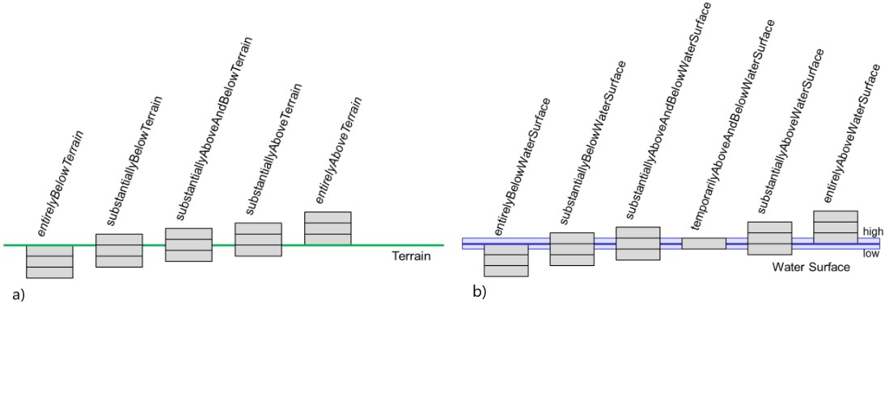

[bp_core]]
=== Core
The CityGML Core module defines the basic concepts and components of the overall CityGML data model.  It forms the universal lower bound of the CityGML data model and, thus, is a dependency of all extension modules. Consequently, the core module has to be implemented by any conformant system. Primarily, the core module provides the abstract base classes from which thematic classes within extension modules are (transitively) derived. Besides abstract type definitions, the core also contains non-abstract content, for example basic data types and thematic classes that may be used by more than one extension module. The UML diagram in Fig. 21 illustrates CityGML’s core module, for the XML Schema definition see below and annex A.1.

NOTE: insert Fig 21 UML

The base class of all thematic classes within CityGML’s data model is the abstract class  _CityObject. _CityObject provides a creation and a termination date for the management of histories of features as well as the possibility to model external references to the same object in other data sets. Furthermore, two qualitative attributes relativeToTerrain and relativeToWater are provided which enable to specify the feature’s location with respect to the terrain and water surface. The possible topological relations are illustrated in Fig. 22. Both attributes facilitate simple and efficient queries like for the number of subsurface buildings (entirelyBelowTerrain) without the need for an additional digital terrain model or a model of the water body.

.Topological relations of a CityGML object with respect to a) the terrain and b) the water surface.

_CityObject is a subclass of the GML class _Feature, thus it inherits the metadata property (which can be e.g. information about the lineage, quality aspects, accuracy, local CRS) and name property from the superclass _GML. A _CityObject may have multiple names, which are optionally qualified by a codeSpace. This enables the differentiation between, for example, an official name and a popular name or of names in different languages (cf. the name property of GML objects, Cox et al. 2004). The generalisation property generalizesTo of _CityObject may be used to relate features, which represent the same real-world object in different Levels-of-Detail, i.e. a feature and its generalised counterpart(s). The direction of this relation is from the feature to the corresponding generalised feature.

Thematic classes may have further subclasses with relations, attributes and geometry. Features of the specialized subclasses of _CityObject may be aggregated to a single CityModel, which is a feature collection with optional metadata. Generally, each feature has the attributes class, function, and usage, unless it is stated otherwise. The class attribute can occur only once, while the attributes usage and function can be used multiple times. The class attribute allows for the classification of features beyond the thematic class hierarchy of _CityObject. For exam-ple, a building feature is represented by the thematic subclass bldg:Building of _CityObject in the first place (this subclass is defined within CityGML’s Building module, cf. chapter 10.3). A further classification, e.g. as resi-dential or administration building, may then be modelled using the class attribute of the class bldg:Building. The attribute function normally denotes the intended purpose or usage of the object, such as hotel or shopping centre for a building, while the attribute usage normally defines its real or actual usage. Possible values for the attrib-utes class, function, and usage can be specified in code lists which are recommended to be implemented as simple dictionaries following the Simple Dictionary Profile of GML 3.1.1 (cf. chapter 6.6 and 10.14). Annex C provides code lists proposed and maintained by the SIG 3D which contain feasible attribute values and which may be extended or redefined by users.

In addition to thematic content, the core module also provides the concept of implicit geometries as an enhance-ment of the geometry model of GML3. Since this concept is strongly related to the spatial model of CityGML it has already been introduced in chapter 8.2.

The top level class hierarchy of the thematic model in CityGML is presented in Fig. 23. The subclasses of _CityObject comprise the different thematic fields of a city model covered by separate CityGML extension modules: the terrain, buildings, bridges, tunnels, the coverage by land use objects, water bodies, vegetation, generic city objects, city furniture objects, city object groups, and transportation. To indicate the extension module defining a respective subclass of _CityObject, the class names in Fig. 23 are preceded by prefixes. Each prefix is associated with one CityGML extension module (see chapter 4.3 and chapter 7 for a list of CityGML’s extension modules and the corresponding prefixes).

NOTE: Insert Fig 23 UML

The classes GenericCityObject and _genericAttribute defined within CityGML’s Generics module (cf. chapters 6.11 and 10.12) allow for modelling and exchanging of 3D objects which are not covered by any other thematic class or which require attributes not represented in CityGML. For example, in the future, sites derived from the abstract class _Site of the core module may be completed by further subclasses like excavation, city wall or embankment. At present, the class GenericCityObject should be used in order to represent and exchange these features. However, the concept of generic city objects and attributes may only be used if appropriate thematic classes or attributes are not provided by any other CityGML module.

If the Generics module is employed, each CityObject may be assigned an arbitrary number of generic attributes in order to represent additional properties of features. For this purpose, the Generics module augments the abstract base class _CityObject by the property element _genericAttribute. The additional property _genericAttribute is injected into _CityObject using CityGML’s Application Domain Extension mechanism (cf. chapter 10.13). By this means, each thematic subclass of _CityObject inherits this property and, thus, the possi-bility to contain generic attributes. Therefore, the Generics module has a deliberate impact on all CityGML extension modules defining thematic subclasses of _CityObject.

Appearance information about a feature’s surfaces can be represented by the class Appearance provided by CityGML’s Appearance module (cf. chapter 9). In contrast to the other thematic extensions to the core, Appear-ance is not derived from _CityObject but from the GML class _Feature. _CityObject features and Appearance features may be embraced within a single CityModel feature collection in an arbitrary or even mixed sequence using the cityObjectMember and appearanceMember elements, both being members of the substitution group gml:featureMember (cf. chapter 9 and chapter 10.1.1). Furthermore, feature appearances may be stored inline the _CityObject itself. In order to enable city objects to store appearance information, the Appearance module augments the abstract base class _CityObject by the property element appearance using CityGML’s Application Domain Extension mechanism (cf. chapter 10.13). Consequently, the appearance property is only available for _CityObject and its thematic subclasses if the Appearance module is supported. Therefore, like the Generics module, the Appearance module has a deliberate impact on any other extension module.

For sake of completeness, the class TexturedSurface is also illustrated in Fig. 23. This approach of appearance modelling of previous versions of CityGML has been deprecated and is expected to be removed in future CityGML versions. Since the information covered by TexturedSurface can be losslessly converted to the Ap-pearance module, the use of TexturedSurface is strongly discouraged.

==== Base elements

===== AbstractCityObjectType, _CityObject

===== AbstractCityObjectType, _CityObject

NOTE: insert AbstractCityObjectType, _CityObject UML

===== CityModelType, CityModel

NOTE: insert CityModelType, CityModel UML

===== cityObjectMember

NOTE: insert cityObjectMember UML

===== AbstractSiteType, _Site

NOTE: insert AbstractSiteType, _Site UML

The abstract class _Site is intended to be the superclass for buildings, bridges, tunnels, facilities, etc. Future extension of CityGML (e.g. excavations, city walls or embankments) would be modelled as subclasses of _Site. As subclass of _CityObject, a _Site inherits all attributes and relations, in particular the id, names, external references, and generalisation relations.

==== Generalisation relation, RelativeToTerrainType and RelativeToWaterType

===== GeneralizationRelationType

NOTE: insert GeneralizationRelationType UML

===== RelativeToTerrainType, RelativeToWaterType

NOTE: insert RelativeToTerrainType, RelativeToWaterType UML

==== External references

An ExternalReference defines a hyperlink from a _CityObject to a corresponding object in another information system, for example in the German cadastre (ALKIS), the German topographic information system (ATKIS), or the OS MasterMap®. The reference consists of the name of the external information system, represented by an URI, and the reference of the external object, given either by a string or by an URI. If the informationSystem element is missing in the ExternalReference, the ExternalObjectReference must be an URI.

===== ExternalReferenceType, ExternalObjectReferenceType

NOTE: insert ExternalReferenceType, ExternalObjectReferenceType UML

==== Address information

The CityGML core module provides the means to represent address information of real-world features within virtual city models. Since not every real-world feature is assigned an address, a correspondent address property is not defined for the base class _CityObject, but has to be explicitly modelled for a thematic subclass. For example, the building model declares address properties for its classes _AbstractBuilding and Door. Both classes are referencing the corresponding data types of the core module to represent address information (cf. chapter 10.3).

Addresses are modelled as GML features having one xalAddress property and an optional multiPoint property. For example, for a building feature the multiPoint property allows for the specification of the exact positions of the building entrances that are associated with the corresponding address. The point coordinates can be 2D or 3D. Modelling addresses as features has the advantage that GML3’s method of representing features by refer-ence (using XLinks) can be applied. This means, that addresses might be bundled as an address FeatureCollec-tion that is stored within an external file or that can be served by an external Web Feature Service. The address property elements within the CityGML file then would not contain the address information inline but only references to the corresponding external features.

The address information is specified using the xAL address standard issued by the OASIS consortium (OASIS 2003), which provides a generic schema for all kinds of international addresses. Therefore, child elements of the xalAddress property of Address have to be structured according to the OASIS xAL schema.

===== AddressPropertyType, AddressType, Address

NOTE: insert AddressPropertyType, AddressType, Address UML

The following two excerpts of a CityGML dataset contain examples for the representation of German and British addresses in xAL. The address information is attached to building objects (bldg:Building) according to the CityGML Building module (cf. chapter 10.3). Generally, if a CityGML instance document contains address information, the namespace prefix “xAL” should be declared in the root element and must refer to “urn:oasis:names:tc:ciq:xsdschema:xAL:2.0”. An example showing a complete CityGML dataset including a building with an address element is provided in annex G.1.

NOTE: insert examples here if appropriate.

