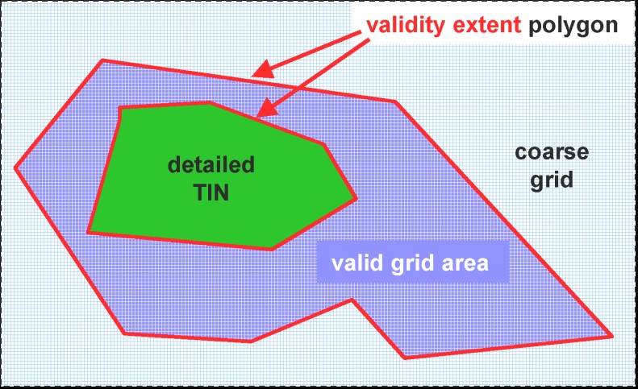

[bp_relief]]
=== Digital Terrain Model
An essential part of a city model is the terrain. The Digital Terrain Model (DTM) of CityGML is provided by the thematic extension module Relief (cf. chapter 7). In CityGML, the terrain is represented by the class ReliefFea-ture in LOD 0-4 (Fig. 24 depicts the UML diagram, for the XML schema definition see annex A.9). A Re-liefFeature consists of one or more entities of the class ReliefComponent. Its validity may be restricted to a certain area defined by an optional validity extent polygon. As ReliefFeature and ReliefComponent are deriva-tives of _CityObject, the corresponding attributes and relations are inherited. The class ReliefFeature is associat-ed with different concepts of terrain representations which can coexist. The terrain may be specified as a regular raster or grid (RasterRelief), as a TIN (Triangulated Irregular Network, TINReflief), by break lines (BreaklineRe-lief), or by mass points (MasspointRelief). The four types are implemented by the corresponding GML3 classes: grids by gml:RectifiedGridCoverage, break lines by gml:MultiCurve, mass points by gml:MultiPoint and TINs either by gml:TriangulatedSurface or by gml:Tin. In case of gml:TriangulatedSurfaces, the triangles are given explicitly while in case of gml:Tin only 3D points are represented, where the triangulation can be reconstructed by standard methods (Delaunay triangulation, cf. Okabe et al. 1992). Break lines are represented by 3D curves. Mass points are simply a set of 3D points.

NOTE: insert Fig 24 UML

In a CityGML dataset the four terrain types may be combined in different ways, yielding a high flexibility. First, each type may be represented in different levels of detail, reflecting different accuracies or resolutions. Second, a part of the terrain can be described by the combination of multiple types, for example by a raster and break lines, or by a TIN and break lines. In this case, the break lines must share the geometry with the triangles. Third, neighboring regions may be represented by different types of terrain models. To facilitate this combination, each terrain object is provided with a spatial attribute denoting its extent of validity (Fig. 25). In most cases, the extent of validity of a regular raster dataset corresponds to its bounding box. This validity extent is represented by a 2D footprint polygon, which may have holes. This concept enables, for example, the modelling of a terrain by a coarse grid, where some distinguished regions are represented by a detailed, high-accuracy TIN. The boundaries between both types are given by the extent attributes of the corresponding terrain objects.

.Nested DTMs in CityGML using validity extent polygons (graphic: IGG Uni Bonn).

Accuracy and resolution of the DTM are not necessarily dependent on features of other CityGML extenstion modules such as building models. Hence, there is the possibility to integrate building models with higher LOD to a DTM with lower accuracy or resolution.

This approach interacts with the concept of TerrainIntersectionCurves TIC (cf. chapter 6.5). The TIC can be used like break lines to adjust the DTM to different features such as buildings, bridges, or city furnitures, and hence to ensure a consistent representation of the DTM. If necessary, a retriangulation may have to be processed. A TIC can also be derived by the individual intersection of the DTM and the corresponding feature.

ReliefFeature and its ReliefComponents both have an lod attribute denoting the corresponding level of detail. In most cases, the LOD of a ReliefFeature matches the LOD of its ReliefComponents. However, it is also allowed to specify a ReliefFeature with a high LOD which consists of ReliefComponents where some of them can have a LOD lower than that of the aggregating ReliefFeature. The idea is that, for example, for a LOD3 scene it might be sufficient to use a regular grid in LOD2 with certain higher precision areas defined by ReliefComponents in LOD3. The LOD2 grid and the LOD3 components can easily be integrated using the concept of the validity extent polygon. Therefore, although some of the ReliefComponents would have been classified to a lower LOD, the whole ReliefFeature would be appropriate to use with other LOD3 models which is indicated by setting its lod value to 3.

==== Relief feature and relief component

===== ReliefFeatureType, ReliefFeature

NOTE: insert ReliefFeatureType, ReliefFeature UML

===== AbstractReliefComponentType, _ReliefComponent

NOTE: insert AbstractReliefComponentType, _ReliefComponent UML

==== TIN relief

===== TINReliefType, TINRelief

NOTE: insert TINReliefType, TINRelief UML

The geometry of a TINRelief is defined by the GML geometry class gml:TriangulatedSurface. This allows either the explicit provision of a set of triangles (gml:TriangulatedSurface) or specifying of only the control points, break and stop lines using the subclass gml:Tin of gml:TriangulatedSurface. In the latter case, an application that processes an instance document containing a gml:Tin has to reconstruct the triangulated surface by the applica-tion of a constrained Delaunay triangulation algorithm (cf. Okabe et al. 1992).

==== Raster relief

===== RasterReliefType, RasterRelief, Elevation

NOTE: insert RasterReliefType, RasterRelief, Elevation UML

==== Mass point relief

===== MassPointReliefType, MassPointRelief

NOTE: insert MassPointReliefType, MassPointRelief UML

==== Breakline relief

===== BreaklineReliefType, BreaklineRelief

NOTE: insert BreaklineReliefType, BreaklineRelief UML

The geometry of a BreaklineRelief can be composed of break lines and ridge/valley lines. Whereas break lines indicate abrupt changes of terrain slope, ridge/valley lines in addition mark a change of the sign of the terrain slope gradient. A BreaklineRelief must have at least one of the two properties.

