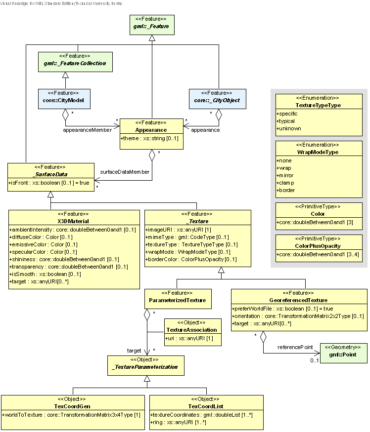

[[bp_appearance]]
== Appearance Model

include::../standard/requirements/requirements_class_appearance.adoc[]

In addition to spatial properties, CityGML features have appearances – observable properties of the feature’s surface. Appearances are not limited to visual data but represent arbitrary categories called themes such as infrared radiation, noise pollution, or earthquake-induced structural stress. Each LOD can have an individual appearance for a specific theme. An appearance is composed of data for each surface geometry object, i.e. surface data. A single surface geometry object may have surface data for multiple themes. Similarly, surface data can be shared by multiple surface geometry objects (e.g. road paving). Finally, surface data values can either be constant across a surface or depend on the exact location within the surface.

CityGML’s appearance model is defined within the extension module Appearance (cf. chapter 7). The UML diagram of the appearance model is illustrated in <<figure-14,Figure 14>>. 

[[figure-14]]
.UML diagram of CityGML’s appearance model. Prefixes are used to indicate XML namespaces associated with model elements. Element names without a prefix are defined within the CityGML Appearance module.

=== Relation between appearances, features and geometry

NOTE: [underline]#short# intro here

For a more detailed discussion of this topic, see https://github.com/opengeospatial/CityGML3-Workspace/blob/master/19-072BP.html[CityGML Best Practice Section nnn].

=== Appearance and SurfaceData

NOTE: [underline]#short# intro here

For a more detailed discussion of Appearance and SurfaceData, see https://github.com/opengeospatial/CityGML3-Workspace/blob/master/19-072BP.html[CityGML Best Practice Section nnn].

The feature class Appearance defines a container for surface data objects. It provides the theme that all contained surface data objects are related to. All appearance objects with the same theme in a CityGML file are considered a group. Surface data objects are stored in the surfaceDataMember property. They can be used in multiple themes simultaneously as remote properties.

The feature class _SurfaceData is the base class for materials and textures. Its only element is the boolean flag isFront, which determines the side a surface data object applies to. Please note, that all classes of the appearance model support CityGML’s ADE mechanism (cf. chapters 6.12 and 10.13). The hooks for application specific extensions are realized by the elements “_GenericApplicationPropertyOf…”.

==== AppearanceType, Appearance, AppearancePropertyType

NOTE: insert UML

==== appearanceMember, appearance

NOTE: insert UML

The definition of appearanceMember allows for an arbitrary or even mixed sequence of _CityObject features and Appearance features within a CityModel feature collection (cf. chapter 10.1).

In order to store appearance information within a single _CityObject feature, the corresponding abstract class _CityObject of the core module is augmented by the property element appearance. The additional property appearance is injected into _CityObject using CityGML’s Application Domain Extension mechanism (cf. chapter 10.13). By this means, each thematic subclass of _CityObject inherits this property. Thus, the Appear-ance module has a deliberate impact on each extension module defining thematic subclasses of _CityObject.

==== AbstractSurfaceDataType, _SurfaceData, SurfaceDataPropertyType

NOTE: insert UML

=== Material

NOTE: [underline]#short# intro here

For a more detailed discussion of Materials, see https://github.com/opengeospatial/CityGML3-Workspace/blob/master/19-072BP.html[CityGML Best Practice Section nnn].

==== X3DMaterialType, X3DMaterial

NOTE: insert UML

=== Texture and texture mapping

NOTE: [underline]#short# intro here

For a more detailed discussion of Texture and Texture Mapping, see https://github.com/opengeospatial/CityGML3-Workspace/blob/master/19-072BP.html[CityGML Best Practice Section nnn].

==== AbstractTextureType, _Texture, WrapModeType, TextureTypeType

NOTE: insert UML

==== GeoreferencedTextureType, GeoreferencedTexture

NOTE: insert UML

==== ParameterizedTextureType, ParameterizedTexture, TextureAssociationType

NOTE: insert UML

==== AbstractTextureParameterizationType, TexCoordListType, TexCoordGenType

NOTE: insert UML

=== Related concepts

NOTE: [underline]#short# intro here

For a more detailed discussion of Related Concepts, see https://github.com/opengeospatial/CityGML3-Workspace/blob/master/19-072BP.html[CityGML Best Practice Section nnn].

include::requirements/appearance/REQ_Appearance_Base.adoc[]

include::requirements/appearance/REQ_Appearance_RefIntegrity.adoc[]

