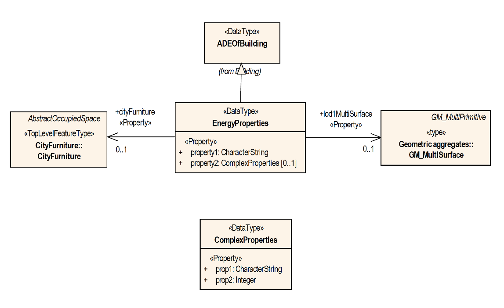

[[extensions-section]]
== CityGML Extension Mechanisms

CityGML defines a rich and general-purpose information model for 3D city and landscape models. While CityGML provides a common basis for a multitude of different use cases and applications, specific applications might have modelling requirements that go beyond the predefined elements of the CityGML conceptual model.

CityGML affords this flexibility by providing a slim base model with the following distinct extension mechanisms:

[arabic]
. Code lists,
. Generic objects and attributes, and
. Application Domain Extensions (ADEs).

These extension mechanisms have been introduced with CityGML 1.0 and are since widely used and accepted in the CityGML community.

=== Code Lists

When an attribute may have only one value selected from a small and fixed set of values, CityGML 3.0 specifies those as an enumeration. When the set of possible values is a priori unknown but predefined and fixed for a specific application domain or user organization, the values may be modelled as classes with the stereotype &#171;CodeList&#187;. 

Many attributes of CityGML types use a code list as data type such as, for instance, the attributes _class_, _usage,_ and _function_ of city objects. A code list defines a value domain including a code for each permissible value. In contrast to fixed enumerations, modifications to the value domain become possible with code lists. 

The feasible values for attributes with code lists may substantially vary for different applications, uses cases, information communities or even countries (e.g., due to national law or regulations). For this reason, code lists are modelled as empty classes without predefined normative content. The governance of code lists is rather decoupled from the governance of the CityGML conceptual model, and the contents may be defined and managed outside this International Standard by any organization or information community according to their information needs. Code lists should be made available as publicly accessible resource, either globally or within an application domain.

Rules and constraints for the encoding of both code lists and attributes having a code list as value are not subject of this document but are defined in a corresponding CityGML Encoding Specification. It is recommended, though, that attributes should be encoded such that they can take a value from a code list and, optionally, provide an identifier that references the code list in a unique way.

=== Generic Objects and Attributes

Generic objects and attributes are available from the <<rc_generics_section, _Generics_>> module of CityGML. A generic object is intended to be used as proxy for a real-world feature that is not mapped by a specific class in CityGML. Depending on the type and geometric characteristics of the real-world feature, CityGML offers the proxy classes _GenericLogicalSpace_, _GenericOccupiedSpace_, _GenericUnoccupiedSpace_ and _GenericThematicSurface_ to capture the feature. Each proxy can have a semantic meaning defined by the attributes _class_, _function_, and _usage_.

Generic attributes are name-value pairs that can be assigned to any city object (i.e., an instance of _core:AbstractCityObject_) to augment it with application data not covered by the predefined attributes. The attribute _name_ can be freely chosen to identify the piece of information represented by the generic attribute. A fixed list of simple data types is offered as possible domains for the attribute _value_. Generic attributes can be grouped into named collections using the _GenericAttributeSet_ data type.

The main advantage of generic objects and attributes is that they are simple and easy-to-use to represent application-specific content. Since this extension mechanism is built into the conceptual model of CityGML, it provides the capability of ad-hoc data enrichment (“at run-time”) without the need for modifying the conceptual model. This flexibility also faces disadvantages though:

* Generic objects are “flat” and cannot be decomposed into sub-features and feature hierarchies like other CityGML features such as, for instance, buildings or transportation features. However, they may be related to other city objects through the inherited _relatedTo_ association. 
* Names, data types, and multiplicities of generic attributes cannot be specified in a formal way. Consequently, there is no guarantee for an application that a generic attribute of a specific name and type is available a minimum or maximum number of times for a given city object.
* Name clashes between generic attributes from different applications are possible and cannot be avoided in a formal way, which might impede semantic interoperability.
* There is only a limited number of predefined simple data types available for generic attributes.

To avoid semantic interoperability issues, generic objects and attributes shall only be used if a more specific feature class or attribute is not available from the CityGML conceptual model.

=== Application Domain Extension (ADE)

An _Application Domain Extension_ (ADE) is a formal and systematic extension of CityGML for a specific application or domain in the form of a conceptual UML model. The application data is mapped to a set of additional classes, attributes, and relations. ADEs may use elements from CityGML, for instance, to derive application-specific subclasses, to inject additional properties, to associate application data with predefined CityGML content, or to define value domains for attributes.

The ADE mechanism allows application-specific information to be aligned with the conceptual model of CityGML in a well-structured and systematic way. By this means, CityGML can be extended to meet the information needs of an application while at the same time preserving its concepts and semantic structures. Moreover, and in contrast to generic city objects and attributes, application data can be validated against the formal definition of an ADE to ensure semantic interoperability.

Previous versions of CityGML defined the ADE mechanism solely on the level of the XML Schema encoding. With CityGML 3.0, ADEs become platform-independent models on a conceptual level that can be mapped to multiple and different target encodings.

ADEs have successfully been implemented in practice and enable a wide range of applications and use cases based on CityGML. An overview and discussion of existing ADEs is provided in [<<Biljecki2018>>].

==== General Rules for ADEs

An ADE shall be defined as conceptual model in UML in accordance with the conceptual modelling framework of the ISO 19100 series of International Standards and by adhering to the General Feature Model and the rules and constraints for application schemas as specified in ISO 19109 and ISO/TS 19103. The <<uml_notation_section, UML notations and stereotypes>> used in the CityGML conceptual model should also be applied to corresponding model elements in an ADE.

Every ADE must be organized into one or more UML packages having globally unique namespaces and containing all UML model elements defined by the ADE. An ADE may additionally import and use predefined classes from external conceptual UML models such as the CityGML modules or the standardized schemas of the ISO 19100 series of International Standards.

==== Defining New ADE Model Elements

Following ISO 19109, features are the primary view of geospatial information and the core elements of application schemas. ADEs therefore typically extend CityGML by defining new feature types appropriate to the application area together with additional content such as object types, data types, code lists, and enumerations.

Every feature type in an ADE must be derived either directly or indirectly from the CityGML root feature type _core:AbstractFeature_ or, depending on its type and characteristics, from a more appropriate subclass thereof. According to the general space concept of CityGML, features representing spaces or space boundaries shall be derived either directly or indirectly from _core:AbstractSpace_ or _core:AbstractSpaceBoundary_ respectively. UML classes representing top-level feature types shall use the _&#171;TopLevelFeatureType&#187;_ stereotype.

In contrast to feature types, object types and data types are not required to be derived from a predefined CityGML class unless explicitly stated otherwise.

ADE classes may have an unlimited number of attributes and associations in addition to those inherited from their parents. Attributes can be modelled with either simple or complex data types. To ensure semantic interoperability, the predefined types from CityGML or the standardized schemas of the ISO 19100 series of International Standards should be used wherever appropriate. This includes, amongst others, basic types from ISO/TS 19103, geometry and topology objects from ISO 10107, and temporal geometry and topology objects from ISO 19108.

If a predefined type is not available, ADEs can either define their own data types or import data types from external conceptual models. This explicitly includes the possibility to define new geometry types not offered by ISO 19107. Designers of an ADE should however note that software might not be able to properly identify and consume such geometry types.

A feature type capturing a real-world feature with geometry should be derived either directly or indirectly from _core:AbstractSpace_ or _core:AbstractSpaceBoundary_. By this means, the predefined spatial properties and the associated LOD concept of CityGML are inherited and available for the feature type. If, however, these superclasses are either inappropriate or lack a spatial property required to represent the feature, an ADE may define new and additional spatial properties. If such a spatial property should belong to one of the predefined LODs, then the property name shall start with the prefix “lod__X__”, where _X_ is to be replaced by an integer value between 0 and 3 indicating the target LOD. This enables software to derive the LOD of the geometry.

Constraints on model elements should be expressed using a formal language such as the Object Constraint Language (OCL). The ADE specifies the manner of application of constraints. However, following the CityGML conceptual model, constraints should at least be expressed on ADE subclasses of _core:AbstractSpace_ to limit the types of space boundaries (i.e., instances of _core:AbstractSpaceBoundary_) that may be used to model the boundary of a space object.

Illustrative examples for ADEs can be found in the <<_user_guide,CityGML 3.0 User Guide>>.

==== Augmenting CityGML Feature Types with Additional ADE Properties

If a predefined CityGML feature type lacks one or more properties required for a specific application, a feasible solution is to derive a new ADE feature type as subclass of the CityGML class and to add the properties to this subclass. While conceptually clean, this approach also faces drawbacks. If multiple ADEs require additional properties for the same CityGML feature type, this will lead to many subclasses of this feature type in different ADE namespaces. Information about the same real-world feature might therefore be spread over various instances of the different feature classes in an encoding making it difficult for software to consume the feature data.

For this reason, CityGML provides a way to augment the predefined CityGML feature types with additional properties from the ADE domain without the need for subclassing. Each CityGML feature type has an extension attribute of name “adeOf__FeatureTypeName__” and type “_ADEOfFeatureTypeName”_, where _FeatureTypeName_ is replaced by the class name in which the attribute is defined. For example, the _bldg:Building_ class offers the attribute _bldg:adeOfBuilding_ of type _bldg:ADEOfBuilding_. Each of these extension attributes can occur zero to unlimited times, and the attribute types are defined as abstract and empty data types.

If an ADE augments a specific CityGML feature type with additional ADE properties, the ADE shall create a subclass of the corresponding abstract data type associated with the feature class. This subclass must also be defined as data type using the stereotype _&#171;DataType&#187;_. The additional application-specific attributes and associations are then modelled as properties of the ADE subclass. This may include, amongst others, attributes with simple or complex data type, spatial properties or associations to other object and feature types from the ADE or external models such as CityGML.

The predefined “_ADEOfFeatureTypeName”_ data types are called “hooks” because they are used as the head of a hierarchy of ADE subclasses attaching application-specific properties. When subclassing the “hook” of a specific CityGML feature type in an ADE, the properties defined in the subclass can be used for that feature type as well as for all directly or indirectly derived feature types, including feature types defined in the same or another ADE.

Multiple distinct ADEs can use the “hook” mechanism to define additional ADE properties for the same CityGML feature type. Since the “adeOf__FeatureTypeName__” attribute may occur multiple times, the various ADE properties can be exchanged as part of the same CityGML feature instance in an encoding. Software can therefore easily consume the default CityGML feature data plus the additional properties from the different ADEs.

Content from unknown or unsupported ADEs may be ignored by an application or service consuming an encoded CityGML model.

Designers of an ADE should favor using this “hook” mechanism over subclassing a CityGML feature type when possible. If an ADE must enable other ADEs to augment its own feature types (so-called ADE of an ADE), then it shall implement “hooks” for its feature types following the same schema and naming concept as in the CityGML conceptual model.

The following UML fragment shows attachment of the Energy ADE. For more details on this and other example ADEs, please see the <<_user_guide,CityGML 3.0 User Guide>> for an example ADE.

==== Encoding of ADEs

This document only addresses the conceptual modelling of ADEs. Rules and constraints for mapping a conceptual ADE model to a target encoding are expected to be defined in a corresponding CityGML Encoding Standard. If supported, an ADE may provide additional mapping rules and constraints in conformance with a corrresponding CityGML Encoding Standard.

