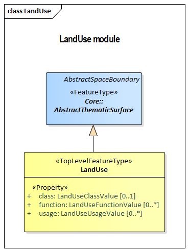

[[rc_land-use_section]]
=== Land Use

include::requirements/requirements_class_landuse.adoc[]

NOTE: Content to be provided by TBD

The UML diagram of the Land Use Model is depicted in <<landuse-uml,Land Use UML Diagram>>. A detailed discussion of this Requirements Class can be found in the CityGML Best Practices document https://github.com/opengeospatial/CityGML3-Workspace/blob/master/19-072BP.html#bp_landuse_section[here].

[[landuse-uml]]
.UML diagram of the Land Use Model.

include::data-dictionaries/LandUse.adoc[]

==== Additional Information

The following sections provide additional information which may not be readily available through the UML Model.

