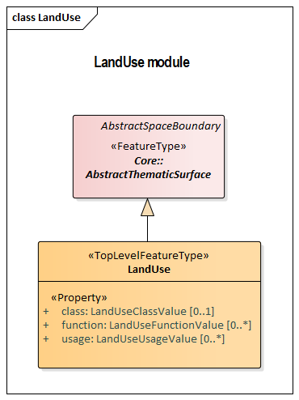

[[rc_land-use_section]]
=== Land Use

include::requirements/requirements_class_landuse.adoc[]

The LandUse module defines objects that can be used to describe areas of the earth’s surface dedicated to a specific land use or having a specific land cover with or without vegetation, such as sand, rock, mud flats, forest, grasslands, or wetlands (i.e. the physical appearance). Land use and land cover are different concepts; the first describes human activities on the earth’s surface, the second describes its physical and biological cover. However, the two concepts are interlinked and often mixed in practice. Land use objects in CityGML support both concepts: They can be employed to represent parcels, spatial planning objects, recreational objects and objects describing the physical characteristics of an area in 3D.
Land use objects are represented in the UML model by the top-level feature type _LandUse_, which is also the only class of the LandUse module.

The UML diagram of the LandUse module is depicted in <<landuse-uml,Land Use UML Diagram>>. A detailed discussion of this Requirements Class can be found in the  https://github.com/opengeospatial/CityGML3-Workspace/blob/master/19-072UG.html#bp_landuse_section[CityGML User Guide].

[[landuse-uml]]
.UML diagram of the Land Use Model.

==== Requirements

include::requirements/LandUse/REQ_LandUse_Classes.adoc[]

==== Class Definitions

include::summaries/LandUse.adoc[]

