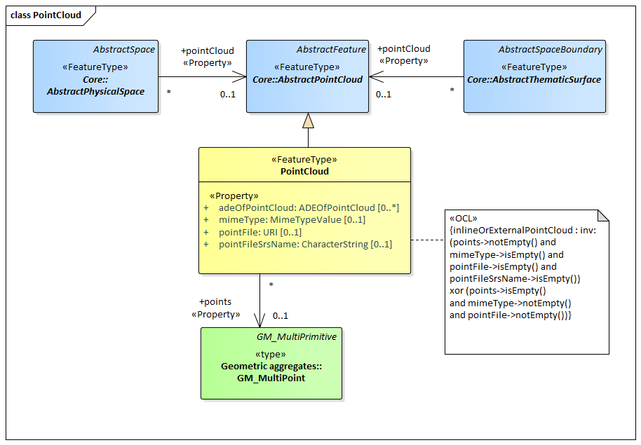

[[rc_pointcloud_section]]
=== Point Cloud

include::requirements/requirements_class_pointcloud.adoc[]

The PointCloud module offers the possibility to provide the geometry of physical spaces and of thematic surfaces by 3D point clouds. In this way, the building hull, a room within a building or a single wall surface can be spatially represented by a point cloud only. The same applies to all other thematic feature types including transportation objects, vegetation, city furniture, etc. Point clouds can either be provided inline within a CityGML file or as reference to external point cloud files of common file types such as LAS or LAZ.
Point clouds are represented in the UML model by the feature type _PointCloud_, which is also the only class of the PointCloud module.

The UML diagram of the PointCloud module is depicted in <<pointcloud-uml,Point Cloud UML Diagram>>. A detailed discussion of this Requirements Class can be found in the CityGML Best Practices document https://github.com/opengeospatial/CityGML3-Workspace/blob/master/19-072BP.html#bp_pointcloud_section[here].

[[pointcloud-uml]]
.UML diagram of the Point Cloud Model.

include::data-dictionaries/PointCloud.adoc[]

==== Additional Information

The following sections provide additional information which may not be readily available through the UML Model.
