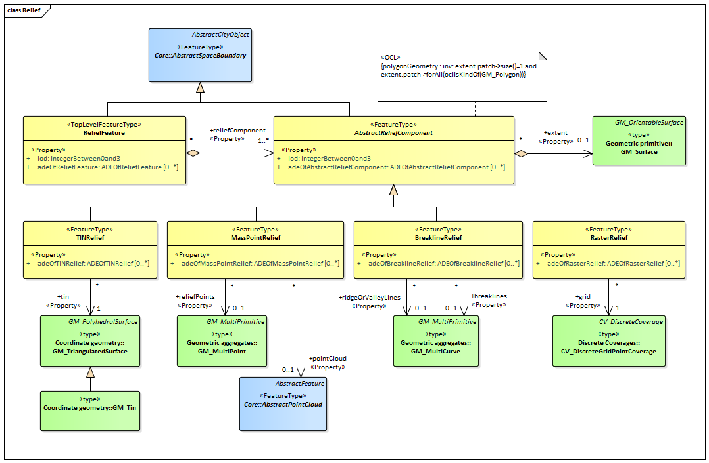

[[rc_relief_section]]
=== Digital Terrain Model

include::requirements/requirements_class_relief.adoc[]

The Relief module provides the representation of terrain which is an essential part of city models. In CityGML, the terrain is modelled by relief features. They are represented in the UML model by the top-level feature type _ReliefFeature_, which is the main class of the Relief module.
The relief features, in turn, are collections of relief components that describe the Earth's surface, a.k.a. the Digital Terrain Model. The relief components can have different terrain representations which can coexist. Each relief component may be specified as a regular raster or grid, as a TIN (Triangulated Irregular Network), by break lines, or by mass points. In addition, the validity of the relief components may be restricted to certain areas.

The UML diagram of the Relief module is depicted in <<relief-uml,Relief UML Diagram>>. A detailed discussion of this Requirements Class can be found in the CityGML Best Practices document https://github.com/opengeospatial/CityGML3-Workspace/blob/master/19-072BP.html#bp_relief_section[here].

[[relief-uml]]
.UML diagram of Relief module.

==== Requirements

include::requirements/Relief/REQ_Relief_Classes.adoc[]

==== Class Definitions

include::summaries/Relief.adoc[]

==== Additional Information

The following sections provide additional information which may not be readily available through the UML Model.
