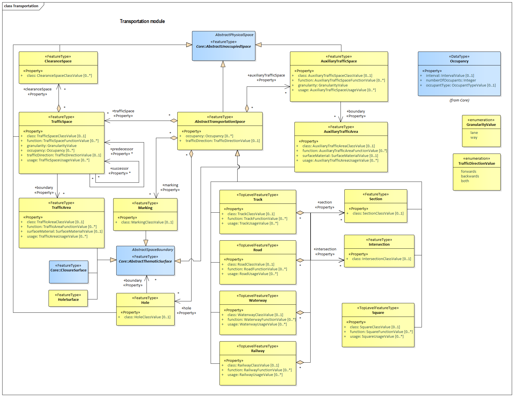

[[rc_transportation_section]]
=== Transportation

include::requirements/requirements_class_transportation.adoc[]

NOTE: Content to be provided by TBD

The UML diagram of the Transportation Model is depicted in <<transportation-uml,Transportation UML Diagram>>. A detailed discussion of this Requirements Class can be found in the CityGML Best Practices document https://github.com/opengeospatial/CityGML3-Workspace/blob/master/19-072BP.html#bp_transportation_section[here].

[[transportation-uml]]
.UML diagram of the Transportation Model.

include::data-dictionaries/Transportation.adoc[]

==== Additional Information

The following sections provide additional information which may not be readily available through the UML Model

