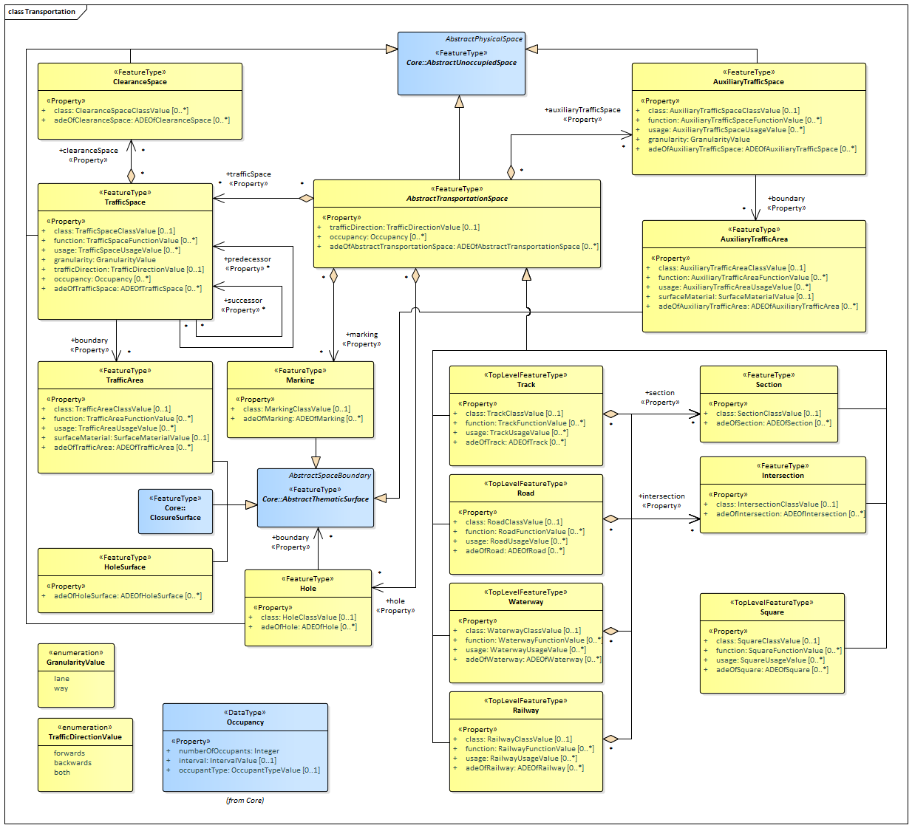

[[rc_transportation_section]]
=== Transportation

include::requirements/requirements_class_transportation.adoc[]

The Transportation module defines central elements of the traffic infrastructure. This includes the transportation objects road, track, and square for the movement of vehicles, bicycles, and pedestrians, the transportation object railway for the movement of wheeled vehicles on rails, as well as the transportation object waterway for the movement of vessels upon or within water bodies.
The transportation objects are represented in the UML model by the top-level feature types _Road_, _Track_, _Square_, _Railway_, and _Waterway_, which are the main classes of the Transportation module. Transportation objects can be subdivided into sections, which can be regular road, track or railway legs, into intersection areas, and into roundabouts.

For each transportation object, traffic spaces and auxiliary traffic spaces can be provided, which are bounded at the bottom by traffic areas and auxiliary traffic areas, respectively. Traffic areas are elements that are important in terms of traffic usage, such as driving lanes, sidewalks, and cycle lanes, whereas auxiliary traffic areas describe further elements, such as kerbstones, middle lanes, and green areas. The corresponding spaces define the free space above the areas. In addition, each traffic space can have an optional clearance space. The transportation objects can be represented in different levels of granularity, either as a single area, split up into individual lanes or even decomposed into individual (carriage)ways. Furthermore, holes in the surfaces of roads, tracks or squares, such as road damages, manholes or drains, can be represented including their corresponding boundary surfaces. In addition, markings for the structuring or restriction of traffic can be added to the transportation areas. Examples are road markings and markings related to railway or waterway traffic.

The UML diagram of the Transportation module is depicted in <<transportation-uml,Transportation UML Diagram>>. A detailed discussion of this Requirements Class can be found in the  https://github.com/opengeospatial/CityGML3-Workspace/blob/master/19-072UG.html#bp_transportation_section[CityGML Users Guide].

[[transportation-uml]]
.UML diagram of the Transportation Model.

==== Requirements

include::requirements/Transportation/REQ_Transportation_Classes.adoc[]

==== Class Definitions

include::summaries/Transportation.adoc[]

