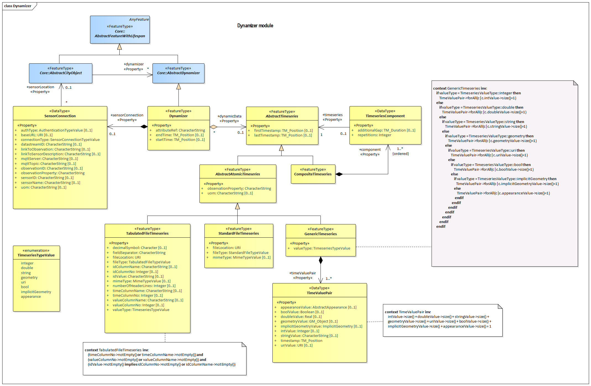

[[rc_dynamizer_section]]
=== Dynamizer

include::requirements/requirements_class_dynamizer.adoc[]

TBD

The UML diagram of the Dynamizer Model is depicted in <<dynamizer-uml,Dynamizer UML Diagram>>. The Data Dictionary for the Dynamizer Package is provided in section <<Dynamizer-dd,Dynamizer Data Dictionary>>.

[[dynamizer-uml]]
.UML diagram of the Dynamizer Model.

The <<dynamizer-uml>> is color coded as follows:

[cols="2,6"]
|====
|Yellow |indicates
|Blue |indicates
|Pink |indicates
|====

include::data-dictionaries/Dynamizer.adoc[]

==== Additional Information

The following sections provide additional information which may not be readily available through the UML Model.

A detailed discussion of this Requirements Class can be found in the CityGML Best Practices document https://github.com/opengeospatial/CityGML3-Workspace/blob/master/19-072BP.html#bp_dynamizer_section[here].

