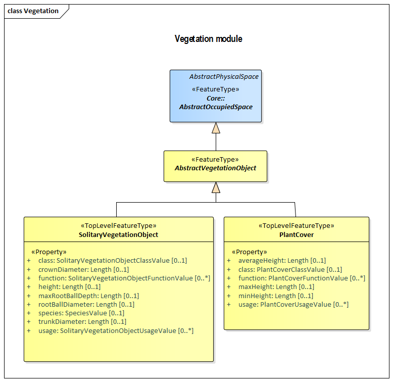

[[rc_vegetation_section]]
=== Vegetation

include::requirements/requirements_class_vegetation.adoc[]

Vegetation consists of trees, bushes, and ground-covering plants. Vegetation is represented in two ways: as models of individual solitary plants and as models of areas covered by plants of a given species. Attributes allow the specialization of vegetation models to have individual sizes, intended and actual uses, and other properties.

The UML diagram of the Vegetation Model is depicted in <<vegetation-uml,Vegetation UML Diagram>>. A detailed discussion of this Requirements Class can be found in the CityGML Best Practices document https://github.com/opengeospatial/CityGML3-Workspace/blob/master/19-072BP.html#bp_vegetation_section[here].

[[vegetation-uml]]
.UML diagram of the Vegetation Model.

include::data-dictionaries/Vegetation.adoc[]

==== Additional Information

The following sections provide additional information which may not be readily available through the UML Model.

