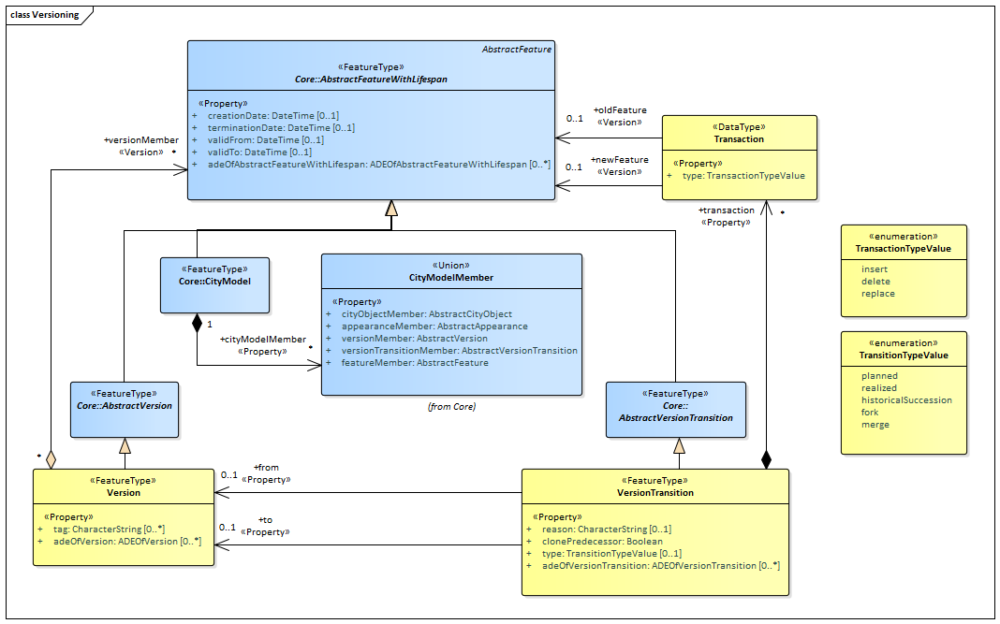

[[rc_versioning_section]]
=== Versioning

include::requirements/requirements_class_versioning.adoc[]

The Versioning module provides the concepts that allow for representing multiple versions of a city model. A specific version represents a defined state of a city model consisting of the dedicated versions of all city object instances that belong to the respective city model version. Each version can be complemented by version transitions that describe the change of the state of a city model from one version to another and that give the reason for the change and the modifications applied. In addition, the Versioning module introduces bitemporal timestamps for all objects. This allows for providing all objects with information on the time period a specific version of an object is an integral part of the 3D city model and on the lifespan a specific version of an object exists in the real world.

By using the Versioning module, slow changes over a long time period with respect to cities and city models can be represented. This includes the creation and termination of objects (e.g. construction or demolition of sites, planting of trees, construction of new roads), structural changes of objects (e.g. raising of buildings), and changes in the status of an object (e.g. change of building owner, change of the traffic direction of a road to a one-way street).
In this way, the history or evolution of cities and city models can be modelled, parallel or alternative versions of cities and city models can be managed, and changes of geometries and thematic properties of individual city objects over time can be tracked.

The UML diagram of the Versioning module is depicted in <<versioning-uml,Versioning UML Diagram>>. A detailed discussion of this Requirements Class can be found in the  https://github.com/opengeospatial/CityGML3-Workspace/blob/master/19-072UG.html#bp_versioning_section[CityGML User Guide].

[[versioning-uml]]
.UML diagram of the Versioning Model.

==== Requirements

include::requirements/Versioning/REQ_Versioning_Classes.adoc[]

==== Class Definitions

include::summaries/Versioning.adoc[]

