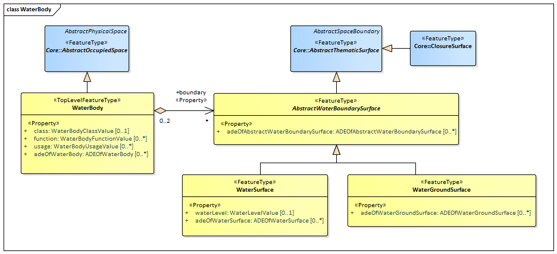

[[rc_waterbody_section]]
=== Water Body

include::requirements/requirements_class_waterbody.adoc[]

The WaterBody module provides the representation of significant and permanent or semi-permanent accumulations of surface water, usually covering a part of the Earth. Examples of such water bodies that can be modelled with CityGML are rivers, canals, lakes, and basins.
Water bodies are represented in the UML model by the top-level feature type _WaterBody_, which is the main class of the WaterBody module.

Water bodies can be bounded by water surfaces, which represent the upper exterior interface between the water body and the atmosphere, and by water ground surfaces, which represent the exterior boundary surfaces of the submerged bottom of a water body (e.g. DTM or floor of a 3D basin object).
Water surfaces are dynamic surfaces, thus, the visible water surface can regularly as well as irregularly change in height and covered area due to natural forces such as tides and floods.

The UML diagram of the WaterBody module is depicted in <<waterbody-uml,Water Body UML Diagram>>. A detailed discussion of this Requirements Class can be found in the CityGML Best Practices document https://github.com/opengeospatial/CityGML3-Workspace/blob/master/19-072BP.html#bp_waterbody_section[here].

[[waterbody-uml]]
.UML diagram of the Water Body Model.

include::summaries/WaterBody.adoc[]

==== Additional Information

The following sections provide additional information which may not be readily available through the UML Model.
