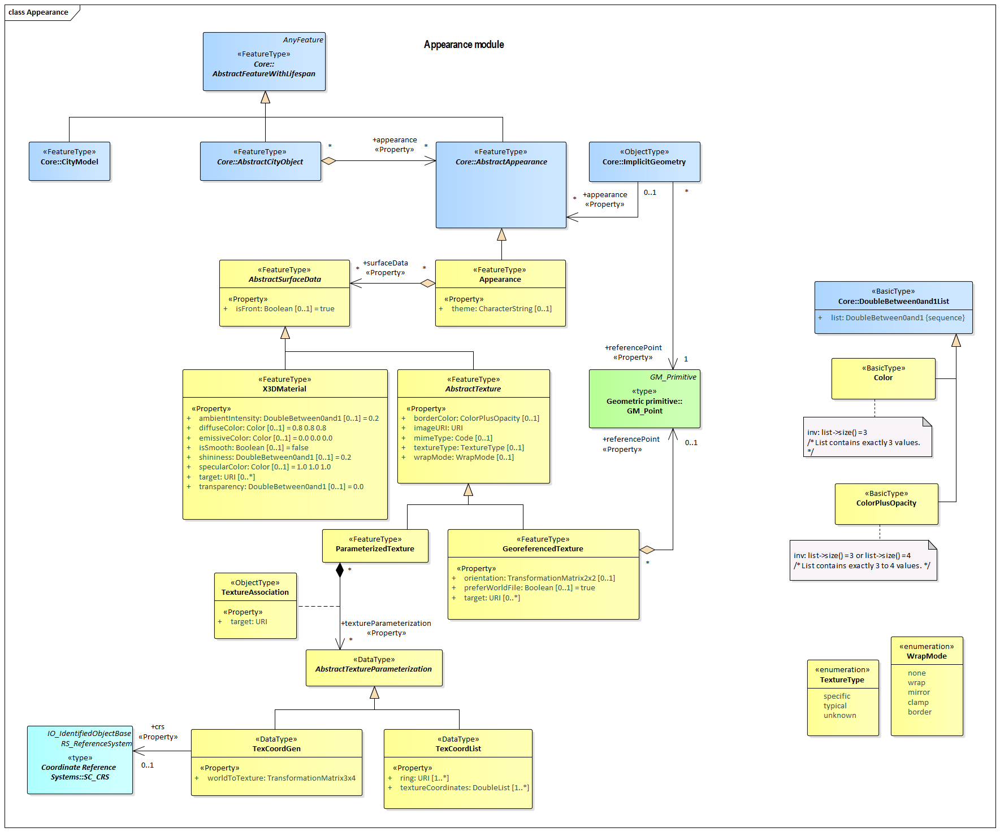

[[rc_appearance_section]]
=== Appearance

include::requirements/requirements_class_appearance.adoc[]

The Appearance module provides the representation of surface data, i.e. observable properties for surface geometry objects in the form of textures and material.
Appearances are not limited to visual data but represent arbitrary categories called themes such as infrared radiation, noise pollution, or earthquake-induced structural stress. A single surface geometry object may have surface data for multiple themes. Similarly, surface data can be shared by multiple surface geometry objects (e.g. road paving).

Surface data that is constant across a surface is modelled as material based on the material definitions from the standards X3D and COLLADA.
Surface data that depends on the exact location within the surface is modelled as texture.
This can either be a parameterized texture, i.e. a texture that uses texture coordinates or a transformation matrix for parameterization, or a georeferenced texture, i.e. a texture that uses a planimetric projection.
Each surface geometry object can have both, a material and a texture per theme and side. This allows for providing a constant approximation and a complex measurement of a surface’s property simultaneously.

The UML diagram of the Appearance module is illustrated in <<appearance-uml,Appearance UML Diagram>>. A detailed discussion of this Requirements Class can be found in the CityGML Best Practices document https://github.com/opengeospatial/CityGML3-Workspace/blob/master/19-072BP.html#bp_appearance_section[here].

[[appearance-uml]]
.UML diagram of CityGML’s appearance model.

include::data-dictionaries/Appearance.adoc[]

==== Additional Information

The following sections provide additional information which may not be readily available through the UML Model.
