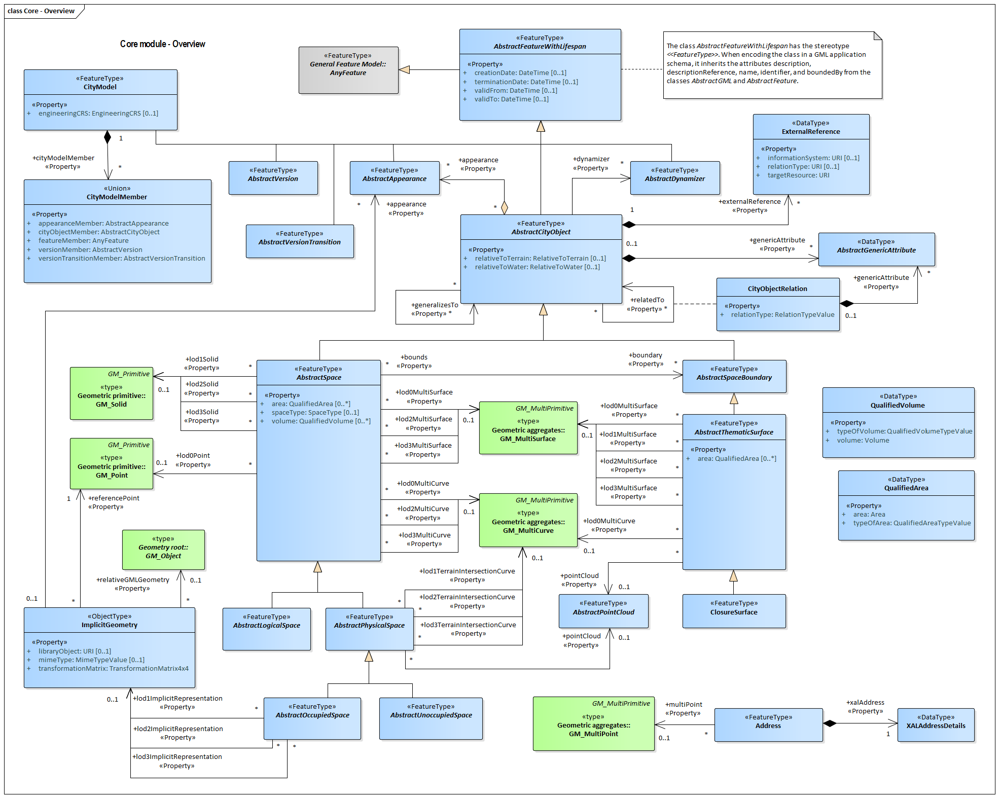

[[rc_core_section]]
=== Core

include::requirements/requirements_class_core.adoc[]

The CityGML Core module defines the basic concepts and components of the overall CityGML data model.  It forms the universal lower bound of the CityGML data model and, thus, is a dependency of all extension modules. Consequently, the core module has to be implemented by any conformant system. Primarily, the core module provides the abstract base classes from which thematic classes within extension modules are (transitively) derived. Besides abstract type definitions, the core also contains non-abstract content, for example basic data types and thematic classes that may be used by more than one extension module. The UML diagram in Fig. 21 illustrates CityGML’s core module, for the XML Schema definition see below and annex A.1.

The UML diagram of the CityGML Core is depicted in <<core-uml,Core UML Diagram>>. A detailed discussion of this Requirements Class can be found in the CityGML Best Practices document https://github.com/opengeospatial/CityGML3-Workspace/blob/master/19-072BP.html#bp_core_section[here].

[[core-uml]]
.UML diagram of CityGML’s core module.

include::data-dictionaries/Core.adoc[]

==== Additional Information

The following sections provide additional information which may not be readily available through the UML Model.

