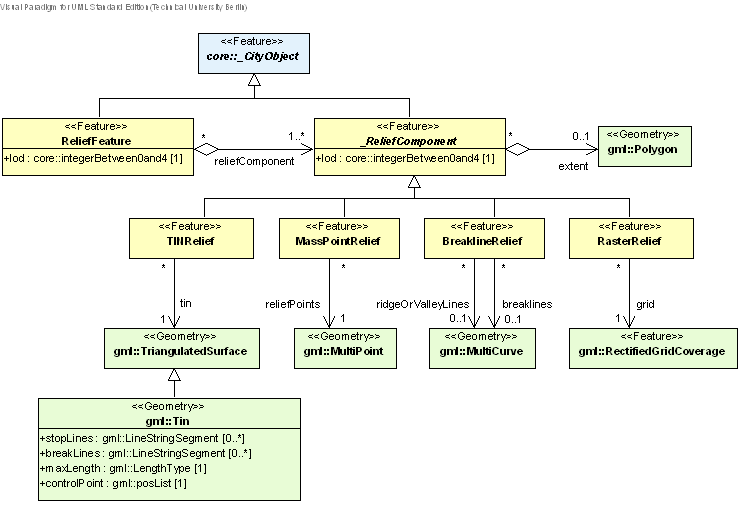

[[bp_relief]]
=== Digital Terrain Model

include::requirements/requirements_class_relief.adoc[]

An essential part of a city model is the terrain. The Digital Terrain Model (DTM) of CityGML is provided by the thematic extension module Relief (cf. chapter 7). In CityGML, the terrain is represented by the class ReliefFea-ture in LOD 0-4 (Fig. 24 depicts the UML diagram, for the XML schema definition see annex A.9). A Re-liefFeature consists of one or more entities of the class ReliefComponent. Its validity may be restricted to a certain area defined by an optional validity extent polygon. As ReliefFeature and ReliefComponent are deriva-tives of _CityObject, the corresponding attributes and relations are inherited. The class ReliefFeature is associat-ed with different concepts of terrain representations which can coexist. The terrain may be specified as a regular raster or grid (RasterRelief), as a TIN (Triangulated Irregular Network, TINReflief), by break lines (BreaklineRe-lief), or by mass points (MasspointRelief). The four types are implemented by the corresponding GML3 classes: grids by gml:RectifiedGridCoverage, break lines by gml:MultiCurve, mass points by gml:MultiPoint and TINs either by gml:TriangulatedSurface or by gml:Tin. In case of gml:TriangulatedSurfaces, the triangles are given explicitly while in case of gml:Tin only 3D points are represented, where the triangulation can be reconstructed by standard methods (Delaunay triangulation, cf. Okabe et al. 1992). Break lines are represented by 3D curves. Mass points are simply a set of 3D points.

[[figure-24]]
.UML diagram of the Digital Terrain Model in CityGML. Prefixes are used to indicate XML namespaces associated with model elements. Element names without a prefix are defined within the CityGML Relief module.

==== Relief feature and relief component

===== ReliefFeatureType, ReliefFeature

NOTE: insert ReliefFeatureType, ReliefFeature UML

===== AbstractReliefComponentType, _ReliefComponent

NOTE: insert AbstractReliefComponentType, _ReliefComponent UML

==== TIN relief

===== TINReliefType, TINRelief

NOTE: insert TINReliefType, TINRelief UML

The geometry of a TINRelief is defined by the GML geometry class gml:TriangulatedSurface. This allows either the explicit provision of a set of triangles (gml:TriangulatedSurface) or specifying of only the control points, break and stop lines using the subclass gml:Tin of gml:TriangulatedSurface. In the latter case, an application that processes an instance document containing a gml:Tin has to reconstruct the triangulated surface by the applica-tion of a constrained Delaunay triangulation algorithm (cf. Okabe et al. 1992).

==== Raster relief

===== RasterReliefType, RasterRelief, Elevation

NOTE: insert RasterReliefType, RasterRelief, Elevation UML

==== Mass point relief

===== MassPointReliefType, MassPointRelief

NOTE: insert MassPointReliefType, MassPointRelief UML

==== Breakline relief

===== BreaklineReliefType, BreaklineRelief

NOTE: insert BreaklineReliefType, BreaklineRelief UML

The geometry of a BreaklineRelief can be composed of break lines and ridge/valley lines. Whereas break lines indicate abrupt changes of terrain slope, ridge/valley lines in addition mark a change of the sign of the terrain slope gradient. A BreaklineRelief must have at least one of the two properties.

include::requirements/Relief/REQ_Relief_Base.adoc[]

include::requirements/Relief/REQ_Relief_RefIntegrity.adoc[]

