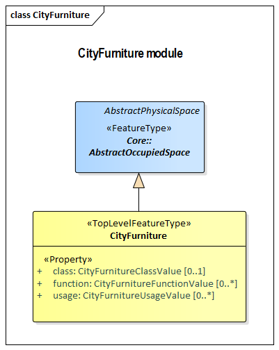

[[rc_City-Furniture_section]]
=== City Furniture Model

City furniture is a semantic category which consists of relatively small objects that usually have a stereotypical form. City furniture functions to decorate, explain, or control outdoor environments. Examples include road signs, traffic signals, bicycle racks, fountains, and benches.

include::requirements/requirements_class_cityfurniture.adoc[]

The UML diagram of the City Furniture model is depicted in the <<cityfurniture-uml,City Furniture UML Diagram>>. A detailed discussion of this Requirements Class can be found in the CityGML Best Practices document https://github.com/opengeospatial/CityGML3-Workspace/blob/master/19-072BP.html#bp_city-furniture_section[here].

[[cityfurniture-uml]]
.UML diagram of CityGML’s city furniture model.

include::data-dictionaries/CityFurniture.adoc[]

==== Additional Information

The following sections provide additional information which may not be readily available through the UML Model.

