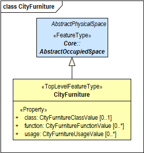

[[rc_City-Furniture_section_new]]
=== Module City Furniture new 1

include::requirements/requirements_class_cityfurniture_new.adoc[]

==== Introduction and UML model

The CityFurniture module provides the representation of objects or pieces of equipment that are installed in the outdoor environment for various purposes, such as decoration, explanation or control. City furniture objects are relatively small, immovable objects and usually are of stereotypical form. Examples include road signs, traffic signals, bicycle racks, street lamps, fountains, flower buckets, advertising columns, and benches.
City furniture is represented in the UML model by the top-level feature type _CityFurniture_, which is also the only class of the CityFurniture module.

The UML diagram of the CityFurniture module is depicted in the <<cityfurniture-uml_new,City Furniture UML Diagram>>. A detailed discussion of this Requirements Class can be found in the CityGML Best Practices document https://github.com/opengeospatial/CityGML3-Workspace/blob/master/19-072BP.html#bp_city-furniture_section[here].

[[cityfurniture-uml_new]]
.UML diagram of CityGML’s city furniture model.

[[req_CityFurniture_new]]
|===
|{set:cellbgcolor:#ccf2ff} *Requirement /req/CityFurniture/CityFurniture*
|The CityFurniture Requirements Class classes shown in yellow in Figure <<cityfurniture-uml_new,City Furniture UML Diagram>> shall be provided by the encoding in a manner consistent with the encoding.
|===

include::data-dictionaries/CityFurniture_new.adoc[]

==== Additional Information

The following sections provide additional information which may not be readily available through the UML Model.
