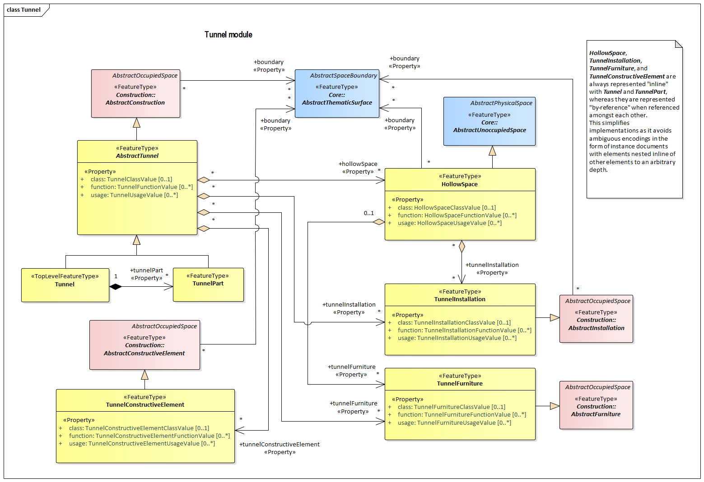

[[rc_tunnel_section]]
=== Tunnel

include::requirements/requirements_class_tunnel.adoc[]

TBD

The UML diagram of the Tunnel Model is depicted in <<tunnel-uml,Tunnel UML Diagram>>. The Data Dictionary for the Tunnel Package is provided in section <<Tunnel-dd,Tunnel Model Data Dictionary>>.

[[tunnel-uml]]
.UML diagram of the Tunnel Model.

The <<tunnel-uml>> is color coded as follows:

[cols="2,6"]
|====
|Yellow |indicates
|Blue |indicates
|Pink |indicates
|====

include::data-dictionaries/Tunnel.adoc[]

==== Additional Information

The following sections provide additional information which may not be readily available through the UML Model.

A detailed discussion of this Requirements Class can be found in the CityGML Best Practices document https://github.com/opengeospatial/CityGML3-Workspace/blob/master/19-072BP.html#bp_tunnel_section[here].

==== Requirements

include::requirements/Tunnel/REQ_Tunnel_Base.adoc[]

include::requirements/Tunnel/REQ_Tunnel_RefIntegrity.adoc[]

include::requirements/Tunnel/REQ_Tunnel_Restrictions.adoc[]

