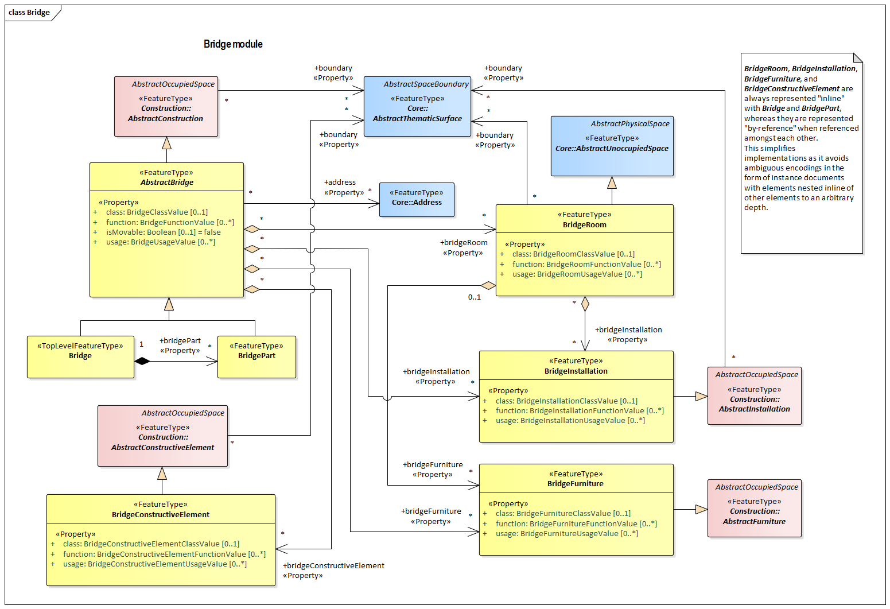

[[rc_bridge-model_section]]
=== Bridge Model

include::requirements/requirements_class_bridge.adoc[]

TBD

The UML diagram of the Bridge Model is depicted in <<bridge-uml,Bridge UML Diagram>>. The Data Dictionary for the Bridge Model Package is provided in section <<Bridge-dd,Bridge Model Data Dictionary>>.

[[bridge-uml]]
.UML diagram of the Bridge Model.

The <<bridge-uml>> is color coded as follows:

[cols="2,6"]
|====
|Yellow |indicates
|Blue |indicates
|Pink |indicates
|====

include::data-dictionaries/Bridge.adoc[]

==== Additional Information

The following sections provide additional information which may not be readily available through the UML Model.

A detailed discussion of this Requirements Class can be found in the CityGML Best Practices document https://github.com/opengeospatial/CityGML3-Workspace/blob/master/19-072BP.html#bp_bridge-model_section[here].

