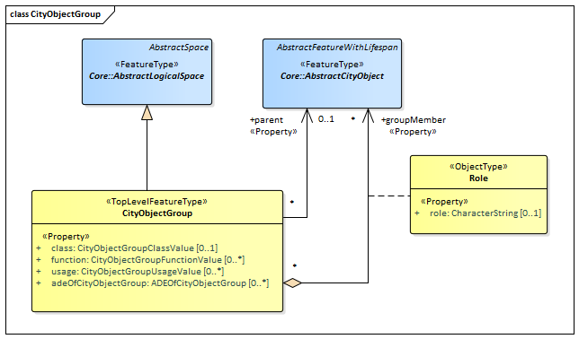

[[rc_city-object-group_section]]
=== City Object Group

include::requirements/requirements_class_cityobjectgroup.adoc[]

The CityObjectGroup module provides the application-specific aggregation of city objects according to some user-defined criteria. Examples for groups are the buildings in a specific region, the result of a query, or objects put together for visualization purposes. Each member of a group may be qualified by a role name, reflecting the role each city object plays in the context of the group.
City object groups are represented in the UML model by the top-level feature type _CityObjectGroup_, which is the main class of the CityObjectGroup module.

City object groups can be linked to other city objects, the so-called parent objects, which allows for modelling a generic hierarchical grouping concept. In addition, as city object groups represent city objects themselves, a group may become a member of another group realizing recursive aggregation in this way.

The UML diagram of the CityObjectGroup module is depicted in <<cityobject-uml,City Object Group UML Diagram>>. A detailed discussion of this Requirements Class can be found in the CityGML Best Practices document https://github.com/opengeospatial/CityGML3-Workspace/blob/master/19-072BP.html#bp_city-object-group_section[here].

[[cityobject-uml]]
.UML diagram of the City Object Group Model.

include::data-dictionaries/CityObjectGroup.adoc[]

==== Additional Information

The following sections provide additional information which may not be readily available through the UML Model.
