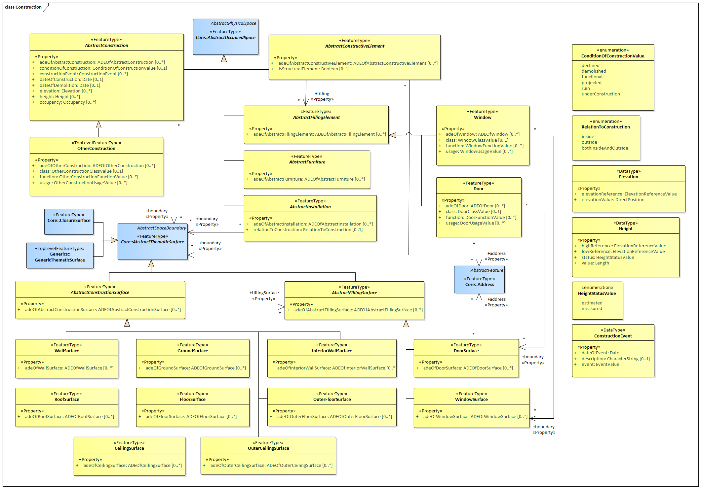

[[rc_construction_section]]
=== Construction

include::requirements/requirements_class_construction.adoc[]

The Construction module defines concepts that are common to all kinds of constructions. Constructions are objects that are manufactured by humans from construction materials, are connected to earth and are intended to be permanent. The Construction module focuses on as-built representations of constructions and integrates all concepts that are similar over different types of constructions, in particular buildings, bridges, and tunnels. In addition, for representing man-made structures that are neither buildings, nor bridges, nor tunnels so-called other constructions (e.g. large chimneys or city walls) can be defined.

Furniture, installations, and constructive elements are further concepts that are defined in the Construction module. Installations are permanent parts of a construction that strongly affect the outer or inner appearance of the construction and that cannot be moved (e.g. balconies, chimneys, or stairs), whereas furniture represent moveable objects of a construction (e.g. tables and chairs). Constructive elements allow for decomposing a construction into volumetric components, such as walls, beams, and slabs.
Constructions and constructive elements can be bounded by different types of surfaces. In this way, the outer structure of constructions and constructive elements can be differentiated semantically into wall surfaces, roof surfaces, ground surfaces, outer floor surfaces, and outer ceiling surfaces, whereas the visible surface of interior spaces can be structured into interior wall surfaces, floor surfaces, and ceiling surfaces.
Furthermore, the openings of constructions, i.e. windows and doors, can be represented as so-called filling elements including their corresponding filling surfaces.

The UML diagram of the Construction module is depicted in <<construction-uml,Construction UML Diagram>>.
The Contruction module defines concepts that are inherited and, where necessary, are specialized by the modules Building, Bridge, and Tunnel  (cf. sections <<rc_building-model_section, Building>>, <<rc_bridge-model_section, Bridge>>, and <<rc_tunnel_section, Tunnel>>).
A detailed discussion of the Requirements Class Construction can be found in the CityGML Best Practices document https://github.com/opengeospatial/CityGML3-Workspace/blob/master/19-072BP.html#bp_construction_section[here].

[[construction-uml]]
.UML diagram of the Construction Model.

include::data-dictionaries/Construction.adoc[]

==== Additional Information

The following sections provide additional information which may not be readily available through the UML Model.
