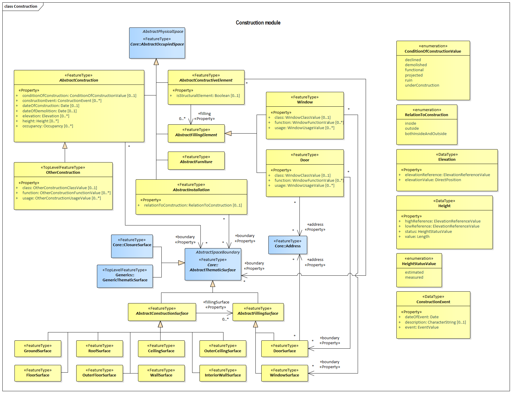

[[rc_construction_section]]
=== Construction

include::requirements/requirements_class_construction.adoc[]

NOTE: Content to be provided by TBD

The UML diagram of the Construction Model is depicted in <<construction-uml,Construction UML Diagram>>. A detailed discussion of this Requirements Class can be found in the CityGML Best Practices document https://github.com/opengeospatial/CityGML3-Workspace/blob/master/19-072BP.html#bp_construction_section[here].

[[construction-uml]]
.UML diagram of the Construction Model.

include::data-dictionaries/Construction.adoc[]

==== Additional Information

The following sections provide additional information which may not be readily available through the UML Model.

