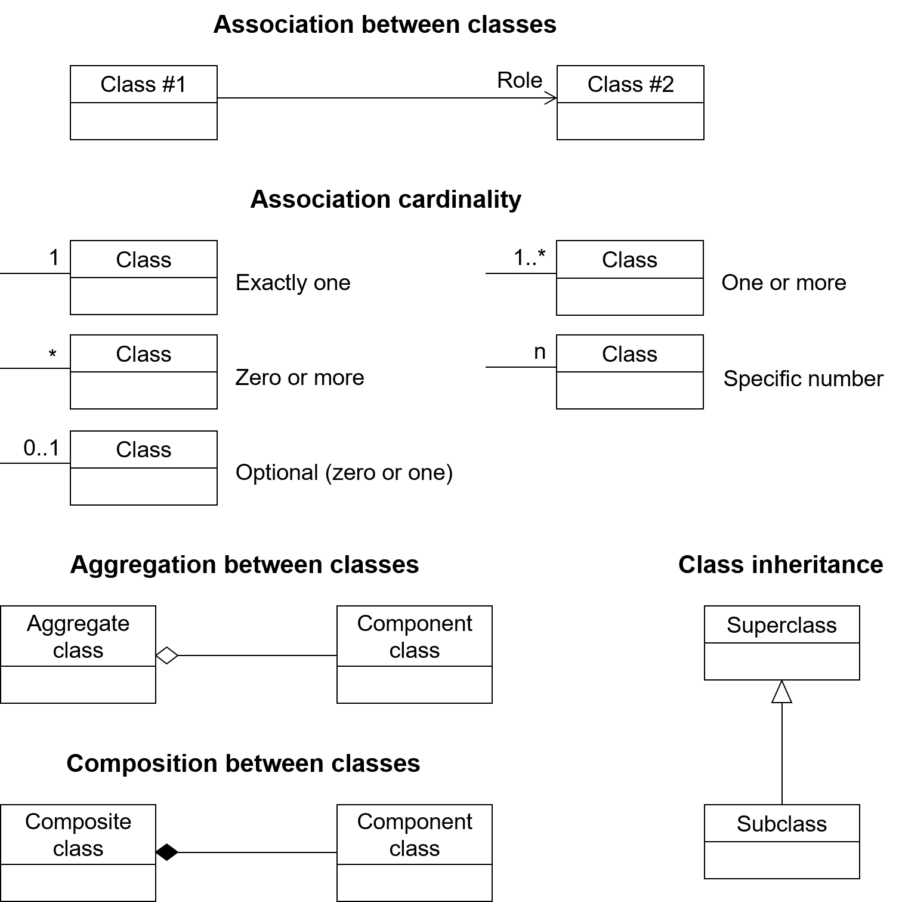
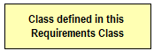
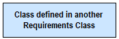
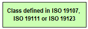
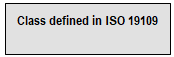
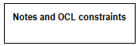
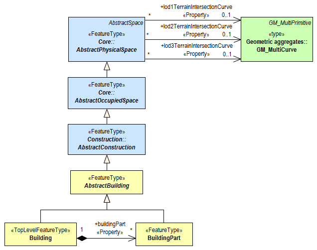

[[conventions-section]]
== Conventions

=== Identifiers
The normative provisions in this document are denoted by the URI

http://www.opengis.net/spec/CityGML-1/3.0

All requirements and conformance tests that appear in this document are denoted by partial URIs which are relative to this base.

[[uml_notation_section]]
=== UML Notation

The CityGML standard is presented in this document in diagrams using the Unified Modeling Language (UML) static structure diagram (see Booch et al. 1997). The UML notations used in this standard are described in the diagram below.

[[figure-1]]
.UML notation (see ISO TS 19103, Geographic information - Conceptual schema language).

All associations between model elements in CityGML are uni-directional. Thus, associations in CityGML are navigable in only one direction. The direction of navigation is depicted by an arrowhead. In general, the context an element takes within the association is indicated by its role. The role is displayed near the target of the association. If the graphical representation is ambiguous though, the position of the role has to be drawn to the element the association points to.

The following stereotypes are used in this model:

* &#171;ApplicationSchema&#187; denotes a conceptual schema for data required by one
 or more applications. In the CityGML conceptual model, every CityGML
module is defined as separate application schema to allow for
modularisation.
* &#171;FeatureType&#187; represents features that are similar and exhibit common characteristics. Features are abstractions of real-world phenomena and have an identity.
* &#171;TopLevelFeatureType&#187; denotes features that represent the main components of the conceptual model. Top-level features may be further semantically and spatially decomposed and substructured into parts.
* &#171;Type&#187; denotes classes that are not directly instantiable, but are used as an abstract collections of operation, attribute and relation signatures. The stereotype is used in the CityGML conceptual model only for classes that are imported from the ISO standards 19107, 19109, 19111, and 19123.
* &#171;ObjectType&#187; represents objects that have an identity, but are not features.
* &#171;DataType&#187; defines a set of properties that lack identity. A data type is a classifier with no operations, whose primary purpose is to hold information.
* &#171;Enumeration&#187; enumerates the valid attribute values in a fixed list of named literal values. Enumerations are specified in the CityGML schema.
* &#171;BasicType&#187; defines a basic data type.
* &#171;CodeList&#187; enumerates the valid attribute values. In contrast to Enumeration, the list of values is open and, thus, not given inline the CityGML UML Model. The allowed values can be provided within an external code list.
* &#171;Union&#187; is a list of attributes. The semantics are that only one of the attributes can be present at any time.
* &#171;Property&#187; denotes attributes and association roles. This stereotype does not add further semantics to the conceptual model, but is required to be able to add tagged values to the attributes and association roles that are relevant for the encoding.
* &#171;Version&#187; denotes that the value of an association role that ends at a feature type is a specific version of the feature, not the feature in general.

In order to enhance the readability of the CityGML UML diagrams, classes are depicted in different colors. The following coloring scheme is applied:

Classes painted in yellow belong to the Requirements Class which is subject of discussion in that clause of the specification in which the UML diagram is given. For example, in the context of chapter <<rc_core_section, Core>>, which introduces the _CityGML Core_ module, the yellow color is used to denote classes that are defined in the _CityGML Core_ Requirements Class. Likewise, the yellow classes shown in the UML diagram in chapter <<rc_building-model_section, Building>> are associated with the _Building_ Requirements Class that is subject of discussion in that chapter.

Classes painted in blue belong to a Requirements Class different to that associated with the yellow color. In order to explicitly denote to which Requirements Class these classes belong, their class names carry the name of the Requirements Class as prefix. For example, in the context of the _Building_ Requirements Class, classes from the _CityGML Core_ and the _Construction_ Requirements Classes are painted in blue and their class names are preceded by the prefix _Core_ and _Construction_, respectively.

Classes painted in green are defined in the ISO standards 19107, 19111, or 19123. Their class names are preceded by the UML package name, in which the classes are defined.

Classes painted in grey are defined in the ISO standard 19109. In the context of this standard this only applies to the class _AnyFeature_. _AnyFeature_ is an instance of the metaclass _FeatureType_ and acts as super class of all classes in the CityGML UML model with the stereotype &#171;FeatureType&#187;.

The color white is used for notes and OCL constraints that are provided in the UML diagrams.

The following example UML diagram demonstrates the UML notation and coloring scheme used throughout this specification. In this example, the yellow classes are associated with the _CityGML Building_ module, the blue classes are from the _CityGML Core_ and _Construction_ modules, and the green class depicts a geometry element defined by ISO 19107.

[[figure-2]]
.Example UML diagram demonstrating the UML notation and coloring scheme used throughout the CityGML specification.

[[conceptual-modeling-description]]
=== Conceptual Modeling

<<iso19101,ISO 19101>> defines universe of discourse to be a view of the real or hypothetical world that includes everything of interest.  That standard then defines conceptual model to be a model that defines concepts of a universe of discourse.

The scope of this CityGML Conceptual Model Standard establishes the limits of the universe of discourse for this Standard. The next task is to discover and standardize the concepts within this scope. CityGML will potentially support numerous diverse application software packages covering multiple disciplines and facility life cycle phases. Each conceivably can have its own universe of discourse and their own set of concepts.

The goal of this CityGML Conceptual Model Standard is to establish and document a common set of concepts that spans the applications supported.  This does not attempt to redefine application concepts, but merely present a common set of concepts from and to which their concepts can be understood and mapped.

GML and JSON encodings are planned and other encodings are anticipated. Each encoding addresses a specific information community and set of application software packages. However, with the increasing desire to share information between communities and applications having a common conceptual model across all of these encodings is highly advantageous.

An added benefit of the development of a conceptual model results from the rigor involved in achieving consensus. After numerous iterations, the end result is consistent, cohesive, and complete.  Updating a conceptual model is far easier than rewriting software code. Further, the iterations help to flesh out details as well as to unearth differences in individual conceptualizations.

Perhaps the greatest benefit of the standards activity is the ability to communicate the resultant model. This is in part due to using a standardized conceptual modelling language like UML and the agreed OGC and TC211 conventions for using UML. The eventual outcome of being able to provide formal documentation for what is meant by each concept is invaluable in understanding the subsequent encodings and applications.

This will be the first OGC conceptual model standard without accompanying encodings. Yet the model is presented in a manner consistent with the formalisms adopted for writing OGC standards. This standard follows the <<ogc08-131,OGC Specification Model standard for modular specifications>> and is consistent with the OGC Naming Authority conventions and recommendations.  The target of this Standard are the encoding standards which will follow and not the application software that will implement these encodings.  Requirements for the encodings are explicit and grouped into Requirements Classes.  Accompanying Conformance Classes are included to determine if an encoding conforms to the conceptual model.

UML has been used as the conceptual modeling language in this Standard.  Class Diagrams have been created and inserted as Figures. The boxes in these diagrams (officially “Classifiers” in UML) typically represent classes, data types, enumerations, code lists, unions, etc. and this terminology is used throughout the Standard. However, since this is a Conceptual Model, these should all be interpreted to be “concepts”.  For each Requirements Class, an introductory diagram is included which contains all of the concepts relevant to that Requirements Class.

Though redundant with the UML diagrams, all of the classes, class attributes, and associations are repeated in the <<data-dictionary-section,Data Dictionary>>. If these differ, the UML takes precedence.
