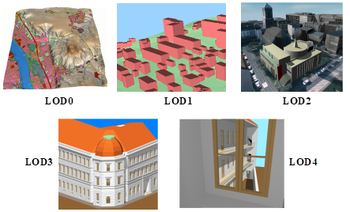
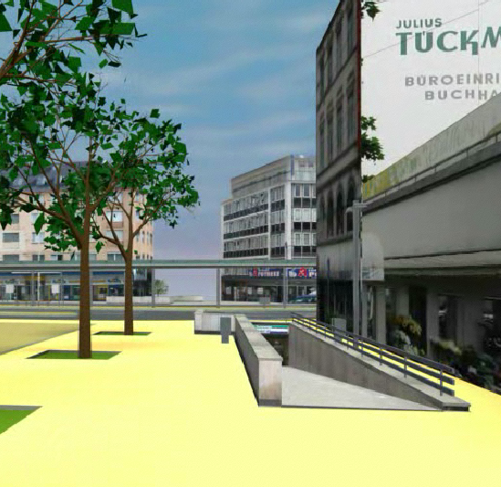
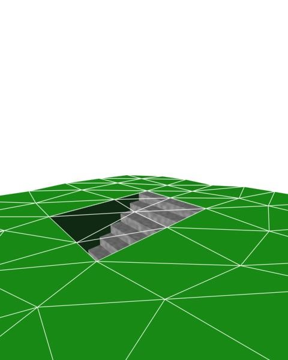
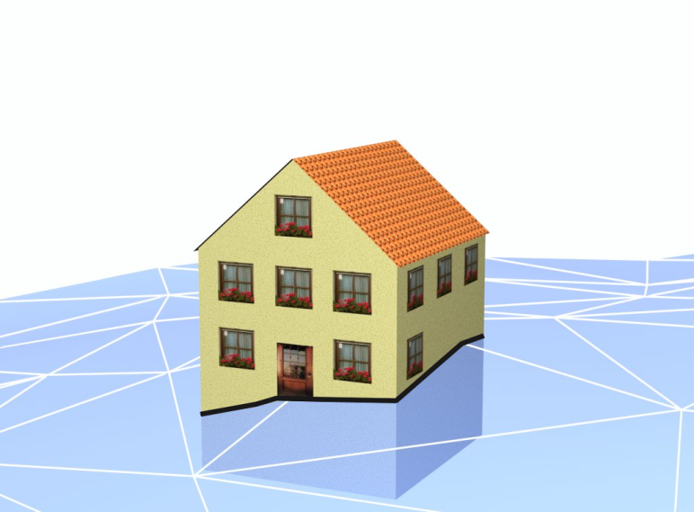
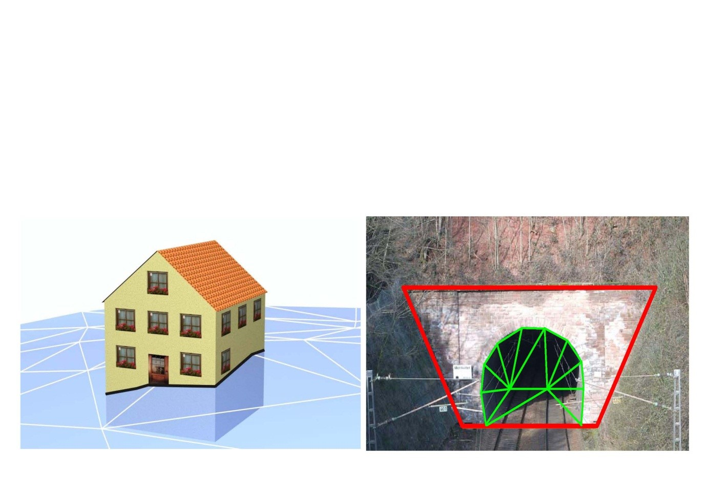
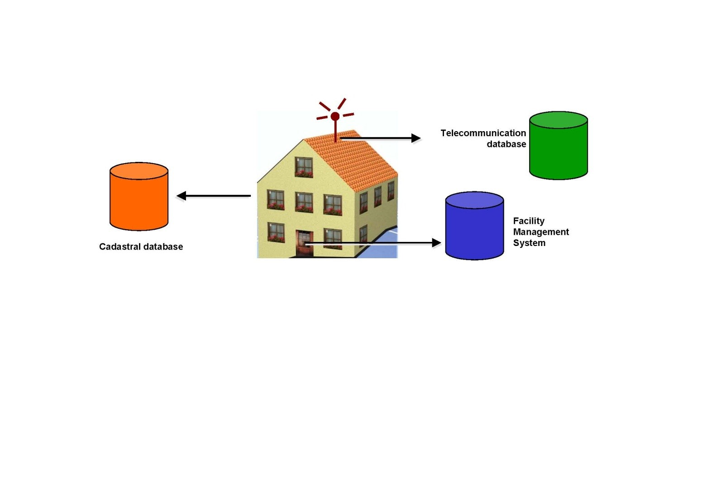
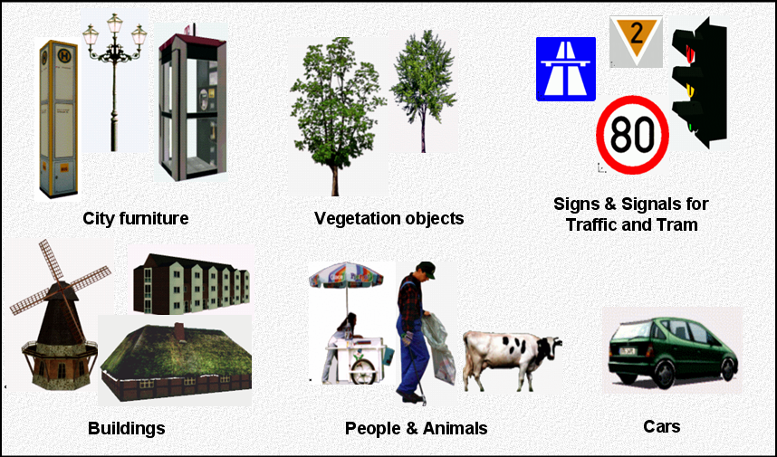

== General characteristics of CityGML

=== Modularisation

The CityGML data model consists of class definitions for the most important types of objects within virtual 3D city models. These classes have been identified to be either required or important in many different application areas. However, implementations are not required to support the overall CityGML data model in order to be conformant to the standard, but may employ a subset of constructs according to their specific information needs. For this purpose, modularisation is applied to the CityGML data model (cf. chapter 7).

The CityGML data model is thematically decomposed into a _core module_ and thematic _extension modules_. The core module comprises the basic concepts and components of the CityGML data model and, thus, must be implemented by any conformant system. Based on the core module, each extension covers a specific thematic field of virtual 3D city models. CityGML introduces the following thirteen thematic extension modules: __Appearance__, __Bridge__, __Building__, __CityFurniture__, __CityObjectGroup__, __Generics__, __LandUse__, __Relief__, __Transportation__, __Tunnel__, __Vegetation__, __WaterBody__, and _TexturedSurface_ [deprecated].

CityGML compliant implementations may support any combination of extension modules in conjunction with the core module. Such combinations of modules are called CityGML profiles. Therefore, CityGML profiles allow for valid partial implementations of the overall CityGML data model.

=== Multi-scale modelling (5 levels of detail, LOD)

CityGML supports different Levels of Detail (LOD). LODs are required to reflect independent data collection processes with differing application requirements. Further, LODs facilitate efficient visualisation and data analysis (see Fig. 3). In a CityGML dataset, the same object may be represented in different LOD simultaneously, enabling the analysis and visualisation of the same object with regard to different degrees of resolution. Furthermore, two CityGML data sets containing the same object in different LOD may be combined and integrated. However, it will be within the responsibility of the user or application to make sure objects in different LODs refer to the same real-world object.

The coarsest level LOD0 is essentially a two and a half dimensional Digital Terrain Model over which an aerial image or a map may be draped. Buildings may be represented in LOD0 by footprint or roof edge polygons. LOD1 is the well-known blocks model comprising prismatic buildings with flat roof structures. In contrast, a building in LOD2 has differentiated roof structures and thematically differentiated boundary surfaces. LOD3 denotes architectural models with detailed wall and roof structures potentially including doors and windows. LOD4 completes a LOD3 model by adding interior structures for buildings. For example, buildings in LOD4 are composed of rooms, interior doors, stairs, and furniture. In all LODs appearance information such as highresolution textures can be mapped onto the structures (cf. 6.9).

[[figure-3]]
.The five levels of detail (LOD) defined by CityGML (source: IGG Uni Bonn)

LODs are also characterised by differing accuracies and minimal dimensions of objects (cf. Tab. 3). The accura-cy requirements given in this standard are debatable and are to be considered as discussion proposals. Accuracy is described as standard deviation  of the absolute 3D point coordinates. Relative 3D point accuracy will be added in a future version of CityGML and it is typically much higher than the absolute accuracy. In LOD1, the positional and height accuracy of points should be 5m or less, while all objects with a footprint of at least 6m by 6m should be considered. The positional and height accuracy of LOD2 is proposed to be 2m or better. In this LOD, all objects with a footprint of at least 4m × 4m should be considered. Both types of accuracies in LOD3 should be 0.5m, and the minimal footprint is suggested to be 2m × 2m. Finally, the positional and height accura-cy of LOD4 should be 0.2m or less. By means of these figures, the classification in five LOD may be used to assess the quality of 3D city model datasets. The LOD categorisation makes datasets comparable and provides support for their integration.

[#citygml_lod_0_4,reftext='{table-caption} {counter:table-num}']
.LOD 0-4 of CityGML with their proposed accuracy requirements (discussion proposal, based on: Albert et al. 2003).
[width="90%",cols="^4,^2,^2,^2,^2,^2",options="header"]
|===
|
|**LOD0**
|**LOD1**
|**LOD2**
|**LOD3**
|**LOD4**
|Model scale description|regional, landscape |city, region |city, city districts, projects |city districts, architectural models (exterior), landmark |architectural models (interi-or), landmark
|Class of accuracy |lowest |low |middle |high |very high
|Absolute 3D point accuracy (position / height) |lower than LOD1 |5/5m |2/2m |0.5/0.5m |0.2/0.2m
|Generalisation |maximal generalisation |object blocks as generalised features; > 6*6m/3m |objects as generalised features; > 4*4m/2m |object as real features; > 2*2m/1m |constructive elements and openings are represented
|Building installations |no |no |yes |representative exterior features |real object form
|Roof structure/representation |yes |flat |differentiated roof structures |real object form |real object form
|Roof overhanging parts |yes |no |yes, if known |yes |yes
|CityFurniture |no |important objects |prototypes, generalized objects |real object form |real object form
|SolitaryVegetationObject |no |important objects |prototypes, higher 6m |prototypes, higher 2m |prototypes, real object form 
|PlantCover |no |>50*50m |>5*5m |< LOD2 |<LOD2
|…to be continued for the other feature themes || | | ||
|===

Whereas in CityGML each object can have a different representation for every LOD, often different objects from the same LOD will be generalised to be represented by an aggregate object in a lower LOD. CityGML supports the aggregation / decomposition by providing an explicit generalisation association between city objects (further details see UML diagram in chapter 10.1).

=== Coherent semantical-geometrical modelling

One of the most important design principles for CityGML is the coherent modelling of semantics and geomet-rical/topological properties. At the semantic level, real-world entities are represented by features, such as build-ings, walls, windows, or rooms. The description also includes attributes, relations and aggregation hierarchies (part-whole-relations) between features. Thus the part-of-relationship between features can be derived at the semantic level only, without considering geometry. However, at the spatial level, geometry objects are assigned to features representing their spatial location and extent. So the model consists of two hierarchies: the semantic and the geometrical in which the corresponding objects are linked by relationships (cf. Stadler & Kolbe 2007). The advantage of this approach is that it can be navigated in both hierarchies and between both hierarchies arbitrarily, for answering thematic and/or geometrical queries or performing analyses.

If both hierarchies exist for a specific object, they must be coherent (i.e. it must be ensured that they match and fit together). For example, if a wall of a building has two windows and a door on the semantic level, then the geometry representing the wall must contain also the geometry parts of both windows and the door.

=== Closure surfaces

Objects, which are not modelled by a volumetric geometry, must be virtually closed in order to compute their volume (e.g. pedestrian underpasses or airplane hangars). They can be sealed using a ClosureSurface. These are special surfaces, which are taken into account, when needed to compute volumes and are neglected, when they are irrelevant or not appropriate, for example in visualisations.

The concept of ClosureSurface is also employed to model the entrances of subsurface objects. Those objects like tunnels or pedestrian underpasses have to be modelled as closed solids in order to compute their volume, for example in flood simulations. The entrances to subsurface objects also have to be sealed to avoid holes in the digital terrain model <<figure-4,Figure 4>>. However, in close-range visualisations the entrance must be treated as open. Thus, closure surfaces are an adequate way to model those entrances.

NOTE: Combine Figures 4

[[figure-4]]

.Closure surfaces to seal open structures. Passages are subsurface objects (left). The entrance is sealed by a virtual   ClosureSurface, which is both part of the DTM and the subsurface object (right) (graphic: IGG Uni Bonn).

=== Terrain Intersection Curve (TIC)

A crucial issue in city modelling is the integration of 3D objects and the terrain. Problems arise if 3D objects float over or sink into the terrain. This is particularly the case if terrains and 3D objects in different LOD are combined, or if they come from different providers (Kolbe and Gröger 2003). To overcome this problem, the TerrainIntersectionCurve (TIC) of a 3D object is introduced. These curves denote the exact position, where the terrain touches the 3D object (see Fig. 5). TICs can be applied to buildings and building parts (cf. chapter 10.3), bridge, bridge parts and bridge construction elements (cf. chapter 10.5), tunnel and tunnel parts (cf. chapter 10.4), city furniture objects (cf. chapter 10.9), and generic city objects (cf. chapter 10.12). If, for example, a building has a courtyard, the TIC consists of two closed rings: one ring representing the courtyard boundary, and one which describes the building's outer boundary. This information can be used to integrate the building and a terrain by ‘pulling up’ or ‘pulling down’ the surrounding terrain to fit the TerrainIntersectionCurve. The DTM may be locally warped to fit the TIC. By this means, the TIC also ensures the correct positioning of textures or the matching of object textures with the DTM. Since the intersection with the terrain may differ depending on the LOD, a 3D object may have different TerrainIntersectionCurves for all LOD.

NOTE: Combine figures 5

[[figure-5]]

.TerrainIntersectionCurve for a building (left, black) and a tunnel object (right, white). The tunnel’s hollow space is sealed by a triangulated ClosureSurface (graphic: IGG Uni Bonn).

=== Code lists for enumerative attributes

CityGML feature types often include attributes whose values can be enumerated in a list of discrete values. An example is the attribute roof type of a building, whose attribute values typically are saddle back roof, hip roof, semi-hip roof, flat roof, pent roof, or tent roof. If such an attribute is typed as string, misspellings or different names for the same notion obstruct interoperability. Moreover, the list of possible attribute values often is not fixed and may substantially vary for different countries (e.g., due to national law and regulations) and for differ-ent information communities.

In CityGML, such enumerative attributes are of type gml:CodeType and their allowed attribute values can be provided in a code list which is specified outside the CityGML schema. A code list contains coded attribute values and ensures that the same code is used for the same notion or concept. If a code list is provided for an enumerative attribute, the attribute may only take values from this list. This allows applications to validate the attribute value and thus facilitates semantic and syntactic interoperability. It is recommended that code lists are implemented as simple dictionaries following the GML 3.1.1 Simple Dictionary Profile (cf. Whiteside 2005).

The governance of code lists is decoupled from the governance of the CityGML schema and specification. Thus, code lists may be specified by any organisation or information community according to their information needs. There shall be one authority per code list who is in charge of the code list values and the maintenance of the code list. Further information on the CityGML code list mechanism is provided in chapter 10.14.

Code lists can have references to existing models. For example, room codes defined by the Open Standards Consortium for Real Estate (OSCRE) can be referenced or classifications of buildings and building parts intro-duced by the National Building Information Model Standard (NBIMS) can be used. Annex C contains non-normative code lists proposed by the SIG 3D for almost all enumerative attributes in CityGML. They can be directly referenced in CityGML instance documents and serve as an example for the definition of code lists.

=== External references

3D objects are often derived from or have relations to objects in other databases or data sets. For example, a 3D building model may have been constructed from a two-dimensional footprint in a cadastre data set, or may be derived from an architectural model (Fig. 6). The reference of a 3D object to its corresponding object in an external data set is essential, if an update must be propagated or if additional data is required, for example the name and address of a building’s owner in a cadastral information system or information on antennas and doors in a facility management system. In order to supply such information, each _CityObject may refer to external data sets (for the UML diagram see Fig. 21; and for XML schema definition see annex A.1) using the concept of ExternalReference. Such a reference denotes the external information system and the unique identifier of the object in this system. Both are specified as a Uniform Resource Identifier (URI), which is a generic format for references to any kind of resources on the internet. The generic concept of external references allows for any _CityObject an arbitrary number of links to corresponding objects in external information systems (e.g. ALKIS, ATKIS, OS MasterMap®, GDF, etc.).

[[figure-6]]
.External references (graphic: IGG Uni Bonn).

=== City object groups

The grouping concept of CityGML allows for the aggregation of arbitrary city objects according to user-defined criteria, and to represent and transfer these aggregations as part of a city model (for the UML diagram see chapter 10.11; XML schema definition see annex A.6). A group may be assigned one or more names and may be further classified by specific attributes, for example, "escape route from room no. 43 in house no. 1212 in a fire scenario" as a name and "escape route" as type. Each member of the group can optionally be assigned a role name, which specifies the role this particular member plays in the group. This role name may, for example, describe the sequence number of this object in an escape route, or in the case of a building complex, denote the main building.

A group may contain other groups as members, allowing nested grouping of arbitrary depth. The grouping concept is delivered by the thematic extension module CityObjectGroup of CityGML (cf. chapter 10.11).

=== Appearances

Information about a surface’s appearance, i.e. observable properties of the surface, is considered an integral part of virtual 3D city models in addition to semantics and geometry. Appearance relates to any surface-based theme, e.g. infrared radiation or noise pollution, not just visual properties. Consequently, data provided by appearances can be used as input for both presentation of and analysis in virtual 3D city models.

CityGML supports feature appearances for an arbitrary number of themes per city model. Each LOD of a feature can have an individual appearance. Appearances can represent – among others – textures and georeferenced textures. CityGML’s appearance model is packaged within its own extension module Appearance (cf. chapter 9).

=== Prototypic objects / scene graph concepts

In CityGML, objects of equal shape like trees and other vegetation objects, traffic lights and traffic signs can be represented as prototypes which are instantiated multiple times at different locations (Fig. 7). The geometry of prototypes is defined in local coordinate systems. Every instance is represented by a reference to the prototype, a base point in the world coordinate reference system and a transformation matrix that facilitates scaling, rotation, and translation of the prototype. The principle is adopted from the concept of scene graphs used in computer graphics standards like VRML and X3D. As the GML3 geometry model does not provide support for scene graph concepts, it is implemented as an extension to the GML3 geometry model (for further description cf. chapter 8.2).

[[figure-7]]

.Examples of prototypic shapes (source: Rheinmetall Defence Electronics).
image::../figures/inwork/Figure_7_B.png[]

=== Generic city objects and attributes

CityGML is being designed as a universal topographic information model that defines object types and attributes which are useful for a broad range of applications. In practical applications the objects within specific 3D city models will most likely contain attributes which are not explicitly modelled in CityGML. Moreover, there might be 3D objects which are not covered by the thematic classes of CityGML. CityGML provides two different concepts to support the exchange of such data: 1) generic objects and attributes, and 2) Application Domain Extensions (cf. chapter 6.12).

The concept of generic objects and attributes allows for the extension of CityGML applications during runtime, i.e. any _CityObject may be augmented by additional attributes, whose names, data types, and values can be provided by a running application without any change of the CityGML XML schema. Similarly, features not represented by the predefined thematic classes of the CityGML data model may be modelled and exchanged using generic objects. The generic extensions of CityGML are provided by the thematic extension module Generics (cf. chapter 10.12).

The current version of CityGML does not include, for example, explicit thematic models for embankments, excavations and city walls. These objects may be stored or exchanged using generic objects and attributes.

=== Application Domain Extensions (ADE)

Application Domain Extensions (ADE) specify additions to the CityGML data model. Such additions comprise the introduction of new properties to existing CityGML classes like e.g. the number of habitants of a building or the definition of new object types. The difference between ADEs and generic objects and attributes is, that an ADE has to be defined in an extra XML schema definition file with its own namespace. This file has to explicitly import the XML Schema definition of the extended CityGML modules.

The advantage of this approach is that the extension is formally specified. Extended CityGML instance docu-ments can be validated against the CityGML and the respective ADE schema. ADEs can be defined (and even standardised) by information communities which are interested in specific application fields. More than one ADE can be actively used in the same dataset (further description cf. chapter 10.13).

ADEs may be defined for one or even several CityGML modules providing a high flexibility in adding additional information to the CityGML data model. Thus, the ADE mechanism is orthogonally aligned with the modular-isation approach of CityGML. Consequently, there is no separate extension module for ADEs.

In this specification, two examples for ADEs are included:

* An ADE for Noise Immission Simulation (Annex H) which is employed in the simulation of environmental noise dispersion according to the Environmental Noise Directive of the European Commission (2002/49/EC);
* An ADE for Ubiquitous Network Robots Services (Annex I) which demonstrates the usage of CityGML for the navigation of robots in indoor environments.

Further examples for ADEs are the CAFM ADE (Bleifuß et al., 2009) for facility management, the UtilityNetworkADE (Becker et al., 2011) for the integrated 3D modeling of multi-utility networks and their interdependencies, the HydroADE (Schulte and Coors, 2008) for hydrographical applications and the GeoBIM (IFC) ADE (van Berlo et al., 2011) which combines BIM information from IFC (from bSI) with CityGML and is implemented in the open source modelserver BIMserver.org.

