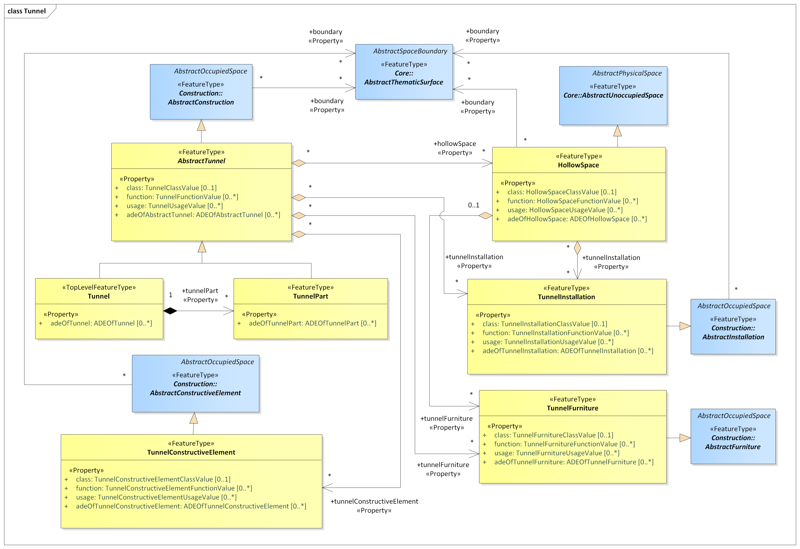

[[rc_tunnel_section]]
=== Tunnel

include::requirements/requirements_class_tunnel.adoc[]

The Tunnel module provides the representation of thematic and spatial aspects of tunnels. Tunnels are horizontal or sloping enclosed passage ways of a certain length, mainly underground or underwater. Tunnels are intended for passing obstacles such as mountains, waterways or other traffic routes by humans, animals or goods.
Tunnels are represented in the UML model by the top-level feature type _Tunnel_, which is the main class of the Tunnel module. Tunnels can physically or functionally be subdivided into tunnel parts. In addition, tunnels can be decomposed into structural elements, such as walls, slabs, staircases, and beams.

The interior of tunnels is represented by hollow spaces. This allows a virtual accessibility of tunnels, e.g. for driving through a tunnel, for simulating disaster management or for presenting the light illumination within a tunnel.
Tunnels can contain installations and furniture. Installations are permanent parts of a tunnel that strongly affect the outer or inner appearance of the tunnel and that cannot be moved. Examples are stairs, railings, radiators or pipes. Furniture, in contrast, represent moveable objects inside a tunnel, like movable equipment in control areas.
Tunnels can be bounded by different types of surfaces. In this way, the outer structure of tunnels can be differentiated semantically into wall surfaces, roof surfaces, ground surfaces, outer floor surfaces, and outer ceiling surfaces, whereas the visible surface of hollow spaces can be structured into interior wall surfaces, floor surfaces, and ceiling surfaces. Furthermore, the openings of tunnels, i.e. windows and doors, can be represented including their corresponding surfaces.

The UML diagram of the Tunnel module is depicted in <<tunnel-uml>>. The Tunnel module inherits concepts from the Construction module (cf. <<rc_construction_section>>). The Construction module defines objects that are common to all types of construction, such as the different surface types and the openings. A detailed discussion of the Requirements Class Tunnel can be found in the https://github.com/opengeospatial/CityGML3-Workspace/blob/master/19-072UG.html#bp_tunnel_section[CityGML Users Guide].

[[tunnel-uml]]
.UML diagram of the Tunnel Model.

<<tunnel-boundaries-table>> lists the surfaces that are allowed as thematic surface boundaries of the spaces classes defined in the Tunnel module:
[[tunnel-boundaries-table]]
.Tunnel space classes and their allowed thematic surface boundaries
[cols="2,6",options="headers"]
|===
^|*Space class* ^|*Allowed space boundaries*
|AbstractTunnel
a| * Construction::AbstractConstructionSurface and all subclasses, i.e. Construction::GroundSurface, Construction::RoofSurface, Construction::CeilingSurface, Construction::OuterCeilingSurface, Construction::FloorSurface, Construction::OuterFloorSurface, Construction::WallSurface, Construction::InteriorWallSurface
   * Core::ClosureSurface
   * Generics::GenericThematicSurface
   * possible classes from ADEs

|HollowSpace
a| * Construction::AbstractConstructionSurface and all subclasses, i.e. Construction::GroundSurface, Construction::RoofSurface, Construction::CeilingSurface, Construction::OuterCeilingSurface, Construction::FloorSurface, Construction::OuterFloorSurface, Construction::WallSurface, Construction::InteriorWallSurface
   * Core::ClosureSurface
   * Generics::GenericThematicSurface
   * possible classes from ADEs

|Tunnel
a| * Construction::AbstractConstructionSurface and all subclasses, i.e. Construction::GroundSurface, Construction::RoofSurface, Construction::CeilingSurface, Construction::OuterCeilingSurface, Construction::FloorSurface, Construction::OuterFloorSurface, Construction::WallSurface, Construction::InteriorWallSurface
   * Core::ClosureSurface
   * Generics::GenericThematicSurface
   * possible classes from ADEs

|TunnelConstructiveElement
a| * Construction::AbstractConstructionSurface and all subclasses, i.e. Construction::GroundSurface, Construction::RoofSurface, Construction::CeilingSurface, Construction::OuterCeilingSurface, Construction::FloorSurface, Construction::OuterFloorSurface, Construction::WallSurface, Construction::InteriorWallSurface
   * Core::ClosureSurface
   * Generics::GenericThematicSurface
   * possible classes from ADEs

|TunnelFurniture
a| -

|TunnelInstallation
a| * Construction::AbstractConstructionSurface and all subclasses, i.e. Construction::GroundSurface, Construction::RoofSurface, Construction::CeilingSurface, Construction::OuterCeilingSurface, Construction::FloorSurface, Construction::OuterFloorSurface, Construction::WallSurface, Construction::InteriorWallSurface
   * Core::ClosureSurface
   * Generics::GenericThematicSurface
   * possible classes from ADEs

|TunnelPart
a| * Construction::AbstractConstructionSurface and all subclasses, i.e. Construction::GroundSurface, Construction::RoofSurface, Construction::CeilingSurface, Construction::OuterCeilingSurface, Construction::FloorSurface, Construction::OuterFloorSurface, Construction::WallSurface, Construction::InteriorWallSurface
   * Core::ClosureSurface
   * Generics::GenericThematicSurface
   * possible classes from ADEs

|===

==== Requirements

include::requirements/Tunnel/REQ_Tunnel_Classes.adoc[]

==== Class Definitions

include::summaries/Tunnel.adoc[]

==== Additional Information

The use of extension capabilities by Tunnel elements is constrained by the following requirement:

include::requirements/Tunnel/REQ_Tunnel_ADE_Use.adoc[]
