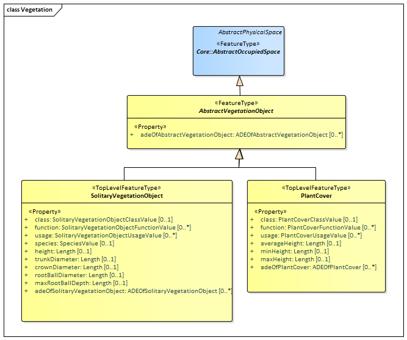

[[rc_vegetation_section]]
=== Vegetation

include::requirements/requirements_class_vegetation.adoc[]

The Vegetation module defines the concepts to represent vegetation within city models. Vegetation can be represented either as solitary vegetation objects, such as trees, bushes and ferns, or as vegetation areas that are covered by plants of a given species or a typical mixture of plant species, such as forests, steppes and wet meadows.
Vegetation is represented in the UML model by the top-level feature types _SolitaryVegetationObject_ and _PlantCover_, which are also the only classes of the Vegetation module.

The UML diagram of the Vegetation module is depicted in <<vegetation-uml>>. A detailed discussion of this Requirements Class can be found in the  https://github.com/opengeospatial/CityGML3-Workspace/blob/master/19-072UG.html#bp_vegetation_section[CityGML User Guide].

[[vegetation-uml]]
.UML diagram of the Vegetation Model.

<<vegetation-boundaries-table>> lists the surfaces that are allowed as thematic surface boundaries of the spaces classes defined in the Vegetation module:
[[vegetation-boundaries-table]]
.Vegetation space classes and their allowed thematic surface boundaries
[cols="2,6",options="headers"]
|===
^|*Space class* ^|*Allowed space boundaries*
|AbstractVegetationObject
a| -

|PlantCover
a| -

|SolitaryVegetationObject
a| -
|===

==== Requirements

include::requirements/Vegetation/REQ_Vegetation_Classes.adoc[]

==== Class Definitions

include::summaries/Vegetation.adoc[]

==== Additional Information

The use of extension capabilities by Vegetation elements is constrained by the following requirement:

include::requirements/Vegetation/REQ_Vegetation_ADE_Use.adoc[]
