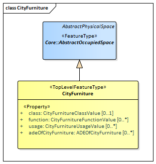

[[rc_City-Furniture_section]]
=== City Furniture

include::requirements/requirements_class_cityfurniture.adoc[]

The CityFurniture module provides the representation of objects or pieces of equipment that are installed in the outdoor environment for various purposes, such as decoration, explanation or control. City furniture objects are relatively small, immovable objects and usually are of stereotypical form. Examples include road signs, traffic signals, bicycle racks, street lamps, fountains, flower buckets, advertising columns, and benches.

City furniture is represented in the UML model by the top-level feature type _CityFurniture_, which is also the only class of the CityFurniture module.

The UML diagram of the CityFurniture module is depicted in <<cityfurniture-uml>>. A detailed discussion of this Requirements Class can be found in the https://github.com/opengeospatial/CityGML3-Workspace/blob/master/19-072UG.html#bp_city-furniture_section[CityGML Users Guide].

[[cityfurniture-uml]]
.UML diagram of CityGML’s City Furniture model.

==== Requirements

include::requirements/CityFurniture/REQ_CityFurniture_Classes.adoc[]

==== Class Definitions

include::summaries/CityFurniture.adoc[]
