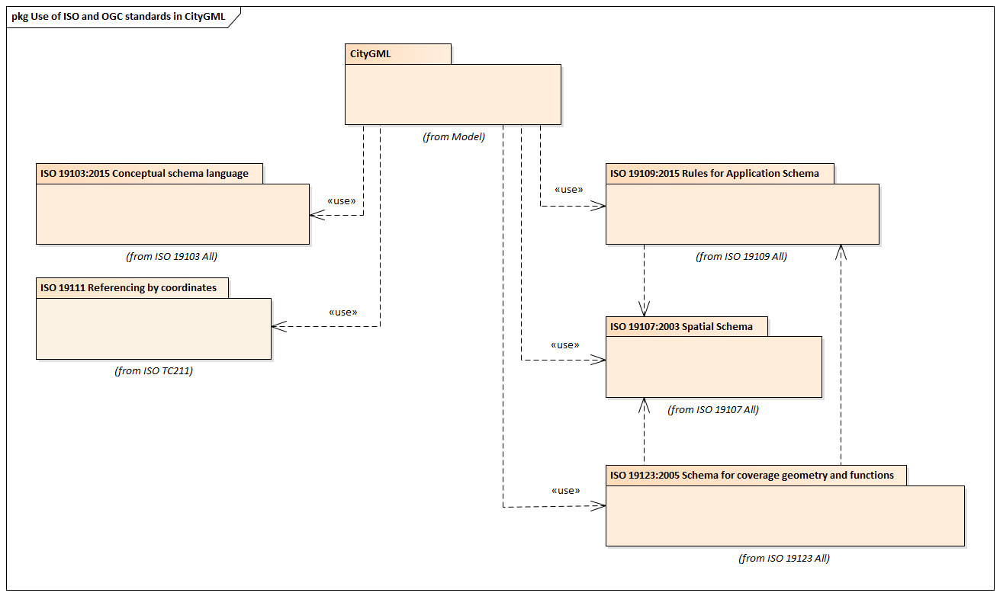
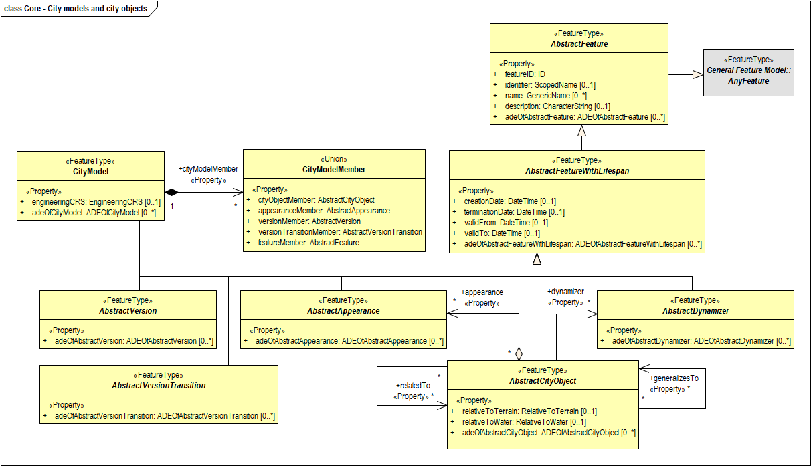
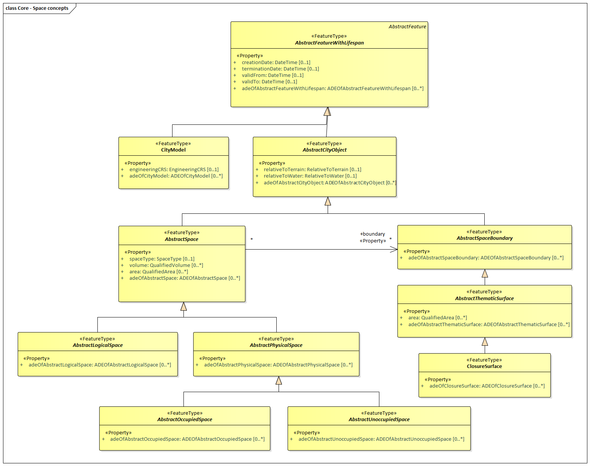
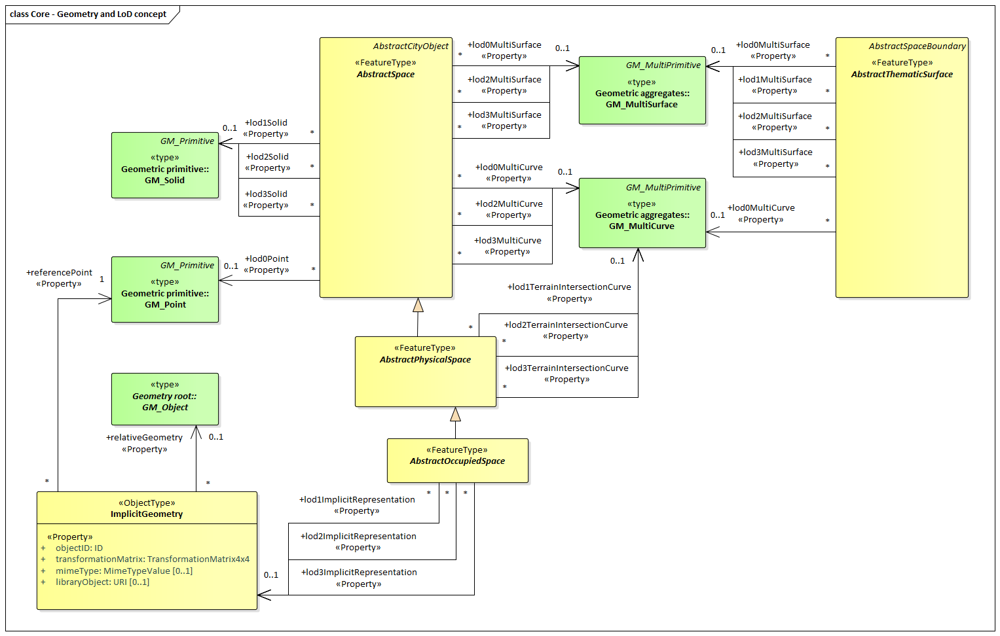
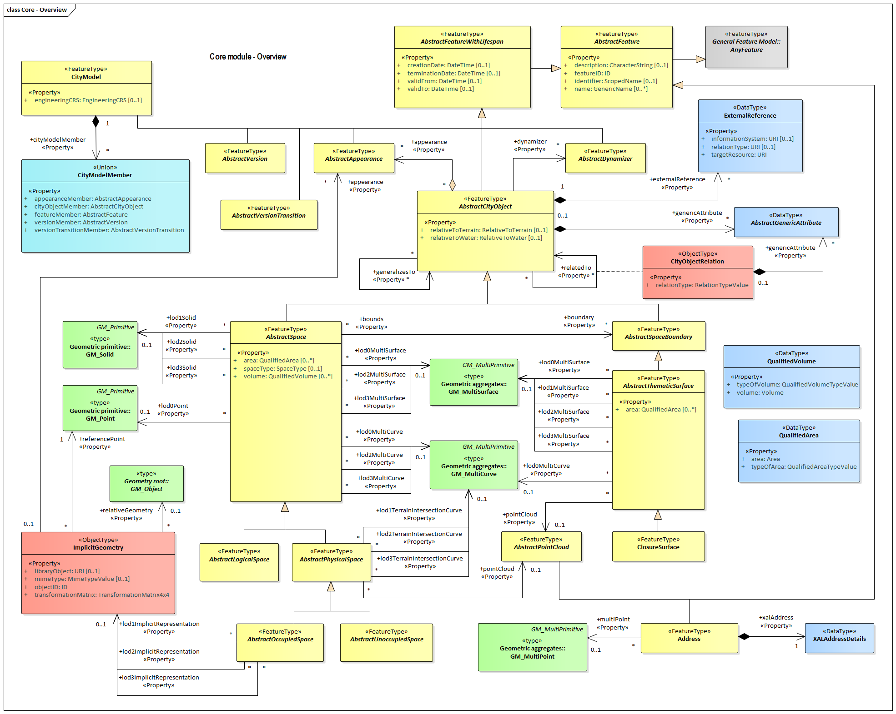

:sectnums:

[[rc_core_section]]
=== Core

include::requirements/requirements_class_core.adoc[]

The Core module defines the basic concepts and components of city models. This rather large body of work has been divided into six sections. These sections build on each other from the fundamental principles specified by the ISO up through the full CityGML model. These sections are summarized in the <<citygml-core-table>> table.

[[citygml-core-table]]
.CityGML Core Sections
[width="90%",cols="2.^,6.^"]
|===
|<<ISO-dependencies-section,The Use of ISO Standards>> |Describes the use of ISO 191** standards to provide a foundation to the CityGML model.
|<<city-objects-section,City Models and City Objects>>|Defines the basic building blocks of the CityGML model.
|<<space-concepts-section,Space Concepts>>|Defines the concepts of space as used in the CityGML model.
|<<geometry-lod-section,Geometry and LOD>>|Defines the geometry and Level Of Detail concepts.
|<<CityGML-section,CityGML Core Model>>|Presents the complete Core model.
|<<b-e-c-section,Types, Enumerations and Codelist>> |Defines the little things which make this model work.
|===

==== Requirements

include::requirements/Core/REQ_Core_Classes.adoc[]

[[ISO-dependencies-section]]
==== ISO Dependencies

CityGML builds on the ISO 191** family of standards. The applicable standards are identified in the <<ISO-in-CityGML-diagram>> diagram. Data dictionaries are included for all of the ISO-defined classes explicitly referenced in the CityGML UML model. These data dictionaries are provided for the convinence of the user. The ISO standards are the normative source.

[[ISO-in-CityGML-diagram]]
.Use of ISO Standards in CityGML

The ISO classes explicitly used in the CityGML UML model are introduced in the <<iso-class-table>> table. More detail about these classes can be found in the <<data-dictionaries-section,Data Dictionaries>> section.

[[iso-class-table]]
.ISO Classes used in CityGML
[cols="2,6",options="headers"]
|===
^|*Class Name* ^|*Description*
|<<AnyFeature-section,AnyFeature>> |A generalization of all feature types
|<<CV_DiscreteGridPointCoverage-section,CV_DiscreteGridPointCoverage>> |undefined
|<<GM_Object-section,GM_Object>> | root class of the geometric object taxonomy.
|<<GM_MultiCurve-section,GM_MultiCurve>> |undefined.
|<<GM_MultiSurface-section,GM_MultiSurface>> |undefined.
|<<GM_Point-section,GM_Point>> |The basic data type for a geometric object consisting of one and only one point.
|<<GM_Solid-section,GM_Solid>> |The basis for 3-dimensional geometry. The extent of a solid is defined by the boundary surfaces.
|<<GM_Surface-section,GM_Surface>> |The basis for 2-dimensional geometry.
|<<GM_Tin-section,GM_Tin>> |A GM_TriangulatedSurface which uses the Delaunay or similar algorithm.
|<<GM_TriangulatedSurface-section,GM_TriangulatedSurface>> |A GM_PolyhedralSurface that is composed only of triangles
|<<SC_CRS-section,SC_CRS>> |Coordinate reference system which is usually single but may be compound.
|===

[[city-objects-section,City Models and City Objects]]
==== City Models and City Objects

City models are virtual representations of real-world cities and landscapes. A city model aggregates different types of objects, which can be city objects, appearances, different versions of the city model, transitions between different versions of the city model, and feature objects. All objects defined in CityGML are features with lifespan. This allows the optional specification of the real-world and database times for the existence of each feature, as is required by the Versioning module (cf. Section <<rc_versioning_section,  Versioning>>). Features that define thematic concepts related to cities and landscapes, such as building, bridge, water body, or land use, are referred to as city objects. All city objects define properties that describe the objects in more detail. These static properties can be overriden with time-varying data through Dynamizers (cf. Section <<rc_dynamizer_section, Dynamizer>>).

.UML City Models and City Objects

The City Model and City Object classes defined in the CityGML UML model are introduced in the <<Core-city-model-class-table>> table. More details about these classes can be found in the <<data-dictionaries-section,Data Dictionaries>> section.

include::summaries/Core-CityObjects.adoc[]

[[space-concepts-section,Space Concepts]]
==== Space Concepts

All city objects are differentiated into spaces and space boundaries. Spaces are entities of volumetric extent in the real world. Buildings, water bodies, trees, rooms, and traffic spaces, for instance, have a volumetric extent. Spaces can be classified into physical spaces and logical spaces. Physical spaces, in turn, can be further classified into occupied spaces and unoccupied spaces.

Space boundaries, in contrast, are entities with a real extent in the real world. Space boundaries can be differentiated into different types of thematic surfaces, such as wall surfaces and roof surfaces.

.UML Space Concepts

The Space Concept classes defined in the CityGML UML model are introduced in the <<Core-spatial-class-table>> table. More detail about these classes can be found in the <<data-dictionaries-section,Data Dictionaries>> section.

include::summaries/Core-Spatial.adoc[]

[[geometry-lod-section]]
==== Geometry and LOD

Spaces and space boundaries can have various geometry representations depending on the Level of Detail (LOD). Spaces can be spatially represented as single points in LOD0, multi-surfaces in LOD0/2/3, solids in LOD1/2/3, and multi-curves in LOD2/3. Space boundaries can be represented as multi-surfaces in LOD0/2/3 and as multi-curves in LOD2/3. All Levels of Detail allow for the representation of the interior of city objects.

In addition, the geometry can also be represented implicitly, i.e. the shape is stored only once as a prototypical geometry, which then is re-used or referenced, wherever the corresponding feature occurs in the 3D city model.

The thematic classes, such as building, tunnel, road, land use, water body, or city furniture are defined as subclasses of the space and space boundary classes within the thematic modules. Since all city objects in the thematic modules represent subclasses of the space and space boundary classes, they automatically inherit the geometries defined in the Core module.

.UML Geometry and LoD Concepts

The Geometry and LOD Concept classes defined in the CityGML UML model are introduced in the <<Core-geometry-class-table>> table. More detail about these classes can be found in the <<data-dictionaries-section,Data Dictionaries>> section.

Of particular note is the Implicit Geometry concept. Many of the objects encountered in a city landscape have the same geometry. How many types of street lamps can there be? An Implicit Geometry captures that geometry once, and re-uses that one geometry for all similar street lamp objects.

include::summaries/Core-Geometry.adoc[]

[[CityGML-section]]
==== CityGML Core Model

The <<city-objects-section,City Model and City Object>> classes, the <<space-concepts-section,Space Concept>> classes, and the <<geometry-lod-section,Geometry and LOD>> classes define the majority of the CityGML Core module. In addition to these concepts, the Core module also specifies that city objects can have relations to other city objects and that they can have address information. All other modules defined in the CityGML model refer to the Core module.

The UML diagram of the complete Core module is depicted in the <<core-uml,Core UML Diagram>>.

[[core-uml]]
.UML diagram of CityGML’s core module.

The tables <<Core-city-model-class-table>>, <<Core-spatial-class-table>>, and <<Core-geometry-class-table>> introduce already most of the classes of the CityGML Core module. The additional classes required to fill out this section are introduced in the <<Core-class-table>> table. More detail about these classes can be found in the <<data-dictionaries-section,Data Dictionaries>> section.

include::summaries/Core-CityModel.adoc[]

==== Data types, Enumerations and CodeLists

While FeatureTypes capture the real-world concepts on the CityGML Conceptual Model, they would be incomplete without the additional concepts from which they are made. These supporting constructs are defined in the following tables.

include::summaries/Core-others.adoc[]

==== Additional Information

A detailed discussion of the CityGML Core can be found in the https://github.com/opengeospatial/CityGML3-Workspace/blob/master/19-072UG.html#bp_core_section[CityGML Users Guide].
