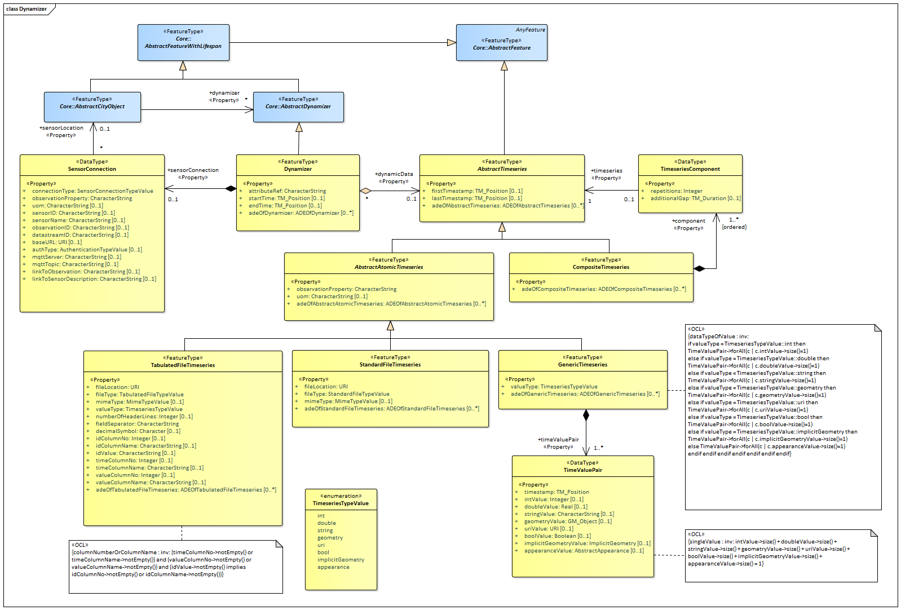

[[rc_dynamizer_section]]
=== Dynamizer

include::requirements/requirements_class_dynamizer.adoc[]

The Dynamizer module provides the concepts that allow for representing time-varying data for city object properties as well as for integrating sensors with 3D city models. Dynamizers are objects that inject timeseries data for an individual attribute of the city object in which it is included. The timeseries data overrides the static value of the referenced city object attribute in order to represent dynamic, i.e. time-dependent, variations of its value.

The dynamic values may be given by retrieving observation results directly from external sensor/IoT services using a sensor connection (e.g. OGC SensorThings API, Sensor Observation Service, or other sensor data platforms including MQTT). Alternatively, the dynamic values may be provided as atomic timeseries that represent time-varying data of a specific data type for a single contiguous time interval. The data can be provided in external tabulated files, such as CSV or Excel sheets, in external files that format timeseries data according to the OGC TimeseriesML or OGC Observations & Measurements standards, or inline as embedded time-value-pairs. Furthermore, timeseries data can also be aggregated to form composite timeseries with non-overlapping time intervals.

By using the Dynamizer module, fast changes over a short or longer time period with respect to cities and city models can be represented. This includes variations of spatial properties, i.e. change of a feature’s geometry, both in respect to shape and to location (e.g. moving objects), variations of thematic attributes, i.e. changes of physical quantities like energy demands, temperatures, solar irradiation, traffic density, pollution concentration, or overpressure on building walls, and variations with respect to sensor or real-time data resulting from simulations or measurements.

The UML diagram of the Dynamizer module is depicted in <<dynamizer-uml>>. A detailed discussion of this Requirements Class can be found in the https://github.com/opengeospatial/CityGML3-Workspace/blob/master/19-072UG.html#bp_dynamizer_section[CityGML Users Guide].

[[dynamizer-uml]]
.UML diagram of the Dynamizer Model.

==== Requirements

The following requirement defines the rules governing implementation of the CityGML Dynamizer Module as an Implementation Specification.

include::requirements/Dynamizer/REQ_Dynamizer_Classes.adoc[]

The use of extension capabilities by Dynamizer elements is constrained by the following requirement:

include::requirements/Dynamizer/REQ_Dynamizer_ADE_Use.adoc[]

==== Class Definitions

include::summaries/Dynamizer.adoc[]

==== Additional Information

Additional information about the Dynamizer Module can be found in the link:http://docs.opengeospatial.org/DRAFTS/20-066.html[OGC CityGML 3.0 Users Guide]
