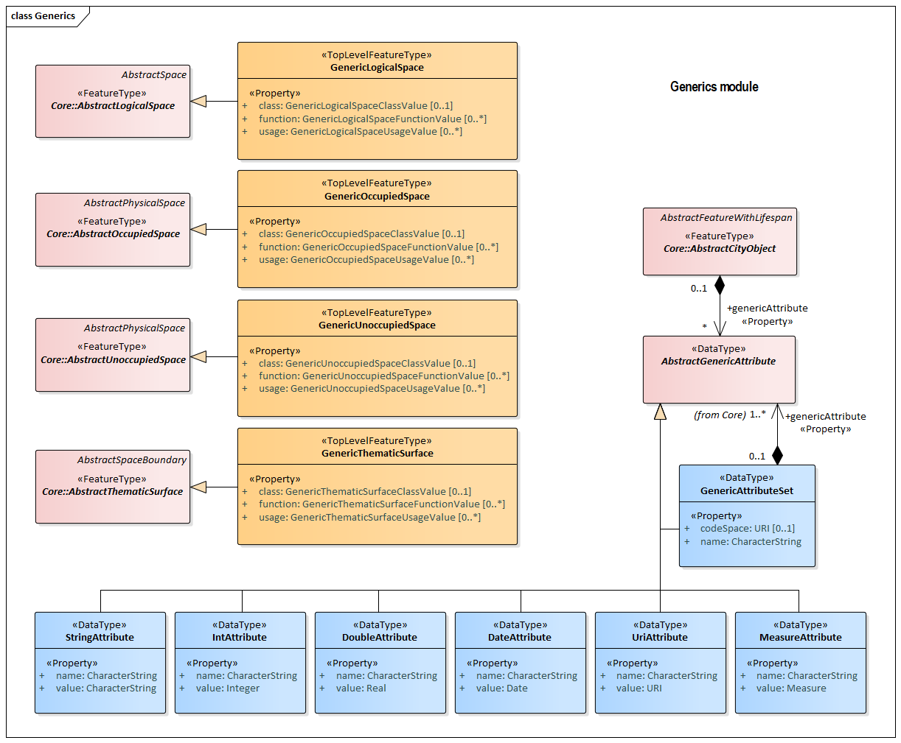
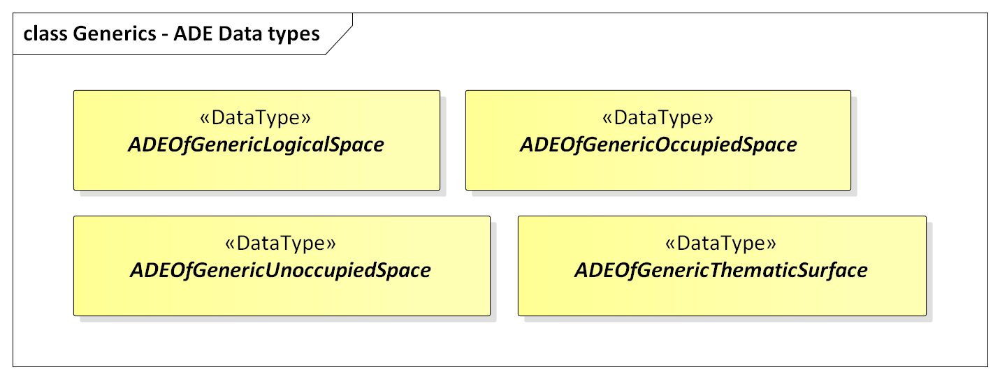
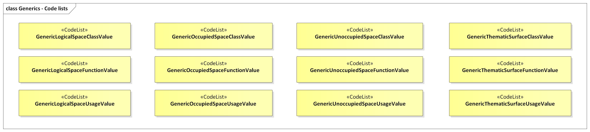

[[rc_generics_section]]
=== Generics

include::requirements/requirements_class_generics.adoc[]

The Generics module provides the representation of generic city objects, i.e. city objects that are not covered by any explicitly modelled thematic class within CityGML, and of generic attributes, i.e. attributes that are not explicitly represented in CityGML. In order to avoid problems concerning semantic interoperability, generic city objects and generic attributes shall only be used if appropriate thematic classes and attributes are not provided by any other CityGML module.

In accordance with the CityGML Space concept defined in the Core module <<rc_core_section, (cf. Section Core)>> generic city objects can be represented as generic logical spaces, generic occupied spaces, generic unoccupied spaces, and generic thematic surfaces. In this way, spaces and surfaces can be defined that are not represented by any explicitly modelled class within CityGML that is a subclass of the classes AbstractLogicalSpace, AbstractOccupiedSpace, AbstractUnoccupiedSpace or AbstractThematicSurface, respectively.
Generic city objects are represented in the UML model by the top-level feature types _GenericLogicalSpace_, _GenericOccupiedSpace_, _GenericUnoccupiedSpace_ and _GenericThematicSurface_.

Generic attributes are defined as name-value pairs and are always associated with a city object. Generic attributes can be of type String, Integer, Double, Date, URI, and Measure. In addition, generic attributes can be grouped under a common name as generic attribute sets.

The UML diagram of the Generics module is depicted in <<generics-uml>>. A detailed discussion of this Requirements Class can be found in the https://github.com/opengeospatial/CityGML3-Workspace/blob/master/19-072UG.html#bp_generics_section[CityGML Users Guide].

[[generics-uml]]
.UML diagram of the Generics Model.

The ADE data types provided for the Generics module are illustrated in the figure <<generics-uml-ade-types>>.

[[generics-uml-ade-types]]
.ADE classes of the CityGML Generics module.

The Code Lists provided for the Generics module are illustrated in the figure <<generics-uml-codelists>>.

[[generics-uml-codelists]]
.Codelists from the CityGML Generics module.

<<generics-boundaries-table>> lists the surfaces that are allowed as thematic surface boundaries of the spaces classes defined in the Generics module:
[[Generics-boundaries-table]]
.Generics space classes and their allowed thematic surface boundaries
[cols="2,6",options="headers"]
|===
^|*Space class* ^|*Allowed space boundaries*
|GenericLogicalSpace
a| * Core::ClosureSurface
   * Generics::GenericThematicSurface
   * possible classes from ADEs

|GenericOccupiedSpace
a| * Core::ClosureSurface
   * Generics::GenericThematicSurface
   * possible classes from ADEs

|GenericUnoccupiedSpace
a| * Core::ClosureSurface
   * Generics::GenericThematicSurface
   * possible classes from ADEs
|===

==== Requirements

The following requirement defines the rules governing implementation of the CityGML Generics Module as an Implementation Specification.

include::requirements/Generics/REQ_Generics_Classes.adoc[]

The implementation of this Module is further constrained by the following spatial boundary requirement:

include::requirements/Generics/REQ_Generics_Boundaries.adoc[]

The decision of whether or not to use Generics is constrained by the following requirement: 

include::requirements/Generics/REQ_Generics_Use.adoc[]

The use of extension capabilities by Generics elements is constrained by the following requirement:

include::requirements/Generics/REQ_Generics_ADE_Use.adoc[]

==== Class Definitions

include::summaries/Generics.adoc[]

==== Additional Information

Additional information about the Genericsn Module can be found in the link:http://docs.opengeospatial.org/DRAFTS/20-066.html[OGC CityGML 3.0 Users Guide]
