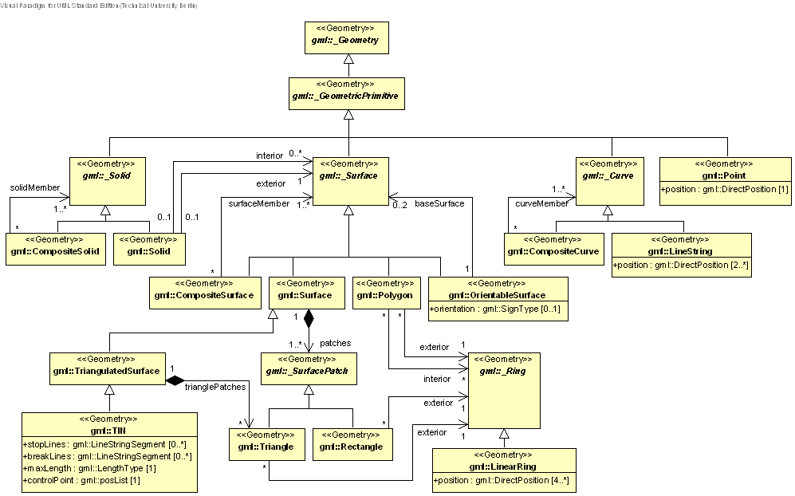
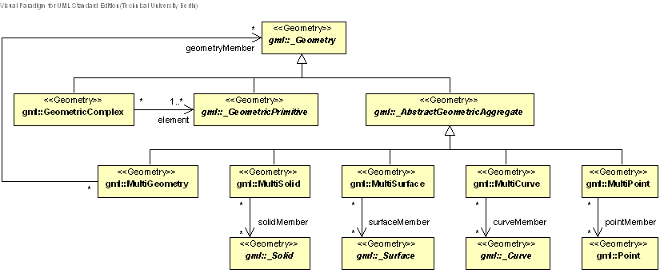
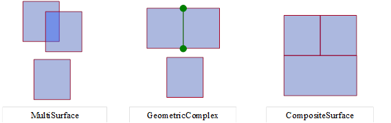
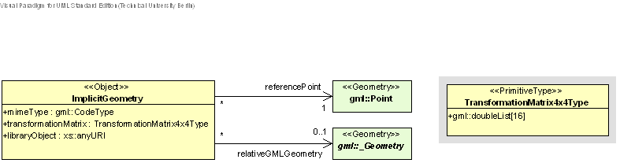

NOTE: Explanatory text edit 09 for 01.04.2020 release starts here

[[rc_spatialModel_section]]
== Spatial Model

NOTE: This section was not generated from the CityGML Conceptual Model. TODO: identify where this info resides in the UML model, then update accordingly.

Spatial properties of CityGML features are represented by objects of GML3’s geometry model. This model is based on the standard ISO 19107 ‘Spatial Schema’ (Herring 2001), representing 3D geometry according to the well-known Boundary Representation (B-Rep, cf. Foley et al. 1995). 

CityGML actually uses only a subset of the GML3 geometry package, defining a profile of GML3. This subset is depicted in Fig. 9 and Fig. 10. Further-more, GML3’s explicit Boundary Representation is extended by scene graph concepts, which allow the represen-tation of the geometry of features with the same shape implicitly and thus more space efficiently (chapter 8.2).

NOTE: Version 2.0 only provides conformance requirements for implicit geometries. Additional requirements will be needed for the other categories. 

=== Geometric-topological model

NOTE: [underline]#short# intro here

==== Primitives and Composits

NOTE: [underline]#short# intro here

For a more detailed discussion of Primitives and Composits, see https://github.com/opengeospatial/CityGML3-Workspace/blob/master/19-072BP.html[CityGML Best Practice Section nnn].

[[figure-9]]
.UML diagram of CityGML’s geometry model (subset and profile of GML3): Primitives and Composites.

==== Complexes and Aggregates

NOTE: [underline]#short# intro here

For a more detailed discussion of Complexes and Aggregates, see https://github.com/opengeospatial/CityGML3-Workspace/blob/master/19-072BP.html[CityGML Best Practice Section nnn].

[[figure-10]]
.UML diagram of CityGML’s geometry model: Complexes and Aggregates

==== Combined Geometries

NOTE: [underline]#short# intro here

For a more detailed discussion of Combined Geometries, see https://github.com/opengeospatial/CityGML3-Workspace/blob/master/19-072BP.html[CityGML Best Practice Section nnn].

[[figure-11]]
.Combined geometries

==== Recursive Aggregation

NOTE: [underline]#short# intro here

For a more detailed discussion of Recursive Aggragation, see https://github.com/opengeospatial/CityGML3-Workspace/blob/master/19-072BP.html[CityGML Best Practice Section nnn].

[[figure-12]]
.Recursive aggregation of objects and geometries in CityGML (graphic: IGG Uni Bonn).
image::../figures/Figure_12.jpg[]

=== Spatial Reference System

NOTE: [underline]#short# intro here

For a more detailed discussion of Spatial Reference Systems, see https://github.com/opengeospatial/CityGML3-Workspace/blob/master/19-072BP.html[CityGML Best Practice Section nnn].

NOTE: add SRS requirements here

=== Implicit geometries, prototypic objects, scene graph concepts

NOTE: [underline]#short# intro here

For a more detailed discussion of Implicit Geometries, see https://github.com/opengeospatial/CityGML3-Workspace/blob/master/19-072BP.html[CityGML Best Practice Section nnn].

[[figure-13]]
.UML diagram of ImplicitGeometries. Prefixes are used to indicate XML namespaces associated with model elements. Element names without a prefix are defined within the CityGML Core module.

NOTE: Explanatory text edit 09 for 01.04.2020 release ends here

