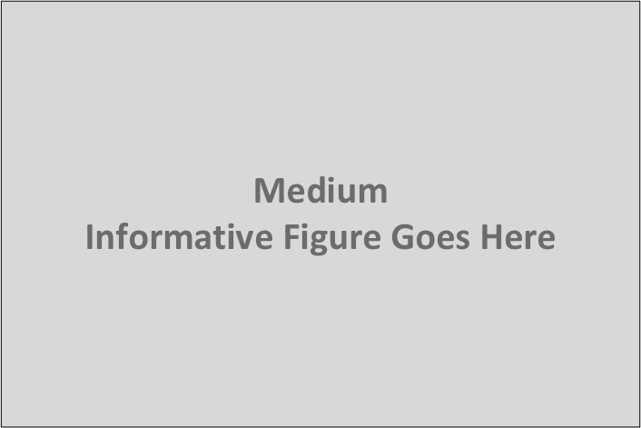

== CityGML Extension Mechanisms

CityGML is a universal and application-independent information model for
3D city and landscape models. It defines a rich set of semantic types and
properties establishing a common ground for a multitude of different use
cases and applications. Specific applications, however, may have
additional information needs to be modelled and exchanged that go beyond
the predefined elements of the CityGML conceptual model.

Rather than incorporating only a fixed and limited number of
application-specific content, CityGML is designed to provide future
flexibility by a slim base model with the option to be extended for
specific applications. For this purpose, the following distinct
extension mechanisms are available:

[arabic]
. Code lists,
. Generic objects and attributes, and
. Application Domain Extensions (ADEs).

The extension mechanisms have been introduced with CityGML version 1.0
and are since widely used and accepted in the CityGML community. An
overview of existing ADEs for different applications and use cases is
provided in [1].

=== Code Lists

Many attributes of CityGML types use a code list as data type, for
instance, the _class_, _usage_ and _function_ attributes, which are
available for most feature classes. In general, code lists are flexible
enumerations that define the value domain including a code for each
permissible value. Whereas the value range is fixed for strict
enumerations, modifications to the value domain become possible with
code lists. Code lists are represented in the CityGML UML model as
classes with the stereotype _<<CodeList>>_.

[NOTE]
====
Note: More information on how code lists are used in CityGML. For
example, all code list classes are modelled to be empty, but some have a
note attached containing values. What does that mean? Suggestion: these are typical values.
====

[NOTE]
====
Note: How can code lists be defined externally? Do we require a specific
format for the code lists? How do they have to be published? How are
external code lists referenced? What is the default if no reference is
provided? Suggestion: put inUser Guide.
====

=== Generic Objects and Attributes

Generic objects and attributes are defined in the <<./clause_11_9_generics.adoc,_Generics_ >> module. 
of CityGML ). A generic object is a proxy for a
real-world feature that is not mapped by a special class in CityGML.
Depending on its type and geometric characteristics, CityGML offers the
feature types _GenericLogicalSpace_, _GenericOccupiedSpace_,
_GenericUnoccupiedSpace_ and _GenericThematicSurface_ as proxies for
capturing the real-world feature. A proxy may have a semantic meaning
defined by the _class_, _function_, and _usage_ attributes.

Generic attributes are name-value pairs that can be assigned to every
city object (i.e., instances of _core:AbstractCityObject_) to augment
the object with application data not covered by its predefined
attributes. The attribute _name_ can be freely chosen to identify the
piece of information represented by the generic attribute. A fixed list
of simple data types is offered as possible domains for the attribute
_value_. Generic attributes can be grouped into named sets using the
_GenericAttributeSet_ data type.

The main advantage of generic objects and attributes is that they are
simple and easy-to-use to represent application-specific content. Since
this extension mechanism is built into the conceptual model of CityGML,
it provides the capability of ad-hoc data enrichment (“at run-time”)
without the need for modifying the conceptual model. This flexibility
also faces disadvantages though:

* Generic objects are “flat” and cannot be decomposed into sub-features
and feature hierarchies like other CityGML features such as, for
instance, buildings or transportation features. However, they may at
least be related to other city objects through the inherited _relatedTo_
association.
* Names, data types, and multiplicities of generic attributes cannot be
specified in a formal way. Consequently, there is no guarantee for an
application that a generic attribute of a specific name and type is
available a minimum or maximum number of times for a given city object.
* Name clashes between generic attributes from different applications
are possible and cannot be avoided in a formal way, which might impede
semantic interoperability.
* There is only a limited number of predefined simple data types
available for generic attributes.

To avoid semantic interoperability issues, generic objects and
attributes shall only be used if a more specific feature class or
attribute is not available from the CityGML conceptual model.

=== Application Domain Extensions

An _Application Domain Extension_ (ADE) is a formal and systematic
extension of CityGML for a specific application defined in the form of a
conceptual UML model. The application data is mapped to a set of
classes, attributes, and relations in accordance with the rules for
modelling feature application schemas as specified in the conceptual
modelling framework of the ISO 19100 series of International Standards.
Elements from the different CityGML modules can be used in the ADE
model, for instance, to derive ADE-specific subclasses with additional
attributes, to associate ADE classes with predefined CityGML content, or
as data types for attributes.

The ADE mechanism allows application-specific information to be
represented and aligned with the semantic constructs of CityGML in a
well-structured and systematic way. By this means, the CityGML model can
be extended by an ADE to meet the information needs of an application,
while at the same time preserving its concepts and semantic structures.
Moreover, and in contrast to generic city objects and attributes,
application data can be validated against the formal definition of the
ADE model to ensure semantic interoperability.

Following ISO 19109, features are the primary view of geospatial
information and are the basic building blocks of conceptual models for
specific applications and domains. New feature types are therefore the
most salient extension to CityGML provided by an ADE. In addition, ADEs
can define various further extensions such as new object types, data
types, associations, code lists or enumerations. Moreover, the ADE
mechanism provides a special way of augmenting existing CityGML feature
types by injecting new and additional ADE properties.

The following chapters discuss…

==== General Rules for ADEs

The following are the general modelling requirements for ADEs:

* Each ADE shall be given as conceptual model in UML and shall adhere to
the rules and constraints specified in ISO 19109 for application schemas
in UML.
* Each ADE must use the conceptual modelling framework of the ISO 19100
series of International Standards and shall be modelled in accordance
with the General Feature Model as specified in ISO 19109.
* Each ADE model shall consist of one or more UML packages. All ADE
model elements shall belong directly or indirectly to one of these ADE
packages. The ADE model shall contain a package diagram showing the ADE
packages together with imported CityGML packages and imported
standardized schemas of the ISO 19100 series of International Standards.
* Each ADE model shall adhere to the UML notation and modelling rules as
defined by CityGML (cf. chapter XX).
** For instance, the stereotypes introduced by CityGML shall be used to
properly model UML classes for (top-level) feature types, object types,
data types, union types, code lists or enumerations.
** If the ADE UML model shall be used to derive a GML encoding, the
additional UML-to-GML encoding rules as specified in ISO 19136 must be
applied.
* The predefined concepts and data types from CityGML and the ISO 19100
series of International Standards shall be used wherever appropriate,
for instance, as data types for thematic and spatial properties. Amongst
others, this includes conceptual classes defined in:

[NOTE]
====
Short references to following and move details to bibliography?
====

** ISO/TS 19103 – Conceptual schema language (units of measure, basic
types),
** ISO 19107 – Spatial schema (geometry and topology objects),
** ISO 19108 – Temporal schema (temporal geometry and topology objects,
temporal reference systems),
** ISO 19109 – Rules for application schemas (features),
** ISO 19123 – Schema for coverage geometry and functions.
* The predefined classes and model elements from CityGML and the ISO
19100 series of International Standards shall neither be edited,
changed, nor deleted, for instance, by changing names or multiplicities
of attributes or by removing associations.

[NOTE]
====
More rules? Less rules? More requirements on how to use UML? If
so, what are the requirements?
====

===== Rules for Defining New Feature Types

The modelling of ADE feature types must adhere to the following rules:

* Each ADE feature type shall belong to precisely one ADE package.
* Each ADE feature type shall be derived directly or indirectly from the
CityGML root feature type _core:AbstractFeature_ or a more specific
subclass thereof.
* Each ADE feature type may have an arbitrary number of additional
attributes, including thematic and spatial ones, as well as relations to
other feature types.
* Features with geometries should be mapped to an ADE feature type
derived from _core:AbstractSpace_ or a more specific subclass thereof.
By this means, the level of detail concept and its associated spatial
properties as defined by CityGML are inherited by the ADE feature type,
which increases semantic interoperability.
** For the same reason, features with geometry representing space
boundaries should be modelled by an ADE feature type derived from
_core:AbstractSpaceBoundary_ or a more specific subclass thereof.
* If an additional spatial property modelled for an ADE feature type is
intended to belong to one of the predefined levels of detail, then the
property name shall have the prefix “lodX”, where X shall be replaced
with an integer value between 0 and 3 indicating the target level of
detail.
* Attributes values should use the predefined data types from CityGML
and the ISO 19100 series of International Standards wherever possible to
increase semantic interoperability. For example, additional spatial
properties for feature types should be modelled using the geometry types
defined in ISO 19107.
** Additional simple or complex data types can be defined by an ADE if
no predefined data type is available or appropriate. This also includes
the definition of new geometry types.
* Constraints on the ADE model elements shall be expressed in OCL.
* UML classes representing top-level feature types shall use the
_<<TopLevelFeatureType>>_ stereotype as defined by CityGML.

[NOTE]
====
What about the modelling of object types, data types, code
lists, enumerations, associations, etc.? Do we need extra chapters for
all of them? Can we skip these chapters because the modelling rules
should be clear from ISO/OGC requirements? Shall we enforce that ADE
code list must be shared publicly? …
====

==== Injection of Extension Properties into CityGML Feature Types

In case a predefined CityGML feature type lacks an attribute that is
required for a specific application, an appropriate solution is to
define a new ADE feature type as subclass of the CityGML class and to
add the attribute to this subclass. If multiple ADEs require additional
attributes for the same CityGML feature type, this in turn may lead to
many subclasses of this feature type in different ADE models.

While conceptually clean, this approach has drawbacks on the encoding
level. ADE-specific information about the same real-world feature cannot
be exchanged as part of the official CityGML encoding of the feature
type but requires additional and different mappings for each derived ADE
feature type, all of which vary in their name and namespace. This might
impede interoperability in cases where software systems support the
official CityGML encoding but not a priori unknown ADE content. Thus,
although such a derived ADE class is simply the CityGML class plus
additional properties, software systems might not be able to recognize
and consume the feature data if encoded based on an ADE subclass.

To overcome this limitation, the ADE mechanism provides a way to
conceptually inject ADE properties into existing CityGML feature types.
The injected properties may be attributes with simple or complex data
types as well as relations to other feature types.

UML has no standard notation for expressing property injection. For this
reason, a specific approach and notation has been proposed in [2] as
best practice for CityGML 2.0. This approach has been incorporated into
CityGML 3.0 and shall be used in ADE UML models defined for this version
of the standard. It consists of the following steps:

* An ADE subclass shall be defined in an ADE package. It must be a
direct subclass of the CityGML feature class into which additional
properties shall be injected. The ADE subclass must be assigned the
identical name of the CityGML superclass.
* The ADE subclass shall use the stereotype _<<ADEElement>>_ to indicate
that it is used for expressing property injection only.
* In general, a UML subclass inherits all properties from its
superclass. However, inheritance is not intended in this case. To make
this explicit, the generalization relation from the ADE subclass to its
CityGML superclass shall receive the stereotype _<<ADE>>_.
* All attributes and relations that are meant to be injected into the
CityGML superclass shall be modelled as properties of the ADE subclass.
* Property injections shall only be modelled for CityGML classes
representing feature types but not for other CityGML classes.

The following figure illustrates the UML notation for expressing
property injection.

On the conceptual model
level, the ADE subclass represents a virtual container that wraps the
properties to be injected. On the encoding level, the ADE subclass
should not be mapped to its own encoding and, thus, should not appear,
for instance, in a CityGML dataset. Only the additional properties
should appear as part of the encoding of the CityGML superclass. By this
means, software systems can still consume the CityGML feature with its
default properties even if they cannot handle the additional ADE
properties.

==== Encoding of ADEs

This specification only addresses the conceptual modelling of ADEs.
Rules for mapping a conceptual ADE model to an encoding shall be
specified and provided by the corresponding CityGML encoding
specification. This includes details on whether and how ADE property
injection is supported and shall be technically implemented on the
encoding level. Please see the CityGML 3.0 User Guide for an example
ADE.

[NOTE]
====
How and where do we map all the sentences containing “shall” and
“must” to conformance requirements?
====

[NOTE]
====
The following go to Bibliography
====

_References_

[1] Biljecki, F., Kumar, K. & Nagel, C. CityGML Application Domain
Extension (ADE): overview of developments. Open geospatial data, softw.
stand. 3, 13 (2018). https://doi.org/10.1186/s40965-018-0055-6

[2] van den Brink L, Stoter J, Zlatanova S. Modeling an application
domain extension of CityGML in UML. Int Arch Photogramm Remote Sens
Spatial Inf Sci. 2012; XXXVIII-4/C26:11–4
