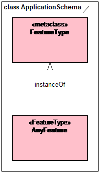

[[req_class-19109]]
[width="90%",cols="2,6"]
|===
^|*Requirement  {counter:req-id}* |*/req/general/19109* 
^|A |Features shall be supported by a CityGML encoding specification in accordance with the uml:feature requirement in ISO 19109:2015 Clause 8.2.6 and shown in <<iso-19109>>, as follows:

Each instance of FeatureType shall be implemented by the encoding’s equivalent of a UML Class having a generalization association with AnyFeature and with a stereotype of <<FeatureType>>.
|===

[[iso-19109]]
.ISO 19109 Feature Type

