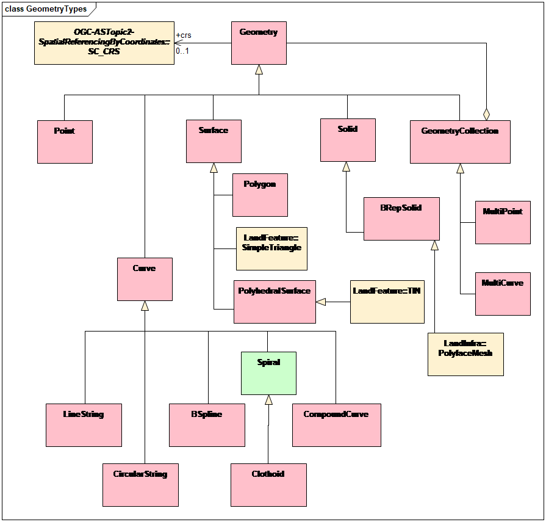

[[req_class-topic-1]]
[width="90%",cols="2,6"]
|===
^|*Requirement  {counter:req-id}* |*/req/general/topic-1* 
^|A |A CityGML encoding specification SHALL support the geometry types specified in the OGC Abstract Specification Topic 1, Feature Geometry as shown in pink and the SimpleTriangle, TIN, and PolyfaceMesh extensions shown in beige in <<topic-1>>, that are appropriate to the supported subject area(s).

Additional geometry types, not found in Topic 1, but required by a specific requirements class, are specified in that requirements class.
|===

[[topic-1]]
.OGC Abstract Specification Topic 1

