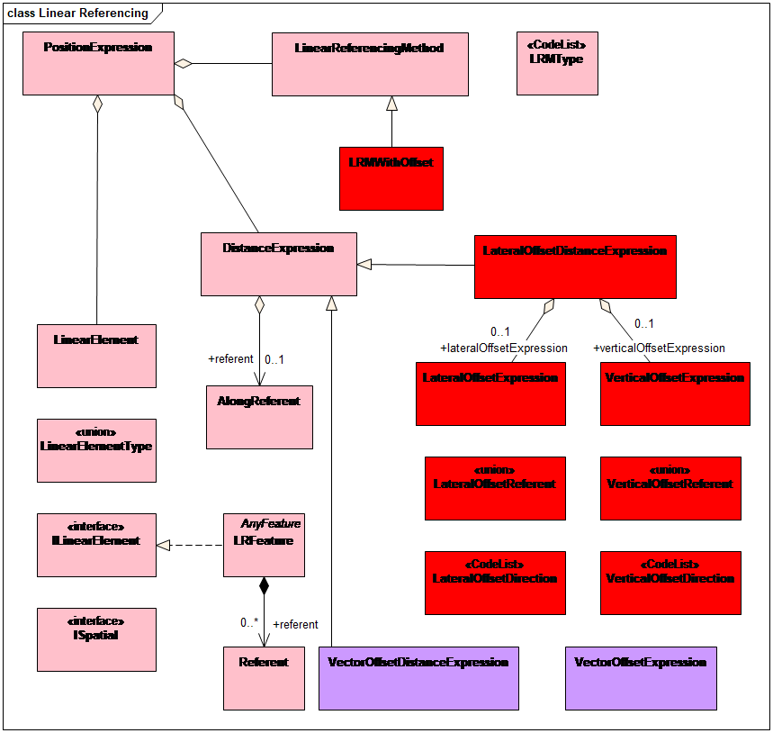
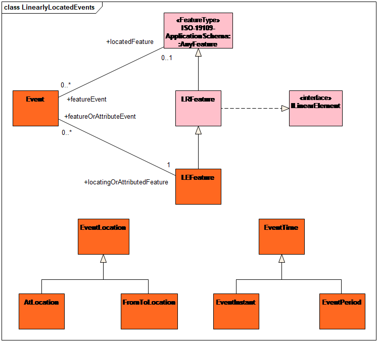

[[req_class-topic-19-extensions]]
[width="90%",cols="2,6"]
|===
^|*Requirement  {counter:req-id}* |*/req/general/topic-19-extensions* 
^|A |If a CityGML encoding specification supports linearly referenced locations, then the encoding shall specify which of the OGC Abstract Specification Topic 19, Linear Referencing extension packages it supports and shall therefore support the appropriate Classes shown in <<ogc-topic-19>> and <<ogc-topic-19-extensions>> for those packages that are appropriate to the supported subject area(s).
|===

[[ogc-topic-19]]
.OGC Abstract Specification Topic 19

[[ogc-topic-19-extensions]]
.OGC Abstract Specification Topic 19 - Extensions

