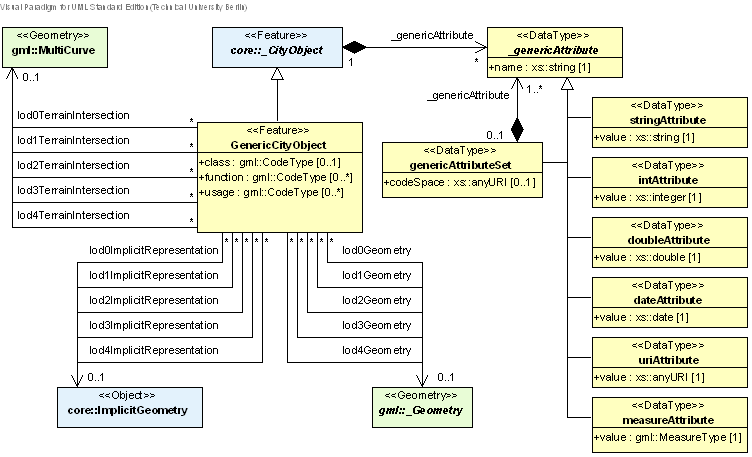
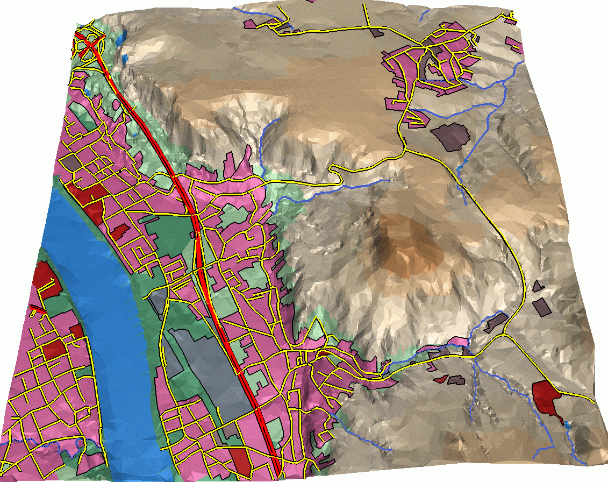

[[bp_landUse]]
=== Land Use

LandUse objects can be used to describe areas of the earth’s surface dedicated to a specific land use, but also to describe areas of the earth’s surface having a specific land cover with or without vegetation, such as sand, rock, mud flats, forest, grasslands, etc (i.e. the physical appearance). Land use and land cover are different concepts; the first describes human activities on the earth’s surface, the second describes its physical and biological cover. However, the two are interlinked and often mixed in practice. LandUse objects in CityGML represent both concepts: They can be employed to represent, parcels, spatial planning objects, recreational objects and objects describing the physical characteristics of an area, in 3D (e.g. wetlands). Fig. 71 shows the UML diagram of land use objects, for the XML schema definition see chapter 10.10.1 and annex A.8. The land use model of CityGML is provided by the thematic extension module LandUse (cf. chapter 7).

[[figure-71]]
.UML diagram of land use objects in CityGML. Prefixes are used to indicate XML namespaces associated with model elements. Element names without a prefix are defined within the CityGML LandUse module.

Every LandUse object may have the attributes class, function, and usage. The class attribute is used to represent the classification of land use objects, like settlement area, industrial area, farmland etc., and can occur only once. The possible values can be specified in a code list (cf. annex C.5). The attribute function defines the purpose of the object or their nature, like e.g. cornfield or heath, while the attribute usage can be used, if the way the object is actually used differs from the function. Both attributes can occur multiple times.

The LandUse object is defined for all LOD 0-4 and may have different geometries in any LOD. The surface geometry of a LandUse object is required to have 3D coordinate values. It must be a GML3 MultiSurface, which might be assigned appearance properties like textures or colors (using CityGML’s appearance model, cf. chapter 9).

LandUse objects can be employed to establish a coherent geometric/semantical tesselation of the earth’s surface. In this case topological relations between neighbouring LandUse objects should be made explicit by defining the boundary LineStrings only once and by referencing them in the corresponding Polygons using XLinks (cf. chapter 8.1). Fig. 72 shows a land use tesselation, where the geometries of the land use objects are represented as triangulated surfaces. In fact, they are the result of a constrained triangulation of a DTM with consideration of breaklines defined by a 2D vector map of land use classifications.

[[figure-72]]
.LOD0 regional model consisting of land use objects in CityGML (source: IGG Uni Bonn).

*XML namespace*

The XML namespace of the CityGML LandUse module is identified by the Uniform Resource Identifier (URI) http://www.opengis.net/citygml/landuse/2.0. Within the XML Schema definition of the LandUse module, this URI is also used to identify the default namespace. 10.10.1 

==== Land use object 

===== LandUseType, LandUse

NOTE: insert LandUseType, LandUse UML

==== Code lists

The attributes class, function, and usage of the feature LandUse are specified as gml:CodeType. The values of these properties can be enumerated in code lists. Proposals for corresponding code lists can be found in annex
C.5.

