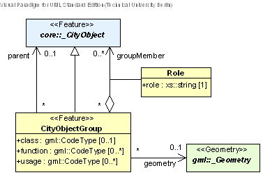

[[bp_cityobjectgroups]]
=== City Object Groups

The CityGML grouping concept has been introduced in chapter 6.8. CityObjectGroups are modelled using the Composite Design Pattern from software engineering (cf. Gamma et al. 1995): CityObjectGroups aggregate CityObjects and furthermore are defined as special CityObjects. This implies that a group may become a member of another group realizing a recursive aggregation schema. However, in a CityGML instance document it has to be ensured (by the generating application) that no cyclic groupings are included. Fig. 73 shows the UML dia-gram for the class CityObjectGroup, for the XML schema see annex A.6. The grouping concept of CityGML is defined by the thematic extension module CityObjectGroup (cf. chapter 7).

[[figure-73]]
.UML diagram of city object groups in CityGML. Prefixes are used to indicate XML namespaces associated with model elements. Element names without a prefix are defined within the CityGML CityObjectGroup module.

The class CityObjectGroup has the optional attributes class, function and usage. The class attribute allows a group classification with respect to the stated function and may occur only once. The function attribute is intend-ed to express the main purpose of a group, possibly to which thematic area it belongs (e.g. site, building, trans-portation, architecture, unknown etc.). The attribute usage can be used, if the way the object is actually used differs from the function. Both attributes can occur multiple times. Each member of a group may be qualified by a role name, reflecting the role each _CityObject plays in the context of the group. Furthermore, a CityObject-Group can optionally be assigned an arbitrary geometry object from the GML3 subset shown in Fig. 9 in chapter 8.1. This may be used to represent a generalised geometry generated from the members geometries.

The parent association linking a CityObjectGroup to a _CityObject allows for the modelling of a generic hierar-chical grouping concept. Named aggregations of components (CityObjects) can be added to specific CityObjects considered as the parent object. The parent association links to the aggregate, while the parts are given by the group members. This concept is used, for example, to represent storeys in buildings (see section 10.3.6: Mo-delling building storeys using CityObjectGroups).

*XML namespace*

The XML namespace of the CityGML CityObjectGroup module is identified by the Uniform Resource Identifier (URI) http://www.opengis.net/citygml/cityobjectgroup/2.0. Within the XML Schema definition of the CityOb-jectGroup module, this URI is also used to identify the default namespace.

==== City object group

===== CityObjectGroupType, CityObjectGroup

NOTE: insert CityObjectGroupType, CityObjectGroup UML

==== Code lists

The attributes class, function, and usage of the feature CityObjectGroup are specified as gml:CodeType. The values of these properties can be enumerated in code lists. Proposals for corresponding code lists can be found in annex C.10.

