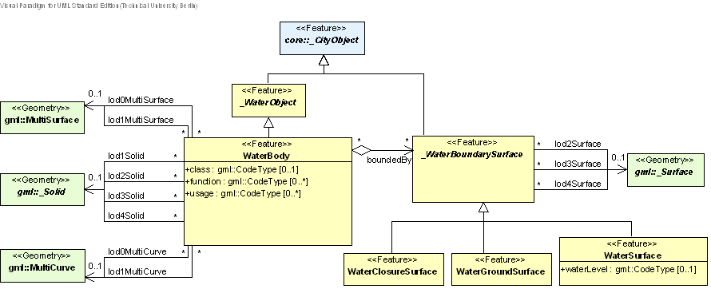

[[bp_waterbody]]
=== Water Bodies
Waters have always played an important role in urbanisation processes and cities were built preferably at rivers and places where landfall seemed to be easy. Obviously, water is essential for human alimentation and sanita-tion. Water bodies present the most economical way of transportation and are barriers at the same time, that avoid instant access to other locations. Bridging waterways caused the first efforts of construction and resulted in high-tech bridges of today. The landscapes of many cities are dominated by water, which directly relates to 3D city models. Furthermore, water bodies are important for urban life as subject of recreation and possible hazards as e.g. floods.

The distinct character of water bodies compared with the permanence of buildings, roadways, and terrain is considered in this thematic model. Water bodies are dynamic surfaces. Tides occur regularly, but irregular events predominate with respect to natural forces, for example flood events. The visible water surface changes in height and its covered area with the necessity to model its semantics and geometry distinct from adjacent objects like terrain or buildings.

This first modelling approach of water bodies fulfils the requirements of 3D city models. It does not inherit any hydrological or other dynamic aspects. In these terms it does not claim to be complete. However, the semantic and geometric description given here allows further enhancements of dynamics and conceptually different descriptions. The water bodies model of CityGML is embraced by the extension module WaterBody (cf. chapter 7).

The water bodies model represents the thematic aspects and three-dimensional geometry of rivers, canals, lakes, and basins. In the LOD 2-4 water bodies are bounded by distinct thematic surfaces. These surfaces are the obligatory WaterSurface, defined as the boundary between water and air, the optional WaterGroundSurface, defined as the boundary between water and underground (e.g. DTM or floor of a 3D basin object), and zero or more WaterClosureSurfaces, defined as virtual boundaries between different water bodies or between water and the end of a modelled region (see Fig. 55). A dynamic element may be the WaterSurface to represent temporarily changing situations of tidal flats.

[[figure-55]]
.Illustration of a water body defined in CityGML (graphic: IGG Uni Bonn).
image::figures/Figure_55.png[]

The UML diagram of the water body model is depicted in Fig. 56, for the XML schema definition see below and annex A.13. Each WaterBody object may have the attributes class, function and usage whose possible values can be enumerated in code lists (cf. chapter 10.6.3 and annex C.9). The attribute class defines the classification of the object, e.g. lake, river, or fountain and can occur only once. The attribute function contains the purpose of the object like, for example national waterway or public swimming, while the attribute usage defines the actual usages, e.g. whether the water body is navigable. The latter two attributes can occur multiple times.

WaterBody is a subclass of _WaterObject and transitively of the root class _CityObject. The class _WaterObject may be differentiated in further subclasses of water objects in the future. The geometrical representation of the WaterBody varies through the different levels of detail. Since WaterBody is a subclass of _CityObject and hence a feature, it inherits the attribute gml:name. The WaterBody can be differentiated semantically by the class _WaterBoundarySurface. A _WaterBoundarySurface is a part of the water body’s exterior shell with a special function like WaterSurface, WaterGroundSurface or WaterClosureSurface. As with any _CityObject, WaterBody objects as well as WaterSurface, WaterGroundSurface, and WaterClosureSurface may be assigned ExternalRef-erences (cf. chapter 6.7) and may be augmented by generic attributes using CityGML’s Generics module (cf. chapter 10.12).

The optional attribute waterLevel of a WaterSurface can be used to describe the water level, for which the given 3D surface geometry was acquired. This is especially important when the water body is influenced by the tide. The allowed values can be defined in a corresponding code list.

[[figure-56]]
.UML diagram of the water body model in CityGML. Prefixes are used to indicate XML namespaces associated with model elements. Element names without a prefix are defined within the CityGML WaterBody module.

Both LOD0 and LOD1 represent a low level of illustration and high grade of generalisation. Here the rivers are modelled as MultiCurve geometry and brooks are omitted. Seas, oceans and lakes with significant extent are represented as a MultiSurface (Fig. 56). Every WaterBody may be assigned a combination of geometries of different types. Linear water bodies are represented as a network of 3D curves. Each curve is composed of straight line segments, where the line orientation denotes the flow direction (water flows from the first point of a curve, e.g. a gml:LineString, to the last). Areal objects like lakes or seas are represented by 3D surface geome-tries of the water surface.

Starting from LOD1 water bodies may also be modelled as water filled volumes represented by Solids. If a water body is represented by a gml:Solid in LOD2 or higher, the surface geometries of the corresponding thematic WaterClosureSurface, WaterGroundSurface, and WaterSurface objects must coincide with the exterior shell of the gml:Solid. This can be ensured, if for each LOD X the respective lodXSolid representation (where X is between 2 and 4) does not redundantly define the geometry, but instead references the corresponding polygons (using GML3’s XLink mechanism) of the lodXSurface elements (where X is between 2 and 4) of Water-ClosureSurface, WaterGroundSurface, and WaterSurface.

LOD2 to LOD4 demand a higher grade of detail and therefore any WaterBody can be outlined by thematic surfaces or a solid composed of the surrounding thematic surfaces.
Every object of the class WaterSurface, WaterClosureSurface, and WaterGroundSurface must have at least one associated surface geometry. This means, that every WaterSurface, WaterClosureSurface, and WaterGroundSur-face feature within a CityGML instance document must contain at least one of the following properties: lod2Surface, lod3Surface, lod4Surface.

The water body model implicitly includes the concept of TerrainIntersectionCurves (TIC), e.g. to specify the exact intersection of the DTM with the 3D geometry of a WaterBody or to adjust a WaterBody or WaterSurface to the surrounding DTM (see chapter 6.5). The rings defining the WaterSurface polygons implicitly delineate the intersection of the water body with the terrain or basin.

==== Water Body

===== AbstractWaterObjectType, _WaterObject

NOTE: insert AbstractWaterObjectType, _WaterObject UML

===== WaterBodyType, WaterBody

NOTE: insert WaterBodyType, WaterBody UML

==== Boundary surfaces

With respect to different functions and characteristics three boundary classes for water are defined to build a solid or composite surface geometry (Fig. 55).

. Boundary class “Air to Water”. The WaterSurface is mandatory to the model and usually is registered using photogrammetric analysis or mapping exploration. The representation may vary due to tidal flats or chang-ing water levels, which can be reflected by including different static water surfaces having different wa-terLevels (gml:CodeType), as for example highest flooding event, mean sea level, or minimum water level. This offers the opportunity to describe significant water surfaces due to levels that are important for certain representations e.g. in tidal zones.
. Boundary class “Water to Ground”. The WaterGroundSurface may be known by sonar exploration or other depth measurements. Also part of the ground surface is the boundary “Water to Construction”. The ground surface might be identical to the underwater terrain model, but also describes the contour to other underwa-ter objects. The usefulness of this concept arises from the existence of water defence constructions like sluices, sills, flood barrage or tidal power stations. The use of WaterGroundSurface as boundary layer to man-made constructions is relevant in urban situations, where such objects may enclose the modeled water body completely, for example fountains and swimming pools. The WaterSurface objects together with the WaterGroundSurface objects enclose the WaterBody as a volume.
. Boundary class “Water to Water”. The WaterClosureSurface is an optional feature that comes in use when the union of the WaterSurfaces and WaterGroundSurfaces of a water body does not define a closed volume. The WaterClosureSurface is then used to complete the enclosure of water volumes and to separate water volumes from those where only the surface is known. This might occur, where the cross section and ground surface of rivers is partly available during its course.

_WaterBoundarySurfaces should only be included as parts of corresponding WaterBody objects and should not be used as stand-alone objects within a CityGML model.

===== AbstractWaterBoundarySurfaceType, _WaterBoundarySurface

NOTE: insert AbstractWaterBoundarySurfaceType, _WaterBoundarySurface UML

===== WaterSurfaceType, WaterSurface

NOTE: insert WaterSurfaceType, WaterSurface UML

===== WaterGroundSurfaceType, WaterGroundSurface

NOTE: insert WaterGroundSurfaceType, WaterGroundSurface UML

===== WaterClosureSurfaceType, WaterClosureSurface

NOTE: insert WaterClosureSurfaceType, WaterClosureSurface UML

