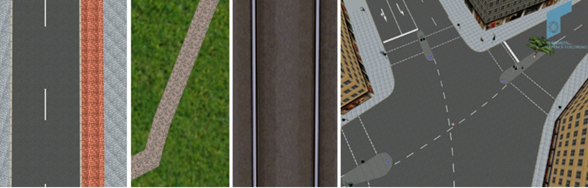
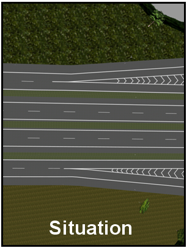
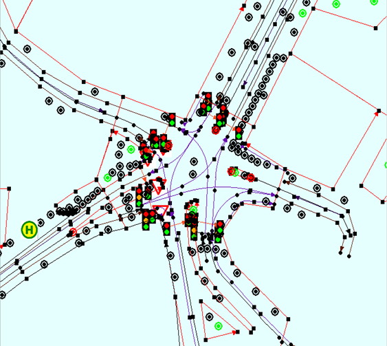

[[bp_transportation]]
=== Transportation
The transportation model of CityGML is a multi-functional, multi-scale model focusing on thematic and func-tional as well as on geometrical/topological aspects. Transportation features are represented as a linear network in LOD0. Starting from LOD1, all transportation features are geometrically described by 3D surfaces. The areal modelling of transportation features allows for the application of geometric route planning algorithms. This can be useful to determine restrictions and manoeuvres required along a transportation route. This information can also be employed for trajectory planning of mobile robots in the real world or the automatic placement of avatars (virtual people) or vehicle models in 3D visualisations and training simulators. The transportation model of CityGML is provided by the thematic extension module Transportation (cf. chapter 7).

The main class is TransportationComplex, which represents, for example, a road, a track, a railway, or a square. Fig. 57 illustrates the four different thematic classes.

NOTE: Four images in the .doc may all be the same.

[[figure-57]]
.Representations of TransportationComplex (from left to right: examples of road, track, rail, and square) (source: Rheinmetall Defence Electronics).

A TransportationComplex is composed of the parts TrafficArea and AuxiliaryTrafficArea. Fig. 58 depicts an example for a LOD2 TransportationComplex configuration within a virtual 3D city model. The Road consists of several TrafficAreas for the sidewalks, road lanes, parking lots, and of AuxiliaryTrafficAreas below the raised flower beds.

[[figure-58]]
.Example for the representation of a TransportationComplex in LOD2 in CityGML: a road, which is the aggregation of TrafficAreas and AuxiliaryTrafficAreas (source: City of Solingen, IGG Uni Bonn).
image::figures/Figure_58.png[]

Fig. 59 depicts the UML diagram of the transportation model, for the XML schema definition see annex A.10.

[[figure-59]]
.UML diagram of the transportation model in CityGML. Prefixes are used to indicate XML namespaces associated with model elements. Element names without a prefix are defined within the CityGML Transportation module.

The road itself is represented as a TransportationComplex, which is further subdivided into TrafficAreas and AuxiliaryTrafficAreas. The TrafficAreas are those elements, which are important in terms of traffic usage, like car driving lanes, pedestrian zones and cycle lanes. The AuxiliaryTrafficAreas are describing further elements of the road, like kerbstones, middle lanes, and green areas.

TransportationComplex objects can be thematically differentiated using the subclasses Track, Road, Railway, and Square. Every TransportationComplex has the attributes class, function and usage whose possible values can be enumerated in code lists (chapter 10.7.4 and annex C.8). The attribute class describes the classification of the object, function describes the purpose of the object, for example national motorway, country road, or airport, while the attribute usage can be used, if the actual usage differs from the function. The attributes function and usage can occur multiple times.

In addition both TrafficArea and AuxiliaryTrafficArea may have the attributes class, function, usage, and sur-faceMaterial. The attribute class describes the classification of the object. For TrafficArea, function describes, if the object for example may be a car driving lane, a pedestrian zones, or a cycle lane, while the usage attribute indicates which modes of transportation can use it (e.g. pedestrian, car, tram, roller skates). The attribute sur-faceMaterial specifies the type of pavement and may also be used for AuxiliaryTrafficAreas (e.g. asphalt, con-crete, gravel, soil, rail, grass). The function attribute of the AuxiliaryTrafficArea defines, for example kerbstones, middle lanes, or green areas. The possible values can also be specified in code lists.

The shape of each traffic area is defined by a surface geometry. Additional metadata may be defined by using attributes from pre-defined catalogues. This affects the class, function and usage of each traffic area as well as its surface material. The attribute catalogues may be customer- or country-specific. The following tables show examples for various kinds of TrafficArea:

[#abstracttransportation_semantics,reftext='{table-caption} {counter:table-num}']
.Examples of TrafficArea
[width="90%",cols="^4,^4,^4",options="header"]
|===
|**Example**
|**Country Road**
|**Motorway Entry**
|TransportationComplex – Function
|road
|road
|TrafficArea – Usage
|car, truck, bus, taxi, motorcycle
|car, truck, bus, taxi, motorcycle
|TrafficArea – Function
|driving lane
|motorway_entry
|TrafficArea – SurfaceMaterial
|asphalt
|concrete
|===

TransportationComplex is a subclass of _TransportationObject and of the root class _CityObject. The geomet-rical representation of the TransportationComplex varies through the different levels of detail. Since Transporta-tionComplex is a subclass of _CityObject and hence a feature, it inherits the attribute gml:name. The street name is also stored within the gml:name property of the Road feature.

In the coarsest LOD0 the transportation complexes are modelled by line objects establishing a linear network. On this abstract level, path finding algorithms or similar analyses can be executed. It also can be used to generate schematic drawings and visualisations of the transport network. Since this abstract definition of transportation network does not contain explicit descriptions of the transportation objects, it may be task of the viewer applica-tion to generate the graphical visualisation, for example by using a library with style-definitions (width, color resp. texture) for each transportation object.

Starting from LOD1 a TransportationComplex provides an explicit surface geometry, reflecting the actual shape of the object, not just its centerline. In LOD2 to LOD4, it is further subdivided thematically into TrafficAreas, which are used by transportation, such as cars, trains, public transport, airplanes, bicycles or pedestrians and in AuxiliaryTrafficAreas, which are of minor importance for transportation purposes, for example road markings, green spaces or flower tubs. The different representations of a TransportationComplex for each LOD are illus-trated in Fig. 60.

[[figure-60]]

.TransportationComplex in LOD0, 1, and 2-4 (example shows part of a motorway) (source: Rheinmetall Defence Electronics).
image::figures/inwork/Figure_60_2.png[]

In LOD0 areal transportation objects like squares should be modelled in the same way as in GDF, the ISO standard for transportation networks, which is used in most car navigation systems. In GDF a square is typically represented as a ring surrounding the place and to which the incident roads connect. CityGML does not cover further functional aspects of transportation network models (e.g. speed limits) as it is intended to complement and not replace existing standards like GDF. However, if specific functional aspects have to be associated with CityGML transportation objects, generic attributes provided by CityGML’s Generics module (cf. chapter 10.12) can be used. Moreover, further objects of interest can be added from other information systems by the use of ExternalReferences (see chapter 6.11). For example, GDF datasets, which provide additional information for car navigation, can be used for simulation and visualisation of traffic flows. The values of the object attributes can be augmented or replaced using the concept of dictionaries (see chapter 6.6). These directories may be country- or user-specific (especially for country-specific road signs and signals).

[[figure-61]]
.TransportationComplex in LOD 2-4: representation of a road with a complex cross-section profile (example shows urban road) (source: Rheinmetall Defence Electronics).
image::figures/Figure_61.png[]

The following example shows a complex urban crossing. The picture on the left is a screenshot of an editor application for a training simulator, which allows the definition of road networks consisting of transportation objects, external references, buildings and vegetation objects. On the right, the 3D representation of the defined crossing is shown including all referenced static and dynamic models.

NOTE: insert fig62
[[figure-62]]

.Complex urban intersection (left: linear transportation network with surface descriptions and external references, right: generated scene) (source: Rheinmetall Defence Electronics).
image::figures/inwork/Figure_62_b.jpg[]

==== Transporatation Complex

===== AbstractTransportationObjectType, _TransportationObject

NOTE: insert AbstractTransportationObjectType, _TransportationObject UML

_TransportationObject represents the abstract superclass for transportation objects. Future extensions of the CityGML transportation model shall be modelled as subclasses of this class.

===== TransportationComplexType, TransportationComplex

NOTE: insert TransportationComplexType, TransportationComplex UML

This type and element describe transportation complexes like roads or railways which may be aggregated from different thematic components (traffic areas, e.g. pedestrian path, and auxiliary traffic areas). As a subclass of _CityObject, TransportationComplex inherits all attributes and relations, in particular an id, names, external references, and generalisation relations. Furthermore, it represents the superclass for thematically distinct types of transportation complexes.

==== Subclasses of Transportation Complexes

===== TrackType, Track

NOTE: insert TrackType, Track UML

A Track is a small path mainly used by pedestrians. It is a subclass of TransportationComplex and thus inherits all its attributes and relations.

===== RoadType, Road

NOTE: insert RoadType, Road UML

Road is intended to be used to represent transportation features that are mainly used by vehicles like cars, for example streets, motorways, and country roads. It is a subclass of TransportationComplex and thus inherits all its attributes and relations.

===== RailwayType, Railway

NOTE: insert RailwayType, Railway UML

Railway represents routes that are utilised by rail vehicles like trams or trains. It is a subclass of Transportation-Complex and thus inherits all its attributes and relations.

==== SquareType, Square

NOTE: insert SquareType, Square UML

A Square is an open area commonly found in cities (e.g. a plaza, market square). It is a subclass of Transporta-tionComplex and thus inherits all its attributes and relations.

==== Subdivisions of Transportation Complexes

===== TrafficAreaType, TrafficArea

NOTE: insert TrafficAreaType, TrafficArea UML

===== AuxiliaryTrafficAreaType, AuxiliaryTrafficArea

NOTE: insert AuxiliaryTrafficAreaType, AuxiliaryTrafficArea UML

