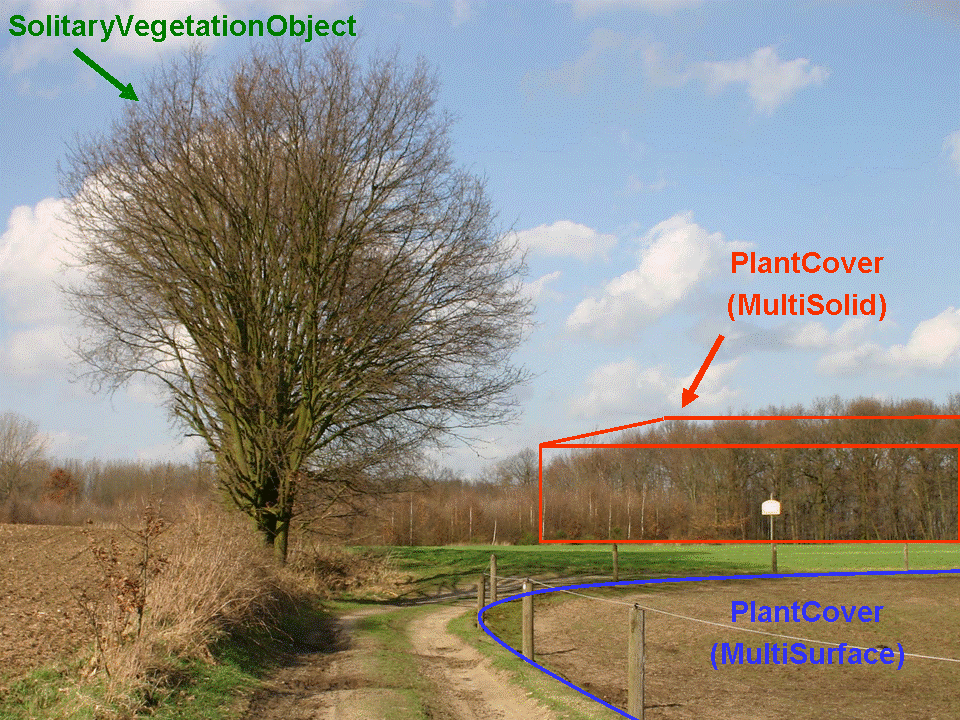
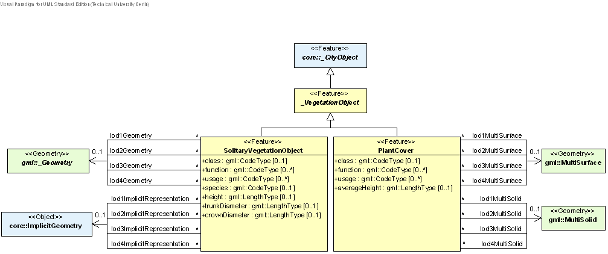
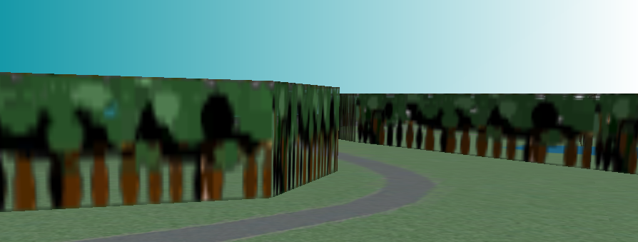

[[bp_vegetation]]
=== Vegetation Objects
Vegetation features are important components of a 3D city model, since they support the recognition of the surrounding environment. By the analysis and visualisation of vegetation objects, statements on their distribu-tion, structure and diversification can be made. Habitats can be analysed and impacts on the fauna can be de-rived. The vegetation model may be used as a basis for simulations of, for example forest fire, urban aeration or micro climate. The model could be used, for example to examine forest damage, to detect obstacles (e.g. con-cerning air traffic) or to perform analysis tasks in the field of environmental protection. The vegetation model of CityGML is defined by the thematic extension module Vegetation (cf. chapter 7).

The vegetation model of CityGML distinguishes between solitary vegetation objects like trees and vegetation areas, which represent biotopes like forests or other plant communities (Fig. 63). Single vegetation objects are modelled by the class SolitaryVegetationObject, whereas for areas filled with a specific vegetation the class PlantCover is used. The geometry representation of a PlantCover feature may be a MultiSurface or a MultiSolid, depending on the vertical extent of the vegetation. For example regarding forests, a MultiSolid representation might be more appropriate. The UML diagram of the vegetation model is depicted in Fig. 64, for the XML schema definition see below and annex A.12.

[[figure-63]]
.Example for vegetation objects of the classes SolitaryVegetationObject and PlantCover (graphic: District of Recklinghausen).

A SolitaryVegetationObject may have the attributes class, function, usage, species height, trunkDiameter and crownDiameter. The attribute class contains the classification of the object or plant habit, e.g. tree, bush, grass, and can occur only once (see chapter 10.8.4 and annex C.7). The attribute species defines the species’ name, for example “Abies alba”, and can occur at most once (see chapter 10.8.4 and annex C.7). The optional attributes function and usage denotes the intended respectively real purpose of the object, for example botanical monu-ment, and can occur multiple times. The possible attribute values for class, species, function, and usage can be provided in a code list. The attribute height contains the relative height of the object. The attributes crownDiame-ter and trunkDiameter represent the plant crown and trunk diameter respectively. The trunk diameter is often used in regulations of municipal cadastre (e.g. tree management rules).

A PlantCover feature may have the attributes class, function, usage and averageHeight. The plant community of a PlantCover is represented by the attribute class. The values of this attribute can be specified in a code list (cf. chapter 10.8.4 and annex C.7) whose values should not only describe one plant type or species, but denote a typical mixture of plant types in a plant community. This information can be used in particular to generate realistic 3D visualisations, where the PlantCover region is automatically, perhaps randomly, filled with a corre-sponding mixture of 3D plant objects. The attributes function and usage indicate the intended respectively real purpose of the object, for example national forest, and can occur multiple times. The attribute averageHeight denotes the average relative vegetation height.

Since both SolitaryVegetationObject and PlantCover are derived fom _CityObject, they inherit all attributes of a city object, in particular a name (gml:name) and an ExternalReference to a corresponding object in an external information system, which may contain botanical information from public environmental agencies (see chapter 6.7).

[[figure-64]]
.UML diagram of vegetation objects in CityGML. Prefixes are used to indicate XML namespaces associated with model elements. Element names without a prefix are defined within the CityGML Vegetation module.

The geometry of a SolitaryVegetationObject may be defined in LOD 1-4 explicitly by a GML geometry having absolute coordinates, or prototypically by an ImplicitGeometry (cf. chapter 8.2). Solitary vegetation objects probably are one of the most important features where implicit geometries are appropriate, since the shape of most types of vegetation objects, such as trees of the same species, can be treated as identical in most cases. Furthermore, season dependent appearances may by mapped using ImplicitGeometry. For visualisation purposes, only the content of the library object defining the object’s shape and appearance has to be swapped (cf. Fig. 65).

[[figure-65]]

.Visualisation of a vegetation object in different seasons (source: District of Recklinghausen).
image::figures/inwork/Figure_65_b.jpg[]

A SolitaryVegetationObject or a PlantCover may have a different geometry in each LOD. Whereas a SolitaryVegetationObject is associated with the gml:_Geometry class representing an arbitrary GML geometry (by the relation lodXGeometry, X  [1..4]), a PlantCover is restricted to be either a gml:MultiSolid or a gml:MultiSurface. An example of a PlantCover modelled as gml:MultiSolid is a ‘solid forest model’, see Fig. 66.

[[figure-66]]
.Example for the visualisation/modelling of a solid forest (source: District of Recklinghausen).

*XML namespace*

The XML namespace of the CityGML Vegetation module is identified by the Uniform Resource Identifier (URI) http://www.opengis.net/citygml/vegetation/2.0. Within the XML Schema definition of the Vegetation module, this URI is also used to identify the default namespace.

==== Vegetation Object

===== AbstractVegetationObjectType, _VegetationObject

NOTE: insert AbstractVegetationObjectType, _VegetationObject UML

==== Solitary Vegetation Objects

===== SolitaryVegetationObjectType, SolitaryVegetationObject

NOTE: insert SolitaryVegetationObjectType, SolitaryVegetationObject UML

==== Plant cover objects

===== PlantCoverType, PlantCover

NOTE: insert PlantCoverType, PlantCover UML

==== Code lists

The attributes class, function, and usage of the features PlantCover and SolitaryVegetationObject as well as the attribute species of the feature SolitaryVegetationObject are specified as gml:CodeType. The values of these properties can be enumerated in code lists. Proposals for corresponding code lists can be found in annex C.7.

==== Example CityGML dataset

The following two excerpts of a CityGML dataset contain a solitary tree (SolitaryVegetationObject) and a plant community (PlantCover). The solitary tree has the attributes: class = 1070 (deciduous tree), species = 1040 (Fagus/beech), height = 8 m, trunkDiameter = 0.7 m, crownDiameter = 8.0 m. The plant community has the attributes: class =1180 (isoeto-nanojuncetea), averageHeight = 0.5 m. The attribute values of the class and species attributes are taken from code lists proposed by the SIG 3D which are presented in annex C.7.

NOTE: include examples, GML or other?

