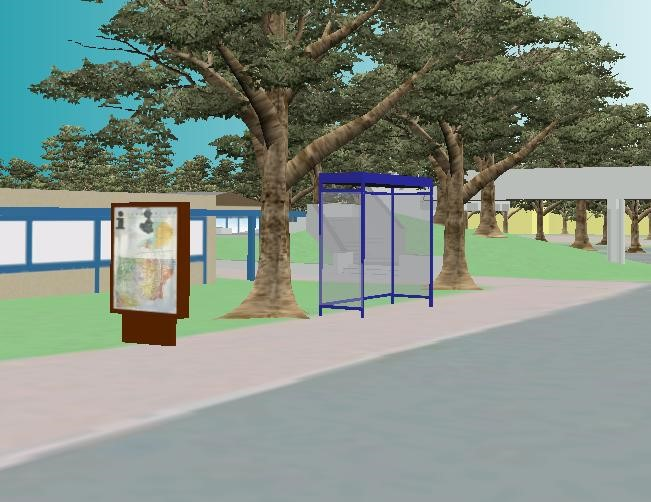
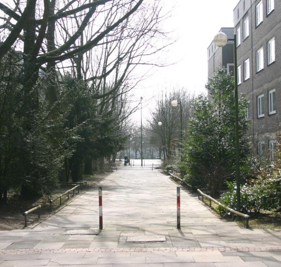
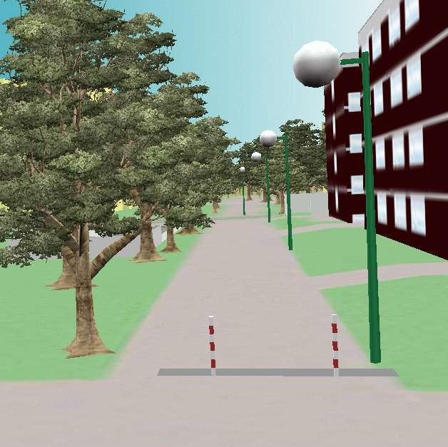
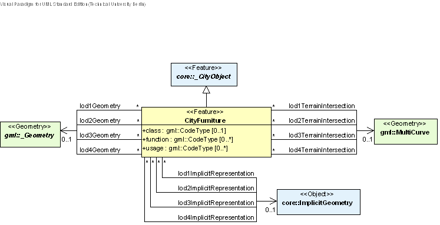
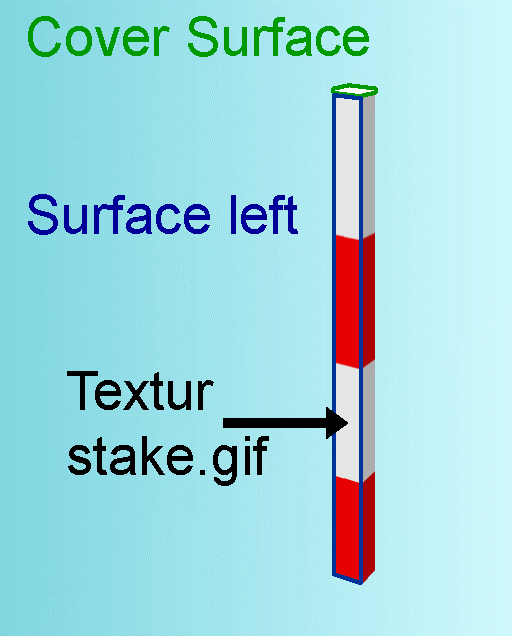

[[bp_cityFurniture]]
=== City Furniture

City furniture objects are immovable objects like lanterns, traffic lights, traffic signs, flower buckets, advertising columns, benches, delimitation stakes, or bus stops (Fig. 67, Fig. 68). City furniture objects can be found in traffic areas, residential areas, on squares or in built-up areas. The modelling of city furniture objects is used for visualisation of, for example city traffic, but also for analysing local structural conditions. The recognition of special locations in a city model is improved by the use of these detailed city furniture objects, and the city model itself becomes more alive and animated. The city furniture model of CityGML is defined by the thematic extension module CityFurniture (cf. chapter 7).

City furniture objects can have an important influence on simulations of, for example city traffic situations. Navigation systems can be realised, for example for visually handicapped people using a traffic light as routing target. Likewise, city furniture objects are important to plan a heavy vehicle transportation, where the exact position and further conditions of obstacles must be known.

[[figure-67]]
image::figures/inwork/Figure_67_a.jpg[]
.Real situation showing a bus stop (left). The advertising billboard and the refuge are modelled as CityFurniture objects in the right image (source: 3D city model of Barkenberg).

[[figure-68]]

.Real situation showing lanterns and delimitation stakes (left). In the right image they are modelled as CityFurniture ob-jects with ImplicitGeometry representations (source: 3D city model of Barkenberg).

The UML diagram of the city furniture model is depicted in Fig. 69, for the XML schema definition see below and annex A.5.

The class CityFurniture may have the attributes class, function and usage. Their possible values can be specified in corresponding code lists (chapter 10.9.2 and annex C.4). The class attribute allows an object classification like traffic light, traffic sign, delimitation stake, or garbage can, and can occur only once. The function attribute describes, to which thematic area the city furniture object belongs to (e.g. transportation, traffic regulation, architecture), and can occur multiple times. The attribute usage denotes the real purpose of the object.

[[figure-69]]
.UML diagram of city furniture objects in CityGML. Prefixes are used to indicate XML namespaces associated with model elements. Element names without a prefix are defined within the CityGML CityFurniture module.

Since CityFurniture is a subclass of _CityObject and hence is a feature, it inherits the attribute gml:name. As with any _CityObject, CityFurniture objects may be assigned ExternalReferences (cf. chapter 6.7) and may be augmented by generic attributes using CityGML’s Generics module (cf. chapter 10.12). For ExternalReferences city furniture objects can have links to external thematic databases. Thereby, semantic information of the objects, which cannot be modelled in CityGML, can be transmitted and used in the 3D city model for further processing, for example information from systems of powerlines or pipelines, traffic sign cadaster, or water resources for disaster management.

City furniture objects can be represented in city models with their specific geometry, but in most cases the same kind of object has an identical geometry. The geometry of CityFurniture objects in LOD 1-4 may be represented by an explicit geometry (lodXGeometry where X is between 1 and 4) or an ImplicitGeometry object (lodXImplic-itRepresentation with X between 1 and 4). Following the concept of ImplicitGeometry the geometry of a proto-type city furniture is stored only once in a local coordinate system and referenced by other city furniture features (see chapter 8.2). Spatial information of city furniture objects can be taken, for example, from city maps or from public and private external information systems.

In order to specify the exact intersection of the DTM with the 3D geometry of a city furniture object, the latter can have a TerrainIntersectionCurve (TIC) for each LOD (cf. chapter 6.5). This allows for ensuring a smooth transition between the DTM and the city furniture object.

*XML namespace*

The XML namespace of the CityGML CityFurniture module is identified by the Uniform Resource Identifier (URI) http://www.opengis.net/citygml/cityfurniture/2.0. Within the XML Schema definition of the CityFurniture module, this URI is also used to identify the default namespace.

==== City furniture object

===== CityFurnitureType, CityFurniture

NOTE: insert CityFurnitureType, CityFurniture UML

==== Code lists

The attributes class, function, and usage of the feature CityFurniture are specified as gml:CodeType. The values of these properties can be enumerated in code lists. Proposals for corresponding code lists can be found in annex C.4.

==== Example CityGML dataset

The following example of a CityGML dataset is an extract of the model of a delimitation stake in LOD3 and contains the attributes class = 1000 and function = 1520 (delimitation stake) whose coded attribute values are taken from a code list proposed by the SIG 3D (cf. annex C.4). The delimitation stake with the object ID stake0815 has an ExternalReference pointing to a cadastre object within the German ALKIS database (www.adv-online.de) which is identified by the URI urn:adv:oid:DEHE123400007001.

The example dataset shows the geometry of the top surface (gml:id “cover”) and of the left surface (gml:id “surfLeft”) of the stake which are both depicted in Fig. 70. The top surface is assigned a constant material (white color) and the left surface is textured using the texture image stake.gif by denoting the relevant texture coordi-nates. Both surface appearances are modelled using the CityGML Appearance module (cf. chapter 9).

[[figure-70]]
.Example of a simple city furniture object (source: District of Recklinghausen).

NOTE: insert example - GML?

