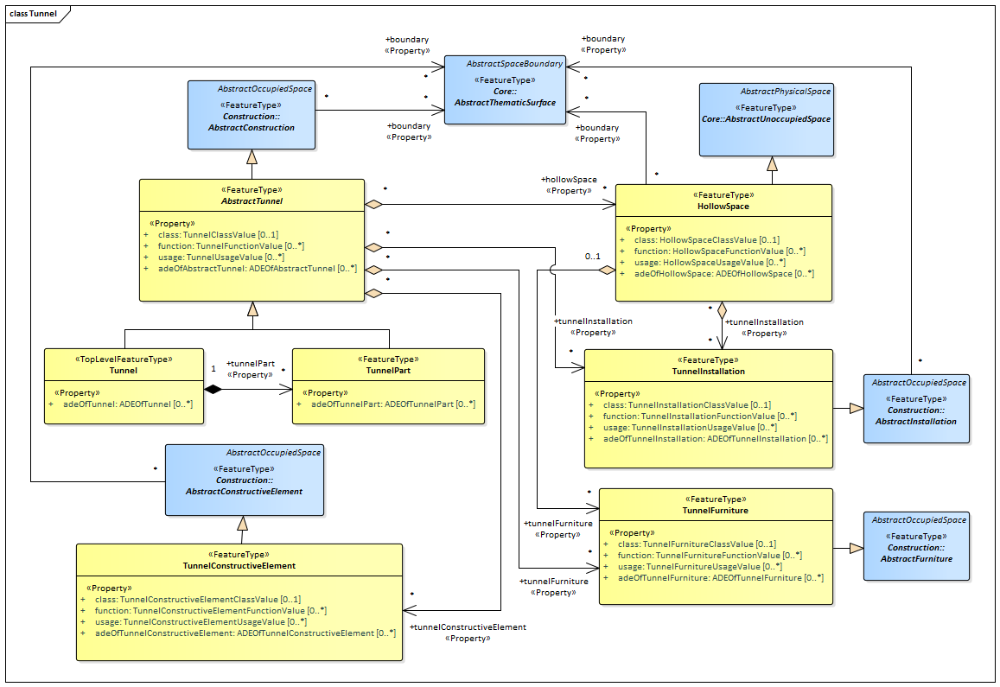

[[ug_model_tunnel_section]]
=== Tunnel Model

|===
^|*Contributors*
|TBD
|===

NOTE: This section uses tables to organize mutiple images into rows and columns. The null.png image serves to associate the caption with a figure rather than with the table. This is a kludge, but seems to work. Is there a better way?

[[ug_tunnel_synopsis_section]]
==== Synopsis

The Tunnel module supports representation of thematic and spatial aspects of tunnels, tunnel parts, tunnel installations, and interior tunnel structures.

[[ug_tunnel_concepts_section]]
==== Key Concepts

<<ug_abstract_tunnel_class,**Abstract Tunnel**>>: AbstractTunnel is an abstract superclass representing the common attributes and associations of the classes Tunnel and TunnelPart.

<<ug_tunnel_class,**Tunnel**>>: A Tunnel represents a horizontal or sloping enclosed passage way of a certain length, mainly underground or underwater. 

<<ug_tunnel_part_class,**Tunnel Part**>>: A TunnelPart is a physical or functional subdivision of a Tunnel. It would be considered a Tunnel, if it were not part of a collection of other TunnelParts.

<<ug_hollow_space_class,**Hollow Space**>>: A HollowSpace is a space within a Tunnel or TunnelPart intended for certain functions (e.g. transport or passage ways, service rooms, emergency shelters). A HollowSpace is bounded physically and/or virtually (e.g. by ClosureSurfaces or GenericSurfaces).

<<ug_tunnel_installation_class,**Tunnel Installation**>>: A TunnelInstallation is a permanent part of a Tunnel (inside and/or outside) which does not have the significance of a TunnelPart. In contrast to TunnelConstructiveElement, a TunnelInstallation is not essential from a structural point of view. Examples are stairs, antennas or railings.

<<ug_tunnel_furniture_class,**Tunnel Furniture**>>: A TunnelFurniture is an equipment for occupant use, usually not fixed to the tunnel. 

<<ug_tunnel_constructive_element_class,**Tunnel Constructive Element**>>: A TunnelConstructiveElement is an element of a Tunnel which is essential from a structural point of view. Examples are walls, slabs, beams.

<<ug_tunnel_abstract_thematic_surface_class,**Abstract Thematic Surface**>>: The abstract superclass for all types of thematic surfaces. The tunnel geometry properties are inherited through this class.

[[ug_tunnel_discussion_section]]
==== Discussion

The tunnel model is closely related to the building model. It supports the representation of thematic and spatial aspects of tunnels and tunnel parts in four levels of detail, LOD1 to LOD4. The tunnel model of CityGML is defined by the thematic extension module Tunnel. <<figure-37>> provides examples of tunnel models for each LOD.

[[figure-37,Figure {counter:figure-num}]]
[cols="2"]
|====
a|image::figures/inwork/Figure_37_a.png[align="center",width="500"] 
a|image::figures/inwork/Figure_37_b.png[align="center",width="500"]
a|image::figures/inwork/Figure_37_c.png[align="center",width="500"]
a|image::figures/inwork/Figure_37_d.png[align="center",width="500"]
|====

.Examples for tunnel models in LOD1 (upper left), LOD2 (upper right), LOD3 (lower left) and LOD4 (lower right) (source: Google 3D warehouse).
image::figures/null.png[]

[[ug_tunnel-class]]
===== Tunnel Class

The Tunnel class is one of the two subclasses of `AbstractTunnel`. If a tunnel only consists of one (homogeneous) part, this class shall be used. A tunnel composed of structural segments, for example tunnel entrance and subway, has to be separated into one tunnel having one or more additional `TunnelParts` (see <<figure-39>>). The geometry and non-spatial properties of the central part of the tunnel should be represented in the aggregating Tunnel feature.

[[ug_tunnel_part_class]]
===== Tunnel Part Class

If sections of a tunnel differ in geometry and / or attributes, the tunnel can be separated into parts (see <<figure-39>>). Like `Tunnel`, the class TunnelPart is derived from `AbstractTunnel` and inherites all attributes of `AbstractTunnel`. A TunnelPart object should be uniquely related to exactly one tunnel or tunnel part object.

[[figure-39,Figure {counter:figure-num}]]
.Example of a tunnel modeled with two tunnel parts (source: Helmut Stracke).

[[ug_abstract_tunnel_class]]
===== Abstract Tunnel Class

The abstract class `AbstractTunnel` contains properties for tunnel attributes, purely geometric representations, and geometric/semantic representations of the tunnel or tunnel part in different levels of detail. The attributes describe:

. The classification of the tunnel or tunnel part (class), 
. the different functions (function), and 
. the usage (usage). 

Spanning the different levels of detail, the tunnel model differs in the complexity and granularity of the geometric representation and the thematic structuring of the model into components with a special semantic meaning. This is illustrated in <<figure-40>>, showing the same tunnel in four different LODs. Some properties of the class `AbstractTunnel` are also associated with certain LODs.

[[figure-40,Figure {counter:figure-num}]]
[cols="4"]
|====
^|**LOD1** ^|**LOD2** ^|**LOD3** ^|**LOD4**
a|image::figures/inwork/Figure_40_1.png[align="center",width="200"]
a|image::figures/inwork/Figure_40_2.png[align="center",width="200"]
a|image::figures/inwork/Figure_40_3.png[align="center",width="200"]
a|image::figures/inwork/Figure_40_4.png[align="center",width="200"]
a|image::figures/inwork/Figure_40_5.png[align="center",width="200"]
a|image::figures/inwork/Figure_40_6.png[align="center",width="200"]
a|image::figures/inwork/Figure_40_7.png[align="center",width="200"]
a|image::figures/inwork/Figure_40_8.png[align="center",width="200"]
a|image::figures/inwork/Figure_40_9.png[align="center",width="200"]
a|image::figures/inwork/Figure_40_10.png[align="center",width="200"]
a|image::figures/inwork/Figure_40_11.png[align="center",width="200"]
a|image::figures/inwork/Figure_40_12.png[align="center",width="200"]
|====

.Tunnel model in LOD1 – LOD4 (source: Karlsruhe Institute of Technology (KIT)).
image::figures/null.png[]

<<abstracttunnel_semantics>> shows the correspondence of the different geometric and semantic themes of the tunnel model to LODs. In each LOD, the volume of a tunnel can be expressed by a `Solid` geometry and/or a `MultiSurface` geometry. The definition of a 3D Terrain Intersection Curve (TIC), used to integrate tunnels from different sources with the Digital Terrain Model, is also possible in all LODs. The TIC can – but does not have to – build closed rings around the tunnel or tunnel parts.

[#abstracttunnel_semantics,reftext='{table-caption} {counter:table-num}']
.Semantic themes of the class _AbstractTunnel
[width="90%",cols="^4,^4,^2,^2,^2,^2",options="header"]
|===
|**Geometric / semantic theme**
|**Property  type**
|**LOD1**
|**LOD2**
|**LOD3**
|**LOD4**
|Building footprint and roof edge
|MultiSurfaceType
|• | | | |
|Volume part of the tunnel shell
|SolidType
|• |• |• |•
|Surface part of the tunnel shell
|MultiSurfaceType
|• |• |• |•
|Terrain intersection curve
|MultiCurveType
|• |• |• |•
|Curve part of the tunnel shell
|MultiCurveType
| |• |• |•
|Tunnel parts
|TunnelPartType
|• |• |• |•
|Boundary surfaces 
|AbstractBoundarySurfaceType
| |• |• |•
|Tunnel installations 
|TunnelInstallationType
| |• |• |•
|Openings
|AbstractOpeningType
| | |• |•
|Hollow spaces 
|HollowSpaceType
| | | |•
|===

[[ug_hollow_space_class]]
===== Hollow Space Class

A HollowSpace is a semantic object for modelling the free space inside a tunnel and should be uniquely related to exactly one tunnel or tunnel part object. It should be closed (if necessary by using ClosureSurface) and the geometry normally will be described by a solid (lod4Solid). However, if the topological correctness of the boundary cannot be guaranteed, the geometry can alternatively be given as a MultiSurface (lod4MultiSurface). The surface normals of the outer shell of a `Solid` must point outwards. This is important if appearences should be assigned to HollowSpace surfaces. In this case, textures and colors must be placed on the backside of the corresponding surfaces in order to be visible from the inside of the hollow space.

In addition to the geometrical representation, different parts of the visible surface of a hollow space can be modelled by specialised boundary surfaces (FloorSurface, CeilingSurface, InteriorWallSurface, and ClosureSur-face, cf. <<ug_model_construction_section>>).

[[ug_tunnel_installation_class]]
===== Tunnel Installation Class

A TunnelInstallation is permanent part of a Tunnel (inside or outside) which does not have the significance of a TunnelPart. In contrast to TunnelConstrucitveElement, a TunnelInstallation is not aessential from a structural point of view. Examples are stairs, antennas or railings. A TunnelInstallation optionally has attributes `class`, `function` and `usage`. The attribute `class` - which can only occur once - represents a general classification of the installation. With the attributes `function` and `usage`, nominal and real functions of a tunnel installation can be described. For all three attributes the list of feasible values can specified in a code list. 

For the geometrical representation of a TunnelInstallation, an arbitrary geometry object from the GML subset shown in <<figure-9>> can be used. Alternatively, the geometry may be given as ImplicitGeometry object. Following the concept of ImplicitGeometry the geometry of a prototype tunnel installation is stored only once in a local coordinate system and referenced by other tunnel installation features. The visible surfaces of a tunnel installation can be semantically classified using the concept of boundary surfaces. A TunnelInstallation object should be uniquely related to exactly one tunnel or tunnel part object.

[[ug_tunnel_furniture_class]]
===== Tunnel Furniture Class

Hollow spaces may have TunnelFurniture. A TunnelFurniture is a movable part of a hollow space. A TunnelFurniture object should be uniquely related to exactly one hollow space. Its geometry may be represented by an explicit geometry or an ImplicitGeometry object. Following the concept of ImplicitGeometry, the geometry of a prototype tunnel furniture is stored only once in a local coordinate system and referenced by other tunnel furniture features.

[[ug_tunnel_constructive_element_class]]
===== Tunnel Constructive Element Class

A TunnelConstructiveElement is an element of a Tunnel which is essential from a structural point of view. Examples are walls, slabs, and beams. A TunnelInstallation optionally has attributes `class`, `function` and `usage`. The attribute `class` - which can only occur once - represents a general classification of the element. With the attributes `function` and `usage`, nominal and real functions of a tunnel constructuve element can be described. For all three attributes the list of feasible values can specified in a code list. 

[[ug_tunnel_abstract_thematic_surface_class]]
===== Abstract Thematic Surface Class

NOTE: More to do here. Have to finish this before LOD can be addressed since it goes directly to the geometry principles.

NOTE: also need a section which discusses what construction brings to the table.

Properties:

* Abstract Feature; featureID, identifier, name, description
* Abstract Feature with Lifespan; creationDate, terminationDate, validTo, ValidFrom
* AbstractCityObject; relativeToTerrain, relativeToWater
* area: 19103 Area with an associated area type codelist.

Note that a closure Surface is a subclass of Abstract thematic Surface

[[ug_tunnel_lod_section]]
==== Level of Detail

The geometric representation and semantic structure of an `AbstractTunnel` is shown in <<tunnel-uml>>. The model is successively refined from LOD1 to LOD4. Therefore, not all components of a tunnel model are represented equally in each LOD and not all aggregation levels are allowed in each LOD. In CityGML, all object classes are associated to the LODs with respect to the proposed minimum acquisition criteria for each LOD. An object can be represented simultaneously in different LODs by providing distinct geometries for the corresponding LODs.

Similar to the building and brigde models (cf. <<ug_model_building_section>> and <<ug_model_bridge_section>>), only the outer shell of a tunnel is represented in LOD1 – 3, which is composed of the tunnel’s boundary surfaces to the surrounding earth, water, or outdoor air. The interior of a tunnel may only be modeled in LOD4. Although the interior built environment is especially relevant for subsurface objects like tunnels or underground buildings, CityGML employs a consistent LOD concept for all thematic modules. If, in contrast, the representation of the interior of subsurface objects would be possible in all LODs, the LOD concept for subsurface objects would have to substantially differ from the LOD concept for aboveground objects. This would require the precise definition of a “transition surface” which delimits the scope of both LOD concepts. Furthermore, features being partially above and below ground would have to be split into an above-ground part (modeled according to the aboveground LOD concept) and a subsurface part (modeled according to the subsurface LOD concept). However, such a splitting violates the CityGML concept of unity of features and would not be feasible in many cases where the transition between above and below ground is often not precisely known or depends on (the LOD of) the terrain model. Hence, CityGML applies a single and consistent LOD concept to both aboveground and subsurface objects. As a consequence, penetrations between a tunnel and objects inside this tunnel (e.g., roads and railways) may occur in LOD1 – 3.

In LOD1, a tunnel model consists of a geometric representation of the tunnel volume. Optionally, a MultiCurve representing the TerrainIntersectionCurve (cf. chapter 6.5) can be specified. The geometric representation is refined in LOD2 by additional MultiSurface and MultiCurve geometries.

In LOD2 and higher LODs the outer structure of a tunnel can also be differentiated semantically by the classe TunnelInstallation. A boundary surface is a part of the tunnel’s exterior shell with a special function like wall (WallSurface), roof (RoofSurface), ground plate (GroundSurface), outer floor (Outer-FloorSurface), outer ceiling (OuterCeilingSurface) or ClosureSurface. The TunnelInstallation class is used for tunnel elements like outer stairs, strongly affecting the outer appearance of a tunnel. A TunnelInstallation may have the attributes class, function and usage (see Fig. 38).

In LOD3, the openings in _BoundarySurface objects (doors and windows) can be represented as thematic ob-jects.

In LOD4, the highest level of resolution, also the interior of a tunnel, composed of several hollow spaces, is represented in the tunnel model by the class HollowSpace. This enlargement allows a virtual accessibility of tunnels, e.g. for driving through a tunnel, for simulating disaster management or for presenting the light illumi-nation within a tunnel. The aggregation of hollow spaces according to arbitrary, user defined criteria (e.g. for defining the hollow spaces corresponding to horizontal or vertical sections) is achieved by employing the general grouping concept provided by CityGML (cf. chapter 10.11). Interior installations of a tunnel, i.e. objects within a tunnel which (in contrast to furniture) cannot be moved, are represented by the class IntTunnelInstallation. If an installation is attached to a specific hollow space (e.g. lamps, ventilator), they are associated with the Hol-lowSpace class, otherwise (e.g. pipes) with _AbstractTunnel. A HollowSpace may have the attributes class, function and usage whose possible values can be enumerated in code lists (chapter 10.4.7, Annex C). The class attribute allows a general classification of hollow spaces, e.g. commercial or private rooms, and occurs only once. The function attribute is intended to express the main purpose of the hollow space, e.g. control area, installation space, storage space. The attribute usage can be used if the way the object is actually used differs from the function. Both attributes can occur multiple times.

The visible surface of a hollow space is represented geometrically as a Solid or MultiSurface. Semantically, the surface can be structured into specialised _BoundarySurfaces, representing floor (FloorSurface), ceiling (Ceil-ingSurface), and interior walls (InteriorWallSurface). Hollow space furniture, like movable equipment in control areas, can be represented in the CityGML tunnel model with the class TunnelFurniture. A TunnelFurniture may have the attributes class, function and usage.

Both classes Tunnel and TunnelPart inherit the attributes of _AbstractTunnel: the class of the tunnel, the function, and the usage. In contrast to _AbstractBuilding, Address features cannot be assigned to _AbstractTunnel.

[[ug_tunnel_uml_section]]
==== UML Model

The UML diagram of the Tunnel module is depicted in <<tunnel-uml>>. The Tunnel module inherits concepts from the Construction module (cf. <<ug_model_construction_section>>). The Construction module defines objects that are common to all types of construction, such as the different surface types and the openings.

The UML diagram of the tunnel model is shown in <<tunnel-uml>>. The pivotal class of the model is `AbstractTunnel`, which is a subclass of the thematic class `AbstractConstruction` (and transitively of the root class `CityObject`). `AbstractTunnel` is specialized either to a `Tunnel` or to a `TunnelPart`. Since an `AbstractTunnel` consists of `TunnelParts`, which again are `AbstractTunnels`, an aggregation hierarchy of arbitrary depth may be realized. As subclass of the root class `CityObject`, an `AbstractTunnel` inherits all properties from `CityObject` such as the feature properties (`name` etc.) and the CityGML specific properties like ExternalReferences (cf. <<ug_model_core_section>>). Further properties not explicitly covered by `AbstractTunnel` may be modelled as generic attributes provided by the CityGML Generics module (cf. <<ug_model_generics_section>>) or using the CityGML Application Domain Extension mechanism (cf. <<ug_model_ade_section>>).

[[tunnel-uml,Figure {counter:figure-num}]]
.UML diagram of the Tunnel Model.

The ADE data types provided for the Tunnel module are illustrated in <<tunnel-uml-ade-types>>.

[[tunnel-uml-ade-types,Figure {counter:figure-num}]]
.ADE classes of the CityGML Tunnel module.
image::../standard/figures/Tunnel-ADE_Datatypes.png[align="center"]

The Code Lists provided for the Tunnel module are illustrated in <<tunnel-uml-codelists>>.

[[tunnel-uml-codelists,Figure {counter:figure-num}]]
.Codelists from the CityGML Tunnel module.
image::../standard/figures/Tunnel-Codelists.png[align="center"]

[[ug_tunnel_examples_section]]
==== Examples

The example in <<figure-42>> shows a pedestrian underpass in the city centre of Karlsruhe, Germany. On the left side of <<figure-42>>, a photo illustrates the real world situation. Both entrances of the underpass are marked in the photo by dashed rectangles. On the right side of the figure, the CityGML tunnel model is shown. The terrain surrounding the tunnel has been virtually cut out of model in order to visualize the entire tunnel with its subsurface body. The same underpass is illustrated in <<figure-43>> from a different perspective. The camera is positioned in front of the left entrance (black dashed rectangle in <<figure-42>>) and pointing in the direction of the right entrance (white dashed rectangle in <<figure-42>>). On the right side of <<figure-43>>, the tunnel model is shown from the same perspective. Again holes are cut in the terrain surface in order to make the subsurface part of the tunnel visible. An LOD1 representation of the nearby buildings is shown in the background of the model.

[[figure-42,Figure {counter:figure-num}]]
image::figures/inwork/Figure_42_a.png[]
.Example of a tunnel modeled in LOD3 (real situation on the left side; CityGML model on the right side) (source: Karlsruhe Institute of Technology (KIT), courtesy of City of Karlsruhe).
image::figures/inwork/Figure_42_b.png[]

[[figure-43,Figure {counter:figure-num}]]
image::figures/inwork/Figure_43_a.png[]
.The same LOD3 tunnel shown from a different perspective. The camera is positioned in front of the left entrance and pointing in the direction of the right entrance. (real situation on the left side; CityGML model on the right side). The model on the right also includes an LOD1 representation of the nearby buildings in the background (painted in light brown) (source: Karlsruhe Institute of Technology (KIT), courtesy of City of Karlsruhe).
image::figures/inwork/Figure_43_b.png[]

The model is subdivided into one Tunnel (the actual underpass) and two TunnelParts (both entrances). The tunnel and tunnel parts are bounded by GroundSurface, WallSurface, RoofSurface. ClosureSurface objects are used to virtually seal the tunnel entrances. For safety reasons each of the two entrances has railings which are modeled as TunnelInstallation. Due to the high geometrical accuracy and the semantic richness, the model is classified as LOD3.

