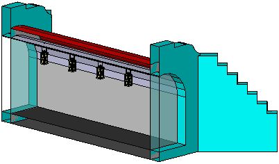
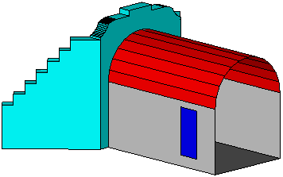

[[ug_model_tunnel_section]]
=== Tunnel Model

|===
^|*Contributors*
|TBD
|===

NOTE: The following text needs to be reviewed and updated.

The tunnel model is closely related to the building model. It supports the representation of thematic and spatial aspects of tunnels and tunnel parts in four levels of detail, LOD1 to LOD4. The tunnel model of CityGML is defined by the thematic extension module Tunnel (cf. chapter 7). Fig. 37 provides examples of tunnel models for each LOD.

[[figure-37]]
image::figures/inwork/Figure_37_a.png[]
image::figures/inwork/Figure_37_b.png[]

.Examples for tunnel models in LOD1 (upper left), LOD2 (upper right), LOD3 (lower left) and LOD4 (lower right) (source: Google 3D warehouse).
image::figures/inwork/Figure_37_d.png[]

The UML diagram of the tunnel model is shown in Fig. 38. The XML schema definition is attached in annex A.11. The pivotal class of the model is _AbstractTunnel, which is a subclass of the thematic class _Site (and transitively of the root class _CityObject). _AbstractTunnel is specialized either to a Tunnel or to a TunnelPart. Since an _AbstractTunnel consists of TunnelParts, which again are _AbstractTunnels, an aggregation hierarchy of arbitrary depth may be realized. As subclass of the root class _CityObject, an _AbstractTunnel inherits all properties from _CityObject like the GML3 standard feature properties (gml:name etc.) and the CityGML specific properties like ExternalReferences (cf. chapter 6.7). Further properties not explicitly covered by _AbstractTunnel may be modelled as generic attributes provided by the CityGML Generics module (cf. chapter 10.12) or using the CityGML Application Domain Extension mechanism (cf. chapter 10.13).

Both classes Tunnel and TunnelPart inherit the attributes of _AbstractTunnel: the class of the tunnel, the func-tion, the usage, the year of construction and the year of demolition. In contrast to _AbstractBuilding, Address features cannot be assigned to _AbstractTunnel.

[[figure-38]]
.UML diagram of CityGML’s tunnel model. Prefixes are used to indicate XML namespaces associated with model elements. Element names without a prefix are defined within the CityGML Tunnel module.

The geometric representation and semantic structure of an _AbstractTunnel is shown in Fig. 38. The model is successively refined from LOD1 to LOD4. Therefore, not all components of a tunnel model are represented equally in each LOD and not all aggregation levels are allowed in each LOD. In CityGML, all object classes are associated to the LODs with respect to the proposed minimum acquisition criteria for each LOD (cf. chapter 6.2). An object can be represented simultaneously in different LODs by providing distinct geometries for the corresponding LODs.

Similar to the building and brigde models (cf. chapters 10.3 and 10.5), only the outer shell of a tunnel is repre-sented in LOD1 – 3, which is composed of the tunnel’s boundary surfaces to the surrounding earth, water, or outdoor air. The interior of a tunnel may only be modeled in LOD4. Although the interior built environment is especially relevant for subsurface objects like tunnels or underground buildings, CityGML employs a consistent LOD concept for all thematic modules. If, in contrast, the representation of the interior of subsurface objects would be possible in all LODs, the LOD concept for subsurface objects would have to substantially differ from the LOD concept for aboveground objects. This would require the precise definition of a “transition surface” which delimits the scope of both LOD concepts. Furthermore, features being partially above and below ground would have to be split into an above-ground part (modeled according to the aboveground LOD concept) and a subsurface part (modeled according to the subsurface LOD concept). However, such a splitting violates the CityGML concept of unity of features and would not be feasible in many cases where the transition between above and below ground is often not precisely known or depends on (the LOD of) the terrain model. Hence, CityGML applies a single and consistent LOD concept to both aboveground and subsurface objects. As a conse-quence, penetrations between a tunnel and objects inside this tunnel (e.g., roads and railways) may occur in LOD1 – 3.

In LOD1, a tunnel model consists of a geometric representation of the tunnel volume. Optionally, a MultiCurve representing the TerrainIntersectionCurve (cf. chapter 6.5) can be specified. The geometric representation is refined in LOD2 by additional MultiSurface and MultiCurve geometries.

In LOD2 and higher LODs the outer structure of a tunnel can also be differentiated semantically by the classes _BoundarySurface and TunnelInstallation. A boundary surface is a part of the tunnel’s exterior shell with a special function like wall (WallSurface), roof (RoofSurface), ground plate (GroundSurface), outer floor (Outer-FloorSurface), outer ceiling (OuterCeilingSurface) or ClosureSurface. The TunnelInstallation class is used for tunnel elements like outer stairs, strongly affecting the outer appearance of a tunnel. A TunnelInstallation may have the attributes class, function and usage (see Fig. 38).

In LOD3, the openings in _BoundarySurface objects (doors and windows) can be represented as thematic ob-jects.

In LOD4, the highest level of resolution, also the interior of a tunnel, composed of several hollow spaces, is represented in the tunnel model by the class HollowSpace. This enlargement allows a virtual accessibility of tunnels, e.g. for driving through a tunnel, for simulating disaster management or for presenting the light illumi-nation within a tunnel. The aggregation of hollow spaces according to arbitrary, user defined criteria (e.g. for defining the hollow spaces corresponding to horizontal or vertical sections) is achieved by employing the general grouping concept provided by CityGML (cf. chapter 10.11). Interior installations of a tunnel, i.e. objects within a tunnel which (in contrast to furniture) cannot be moved, are represented by the class IntTunnelInstallation. If an installation is attached to a specific hollow space (e.g. lamps, ventilator), they are associated with the Hol-lowSpace class, otherwise (e.g. pipes) with _AbstractTunnel. A HollowSpace may have the attributes class, function and usage whose possible values can be enumerated in code lists (chapter 10.4.7, Annex C). The class attribute allows a general classification of hollow spaces, e.g. commercial or private rooms, and occurs only once. The function attribute is intended to express the main purpose of the hollow space, e.g. control area, installation space, storage space. The attribute usage can be used if the way the object is actually used differs from the function. Both attributes can occur multiple times.

The visible surface of a hollow space is represented geometrically as a Solid or MultiSurface. Semantically, the surface can be structured into specialised _BoundarySurfaces, representing floor (FloorSurface), ceiling (Ceil-ingSurface), and interior walls (InteriorWallSurface). Hollow space furniture, like movable equipment in control areas, can be represented in the CityGML tunnel model with the class TunnelFurniture. A TunnelFurniture may have the attributes class, function and usage.

==== Tunnel and Tunnel Part

===== TunnelType, Tunnel

NOTE: insert TunnelType, Tunnel UML

The Tunnel class is one of the two subclasses of _AbstractTunnel. If a tunnel only consists of one (homogene-ous) part, this class shall be used. A tunnel composed of structural segments, for example tunnel entrance and subway, has to be separated into one tunnel having one or more additional TunnelPart (see Fig. 39). The geome-try and non-spatial properties of the central part of the tunnel should be represented in the aggregating Tunnel feature.

===== TunnelPartType, TunnelPart

NOTE: insert TunnelPartType, TunnelPart UML

If sections of a tunnel differ in geometry and / or attributes, the tunnel can be separated into parts (see Fig. 39). Like Tunnel, the class TunnelPart is derived from _AbstractTunnel and inherites all attributes of _AbstractTunnel. A TunnelPart object should be uniquely related to exactly one tunnel or tunnel part object.

[[figure-39]]
.Example of a tunnel modeled with two tunnel parts (source: Helmut Stracke).
image::figures/Figure_39.jpg[]

===== AbstractTunnelType, _AbstractTunnel

NOTE: insert AbstractTunnelType, _AbstractTunnel UML

The abstract class _AbstractTunnel contains properties for tunnel attributes, purely geometric representations, and geometric/semantic representations of the tunnel or tunnel part in different levels of detail. The attributes describe:

. The classification of the tunnel or tunnel part (class), the different functions (function), and the usage (us-age). The type of these attributes is gml:CodeType and the values can be specified in separate code lists.
. The year of construction (yearOfConstruction) and the year of demolition (yearOfDemolition) of the tunnel or tunnel part. The yearOfConstruction is the year of completion of the tunnel. The yearOfDemolition is the year when the demolition of the tunnel was completed. The date (year) refer to real world time (e.g. 2011).

Spanning the different levels of detail, the tunnel model differs in the complexity and granularity of the geomet-ric representation and the thematic structuring of the model into components with a special semantic meaning. This is illustrated in Fig. 40, showing the same tunnel in four different LODs. Some properties of the class _AbstractTunnel are also associated with certain LODs.

[[figure-40]]
image::figures/inwork/Figure_40_1.png[]
image::figures/inwork/Figure_40_2.png[]
image::figures/inwork/Figure_40_3.png[]
image::figures/inwork/Figure_40_4.png[]

image::figures/inwork/Figure_40_6.png[]
image::figures/inwork/Figure_40_7.png[]

image::figures/inwork/Figure_40_9.png[]
image::figures/inwork/Figure_40_10.png[]

.Tunnel model in LOD1 – LOD4 (source: Karlsruhe Institute of Technology (KIT)).
image::figures/inwork/Figure_40_12.png[]

Tab. 6 shows the correspondence of the different geometric and semantic themes of the tunnel model to LODs. In each LOD, the volume of a tunnel can be expressed by a gml:Solid geometry and/or a gml:MultiSurface geometry. The definition of a 3D Terrain Intersection Curve (TIC), used to integrate tunnels from different sources with the Digital Terrain Model, is also possible in all LODs. The TIC can – but does not have to – build closed rings around the tunnel or tunnel parts.

[#abstracttunnel_semantics,reftext='{table-caption} {counter:table-num}']
.Semantic themes of the class _AbstractTunnel
[width="90%",cols="^4,^4,^2,^2,^2,^2",options="header"]
|===
|**Geometric / semantic theme**
|**Property  type**
|**LOD1**
|**LOD2**
|**LOD3**
|**LOD4**
|Building footprint and roof edge
|gml:MultiSurfaceType
|• | | | |
|Volume part of the tunnel shell
|gml:SolidType
|• |• |• |•
|Surface part of the tunnel shell
|gml:MultiSurfaceType
|• |• |• |•
|Terrain intersection curve
|gml:MultiCurveType
|• |• |• |•
|Curve part of the tunnel shell
|gml:MultiCurveType
| |• |• |•
|Tunnel parts
|TunnelPartType
|• |• |• |•
|Boundary surfaces (chapter 10.4.3)
|AbstractBoundarySurfaceType
| |• |• |•
|Outer tunnel installations (chapter 10.4.2)
|TunnelInstallationType
| |• |• |•
|Openings
|AbstractOpeningType
| | |• |•
|Hollow spaces (chapter 10.4.5)
|HollowSpaceType
| | | |•
|Interior tunnel installations
|IntTunnelInstallationType
| | | |•
|===

==== Outer Tunnel Installations

===== TunnelInstallationType, TunnelInstallation

A TunnelInstallation is an outer component of a tunnel which has not the significance of a TunnelPart, but which strongly affects the outer characteristic of the tunnel, for examples stairs. A TunnelInstallation optionally has attributes class, function and usage. The attribute class - which can only occur once - represents a general classification of the installation. With the attributes function and usage, nominal and real functions of a tunnel installation can be described. For all three attributes the list of feasible values can specified in a code list. For the geometrical representation of a TunnelInstallation, an arbitrary geometry object from the GML subset shown in Fig. 9 can be used. Alternatively, the geometry may be given as ImplicitGeometry object. Following the concept of ImplicitGeometry the geometry of a prototype tunnel installation is stored only once in a local coordinate system and referenced by other tunnel installation features (see chapter 8.2). The visible surfaces of a tunnel installation can be semantically classified using the concept of boundary surfaces (cf. 10.3.3). A TunnelInstalla-tion object should be uniquely related to exactly one tunnel or tunnel part object.

==== Boundary surfaces

NOTE: insert Boundary surfaces UML

_BoundarySurface is the abstract base class for several thematic classes, structuring the exterior shell of a tunnel as well as the visible surface of hollow spaces and both outer and interior tunnel installations. It is a subclass of _CityObject and thus inherits all properties like the GML3 standard feature properties (gml:name etc.) and the CityGML specific properties like ExternalReferences. From _BoundarySurface, the thematic classes RoofSur-face, WallSurface, GroundSurface, OuterCeilingSurface, OuterFloorSurface, ClosureSurface, FloorSurface, InteriorWallSurface, and CeilingSurface are derived. The thematic classification of tunnel surfaces is illustrated in Fig. 41 for different types of tunnel cross sections and are specified below.

[[figure-41]]
.Examples for the use of boundary surfaces for tunnels with different cross sections. WallSurface, RoofSurface, GroundSurface, OuterCeilingSurface and OuterFloorSurface are available in LOD2– 4, whereas InteriorWallSurface, FloorSurface and CeilingSurface may only be used in LOD4 to model the interior boundary surfaces of a hollow space.

For each LOD between 2 and 4, the geometry of a _BoundarySurface may be defined by a different gml:MultiSurface geometry. Starting from LOD3, a _BoundarySurface may contain _Openings (cf. chapter 10.4.4) like doors and windows. If the geometric location of openings topologically lies within a surface compo-nent (e.g. gml:Polygon) of the gml:MultiSurface geometry, these openings must be represented as holes within that surface. A hole is represented by an interior ring within the corresponding surface geometry object. Accord-ing to GML3, the points have to be specified in reverse order (exterior boundaries counter-clockwise and interior boundaries clockwise when looking in opposite direction of the surface’s normal vector). If such an opening is sealed by a Door or a Window, their outer boundary may consist of the same points as the inner ring (denoting the hole) of the surrounding surface. The embrasure surfaces of an opening belong to the relevant adjacent _BoundarySurface. If, for example a door seals the opening, the embrasure surface on the one side of the door belongs to the InteriorWallSurface and on the other side to the WallSurface (cf. right part of Fig. 32 for the same situation in a building model).

===== GroundSurfaceType, GroundSurface

NOTE: insert GroundSurfaceType, GroundSurface UML

The ground plate of a tunnel or tunnel part is modelled by the class GroundSurface. Usually a GroundSurface is a boundary surface between the tunnel and the surrounding earth (soil, rock etc.) or water.

===== OuterCeilingSurfaceType, OuterCeilingSurface

NOTE: insert OuterCeilingSurfaceType, OuterCeilingSurface UML

A mostly horizontal surface belonging to the outer tunnel shell and with the orientation pointing downwards can be modeled as an OuterCeilingSurface. Examples are the visible part of an avalanche protector or the boundary surface between the tunnel and the surrounding earth or water.

===== WallSurfaceType, WallSurface

NOTE: insert WallSurfaceType, WallSurface UML

All parts of the tunnel facade belonging to the outer tunnel shell can be modelled by the class WallSurface. Usually a WallSurface is a boundary surface between the tunnel and the surrounding earth (soil, rock etc.) or water.

===== OuterFloorSurfaceType, OuterFloorSurface

NOTE: insert OuterFloorSurfaceType, OuterFloorSurface UML

A mostly horizontal surface belonging to the outer tunnel shell and with the orientation pointing upwards can be modeled as an OuterFloorSurface.

===== RoofSurfaceType, RoofSurface

NOTE: insert RoofSurfaceType, RoofSurface UML

Boundary surfaces belonging to the outer tunnel shell and with the main purpose to protect the tunnel from above are expressed by the class RoofSurface. The orientation of these boundaries is mainly pointing upwards.

===== ClosureSurfaceType, ClosureSurface

NOTE: insert ClosureSurfaceType, ClosureSurface UML

Openings in tunnels or hollow spaces not filled by a door or a window can be sealed by a virtual surface called ClosureSurface (cf. chapter 6.4). For example, the doorways of tunnels can be modelled as ClosureSurface.

===== FloorSurfaceType, FloorSurface

NOTE: insert FloorSurfaceType, FloorSurface UML

The class FloorSurface must only be used in the LOD4 interior tunnel model for modelling the floor of hollow spaces.

===== InteriorWallSurfaceType, InteriorWallSurface

NOTE: insert InteriorWallSurfaceType, InteriorWallSurface UML

The class InteriorWallSurface is only allowed to be used in the LOD4 interior tunnel model for modelling the visible wall surfaces of hollow spaces.

===== CeilingSurfaceType, CeilingSurface

NOTE: insert CeilingSurfaceType, CeilingSurface UML

The class CeilingSurface is only allowed to be used in the LOD4 interior tunnel model for modelling the ceiling of hollow spaces.

==== Openings

===== AbstractOpeningType, _Opening

NOTE: insert AbstractOpeningType, _Opening UML

The class _Opening is the abstract base class for semantically describing openings like doors or windows in outer and inner boundary surfaces. Openings only exist in models of LOD3 or LOD4. Each _Opening is associ-ated with a gml:MultiSurface geometry. Alternatively, the geometry may be given as ImplicitGeometry object. Following the concept of ImplicitGeometry the geometry of a prototype opening is stored only once in a local coordinate system and referenced by other opening features (see chapter 8.2).

===== WindowType, Window

NOTE: insert WindowType, Window UML

The class Window is used for modelling windows in the in the exterior shell of a tunnel and in hollow spaces, or hatches between adjacent hollow spaces. The formal difference between the classes Window and Door is that – in normal cases – Windows are not specifically intended for the transit of people or vehicles.

===== DoorType, Door

NOTE: insert DoorType, Door UML

The class Door is used for modelling doors in the exterior shell of a tunnel, or between adjacent hollow spaces. Doors can be used by people to enter or leave a tunnel or ahollow space. In contrast to a ClosureSurface a door may be closed, blocking the transit of people or vehicles.

==== Tunnel Interior

===== HollowSpaceType, HollowSpace

NOTE: insert HollowSpaceType, HollowSpace UML

A HollowSpace is a semantic object for modelling the free space inside a tunnel and should be uniquely related to exactly one tunnel or tunnel part object. It should be closed (if necessary by using ClosureSurface) and the geometry normally will be described by a solid (lod4Solid). However, if the topological correctness of the boundary cannot be guaranteed, the geometry can alternatively be given as a MultiSurface (lod4MultiSurface). The surface normals of the outer shell of a GML solid must point outwards. This is important if appearences should be assigned to HollowSpace surfaces. In this case, textures and colors must be placed on the backside of the corresponding surfaces in order to be visible from the inside of the hollow space.

In addition to the geometrical representation, different parts of the visible surface of a hollow space can be modelled by specialised boundary surfaces (FloorSurface, CeilingSurface, InteriorWallSurface, and ClosureSur-face, cf. chapter 10.4.3).

===== TunnelFurnitureType, TunnelFurniture

NOTE: insert TunnelFurnitureType, TunnelFurniture UML

Hollow spaces may have TunnelFurniture. A TunnelFurniture is a movable part of a hollow space. A Tunnel-Furniture object should be uniquely related to exactly one hollow space. Its geometry may be represented by an explicit geometry or an ImplicitGeometry object. Following the concept of ImplicitGeometry the geometry of a prototype tunnel furniture is stored only once in a local coordinate system and referenced by other tunnel furni-ture features (see chapter 8.2).

===== IntTunnelInstallationType, IntTunnelInstallation

NOTE: insert IntTunnelInstallationType, IntTunnelInstallation UML

An IntTunnelInstallation is an object inside a tunnel with a specialized function or semantic meaning. In contrast to TunnelFurniture, objects of the class IntTunnelInstallation are permanently attached to the tunnel structure and cannot be moved. Typical examples are interior stairs, railings, radiators or pipes. Objects of the class IntTunnelInstallation can either be associated with a hollow space (class HollowSpace), or with the complete tunnel or tunnel part (class _AbstractTunnel, see chapter 10.4.1). However, they should be uniquely related to exactly one hollow space or one tunnel / tunnel part object. An IntTunnelInstallation optionally has the attributes class, function and usage. The attribute class, which can only occur once, represents a general classification of the internal tunnel component. With the attributes function and usage, nominal and real functions of a tunnel installation can be described. For all three attributes the list of feasible values can be specified in a code list. For the geometrical representation of an IntTunnelInstallation, an arbitrary geometry object from the GML subset shown in Fig. 9 can be used. Alternatively, the geometry may be given as ImplicitGeometry object. Following the concept of ImplicitGeometry the geometry of a prototype interior tunnel installation is stored only once in a local coordinate system and referenced by other interior tunnel installation features (see chapter 8.2). The visible surfaces of an interior tunnel installation can be semantically classified using the concept of boundary surfaces (cf. 10.4.3).

==== Examples

The example in Fig. 42 shows a pedestrian underpass in the city centre of Karlsruhe, Germany. On the left side
of Fig. 42, a photo illustrates the real world situation. Both entrances of the underpass are marked in the photo by
dashed rectangles. On the right side of the figure, the CityGML tunnel model is shown. The terrain surrounding
the tunnel has been virtually cut out of model in order to visualize the entire tunnel with its subsurface body. The
same underpass is illustrated in Fig. 43 from a different perspective. The camera is positioned in front of the left
entrance (black dashed rectangle in Fig. 42) and pointing in the direction of the right entrance (white dashed
rectangle in Fig. 42). On the right side of Fig. 43, the tunnel model is shown from the same perspective. Again
holes are cut in the terrain surface in order to make the subsurface part of the tunnel visible. An LOD1 representation
of the nearby buildings is shown in the background of the model.

[[figure-42]]
image::figures/inwork/Figure_42_a.png[]
.Example of a tunnel modeled in LOD3 (real situation on the left side; CityGML model on the right side) (source: Karlsruhe Institute of Technology (KIT), courtesy of City of Karlsruhe).

NOTE: insert Fig 43
[[figure-43]]
image::figures/inwork/Figure_43_a.png[]
.The same LOD3 tunnel shown from a different perspective. The camera is positioned in front of the left entrance and pointing in the direction of the right entrance. (real situation on the left side; CityGML model on the right side). The model on the right also includes an LOD1 representation of the nearby buildings in the background (painted in light brown) (source: Karlsruhe Institute of Technology (KIT), courtesy of City of Karlsruhe).
image::figures/inwork/Figure_43_b.png[]

The model is subdivided into one Tunnel (the actual underpass) and two TunnelParts (both entrances). The tunnel and tunnel parts are bounded by GroundSurface, WallSurface, RoofSurface. ClosureSurface objects are used to virtually seal the tunnel entrances. For safety reasons each of the two entrances has railings which are modeled as TunnelInstallation. Due to the high geometrical accuracy and the semantic richness, the model is
classified as LOD3.

