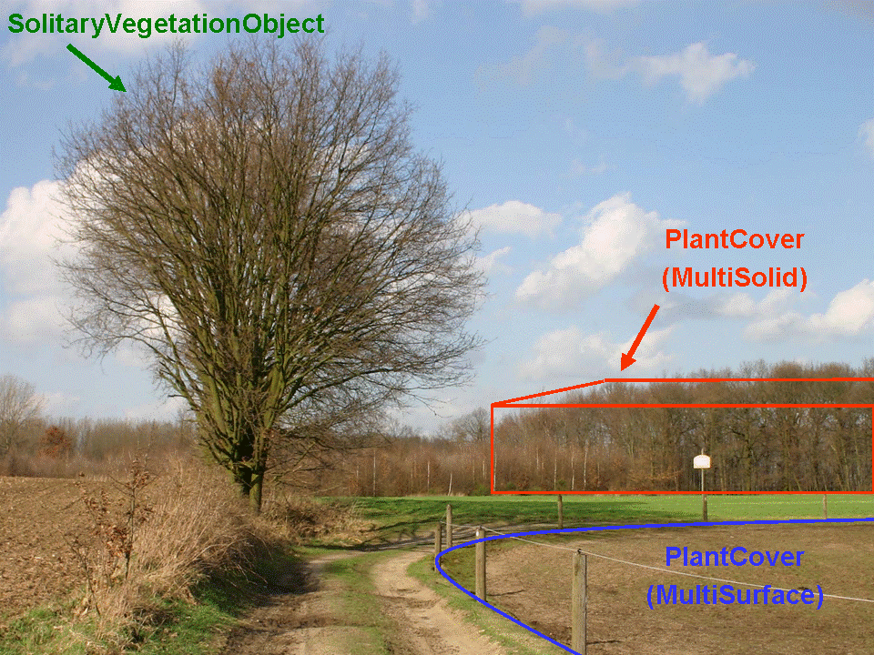
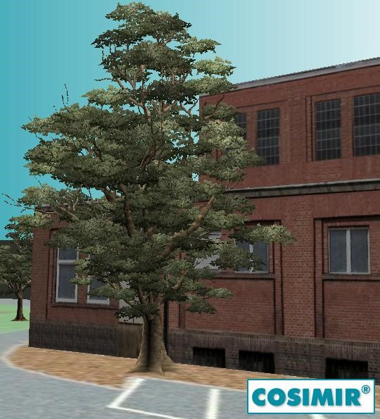
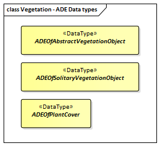

[[ug_model_vegetation_section]]
=== Vegetation

|===
^|*Contributors*
|C. Heazel - first draft
|===

[[ug_vegetation_synopsis_section]]
==== Synopsis

The Vegetation module defines the concepts to represent vegetation within city models. Vegetation can be represented either as solitary vegetation objects, such as trees, bushes and ferns, or as vegetation areas that are covered by plants of a given species or a typical mixture of plant species, such as forests, steppes and wet meadows.

[[ug_vegetation_concepts_section]]
==== Key Concepts

**Solitary Vegetation Object**: A SolitaryVegetationObject represents individual vegetation objects, e.g. trees or bushes.

**Plant Cover**: A PlantCover represents a space covered by vegetation.

[[ug_vegetation_discussion_section]]
==== Discussion

Vegetation features are important components of a 3D city model, since they support the recognition of the surrounding environment. By the analysis and visualisation of vegetation objects, statements on their distribution, structure and diversification can be made. Habitats can be analysed and impacts on the fauna can be derived. The vegetation model may be used as a basis for simulations of, for example forest fire, urban aeration or micro climate. The model could be used, for example to examine forest damage, to detect obstacles (e.g. con-cerning air traffic) or to perform analysis tasks in the field of environmental protection.

The vegetation model of CityGML distinguishes between solitary vegetation objects like trees and vegetation areas, which represent biotopes like forests or other plant communities (<<figure-63>>). Single vegetation objects are modelled by the class `SolitaryVegetationObject`, whereas for areas filled with a specific vegetation the class `PlantCover` is used. The geometry representation of a PlantCover feature may be a MultiSurface or a MultiSolid, depending on the vertical extent of the vegetation. For example regarding forests, a MultiSolid representation might be more appropriate. 

[[figure-63]]
.Example for vegetation objects of the classes SolitaryVegetationObject and PlantCover (graphic: District of Recklinghausen).

[[ug_vegetation_lod_section]]
==== Level of Detail

The geometry of a SolitaryVegetationObject may be defined in LOD 1-4 explicitly by a GML geometry having absolute coordinates, or prototypically by an ImplicitGeometry. Solitary vegetation objects probably are one of the most important features where implicit geometries are appropriate, since the shape of most types of vegetation objects, such as trees of the same species, can be treated as identical in most cases. Furthermore, season dependent appearances may by mapped using ImplicitGeometry. For visualisation purposes, only the content of the library object defining the object’s shape and appearance has to be swapped (see <<figure-65>>).

[[figure-65]]
image::figures/inwork/Figure_65_a.jpg[align="center"]
.Visualisation of a vegetation object in different seasons (source: District of Recklinghausen).

A SolitaryVegetationObject or a PlantCover may have a different geometry in each LOD. Whereas a SolitaryVegetationObject is associated with the `Geometry` class representing an arbitrary geometry, a PlantCover is restricted to be either a `MultiSolid` or a `MultiSurface`. An example of a PlantCover modeled as MultiSolid is a ‘solid forest model’ (see <<figure-66>>).

[[figure-66]]
.Example for the visualisation/modelling of a solid forest (source: District of Recklinghausen).
image::figures/Figure_66.png[align="center"]

[[ug_vegetation_uml_section]]
==== UML Model

The UML diagram of the Vegetation module is depicted in <<vegetation-uml>>.

A SolitaryVegetationObject may have the attributes `class`, `function`, `usage`, `species`, `height`, `trunkDiameter`, `crownDiameter`, `rootBallDiameter`, and `maxRootBallDepth`. The attribute `class` contains the classification of the object or plant habit, e.g. tree, bush, grass, and can occur only once. The attribute `species` defines the species’ name, for example “Abies alba”, and can occur at most once. The optional attributes `function` and `usage` denotes the intended respectively real purpose of the object, for example botanical monument, and can occur multiple times. The possible attribute values for `class`, `species`, `function`, and `usage` can be provided in a code list. The attribute `height` contains the relative height of the object. The attributes `crownDiameter` and `trunkDiameter` represent the plant crown and trunk diameter respectively. The trunk diameter is often used in regulations of municipal cadastre (e.g. tree management rules). The attributes `rootBallDiameter` and `maxRootBallDepth` represent the diameter of the root ball and its' maximum depth respectively. 

A PlantCover feature may have the attributes `class`, `function`, `usage`, `averageHeight`, `minHeight`, and `maxHeight`. The plant community of a PlantCover is represented by the attribute `class`. The values of this attribute can be specified in a code list whose values should not only describe one plant type or species, but denote a typical mixture of plant types in a plant community. This information can be used in particular to generate realistic 3D visualisations, where the PlantCover region is automatically, perhaps randomly, filled with a corresponding mixture of 3D plant objects. The attributes `function` and `usage` indicate the intended respectively real purpose of the object, for example national forest, and can occur multiple times. The attributes `averageHeight`, `minHeight`, and `maxHeight` denotes the minimum, maximum, and average relative vegetation heights.

Since SolitaryVegetationObject and PlantCover are subclasses of AbstractOccupiedSpace, they are Features. As such they inherit the attribute `name` from the AbstractFeature class and an ExternalReference to a corresponding object. That external object may be in an external information system which may contains botanical information from public environmental agencies.

[[vegetation-uml]]
.UML diagram of the Vegetation Model.

image::../standard/figures/Vegetation.png[align="center"]

The ADE data types provided for the Vegetation module are illustrated in <<vegetation-uml-ade-types>>.

[[vegetation-uml-ade-types]]
.ADE classes of the CityGML Vegetation module.

The Code Lists provided for the Vegetation module are illustrated in <<vegetation-uml-codelists>>.

[[vegetation-uml-codelists]]
.Codelists from the CityGML Vegetation module.
image::../standard/figures/Vegetation-Codelists.png[align="center"]

[[ug_vegetation_examples_section]]
==== Examples

The following two excerpts of a CityGML dataset contain a solitary tree (SolitaryVegetationObject) and a plant community (PlantCover). The solitary tree has the attributes: class = 1070 (deciduous tree), species = 1040 (Fagus/beech), height = 8 m, trunkDiameter = 0.7 m, crownDiameter = 8.0 m. The plant community has the attributes: class =1180 (isoeto-nanojuncetea), averageHeight = 0.5 m. 

NOTE: include examples, GML or other?

