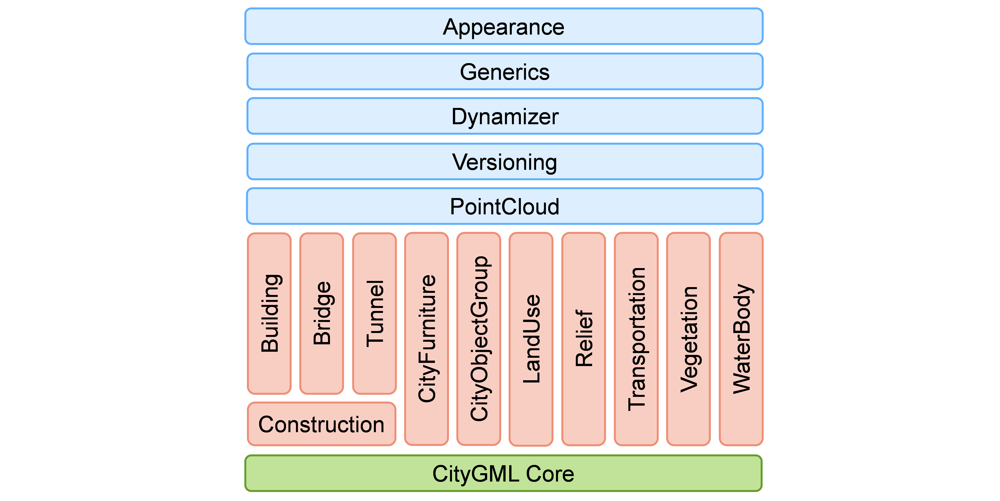

[[ug-modularization-section]]
=== Modularization

The CityGML Conceptual Model provides models for the most important types of objects within virtual 3D city and landscape models. These feature types have been identified to be either required or important in many different application areas. However, implementations are not required to support the complete CityGML model in order to be conformant to the standard. Implementations may employ a subset of constructs according to their specific information needs. For this purpose, modularisation is applied to the CityGML CM.

[[figure-moduleoverview,Figure {counter:figure-num}]]
.CityGML 3.0 module overview. The vertical boxes show the different thematic modules. Horizontal modules specify concepts that are applicable to all thematic modules.

The CityGML conceptual model is thematically decomposed into a _Core module_ and different kinds of _extension modules_ as shown in <<figure-moduleoverview>>. The Core module (shown in green) comprises the basic concepts and components of the CityGML CM and, thus, must be implemented by any conformant system. Each red colored module covers a specific thematic field of virtual 3D city models.

The CityGML CM introduces the following eleven thematic extension modules: _Building_, _Bridge_, _Tunnel_, _Construction_, _CityFurniture_, _CityObjectGroup_, _LandUse_, _Relief_, _Transportation_, _Vegetation_, and _WaterBody_. All three modules _Building_, _Bridge_, and _Tunnel_ model civil structures and share common concepts that are grouped within the _Construction_ module. The five blue colored extension modules add specific modelling aspects that can be used in conjunction with all thematic modules:

* The _Appearance_ module contains the concepts to represent appearances (like textures and colours) of city objects.
* The _PointCloud_ module provides concepts to represent the geometry of city objects by 3D point clouds.
* The _Generics_ module defines the concepts for generic objects, attributes, and relationships.
* _Versioning_ adds concepts for the representation of concurrent versions, real world object histories and feature histories.
* The _Dynamizer_ module contains the concepts to represent city object properties by time series data and to link them with sensors, sensor data services or external files.

Each CityGML encoding can specify support for a subset of the CityGML modules only. If a module is supported by an encoding, then all concepts should be mapped. However, the encoding specification can define so-called _null mappings_ to restrict the use of specific elements of the conceptual model in an encoding. Null mappings can be expressed in an encoding specification for individual feature types, properties, and associations defined within a CityGML module. This means that the corresponding element will not be included in the respective encoding.

Note that also CityGML applications do not have to support all modules. Applications can also decide to only support a specific subset of CityGML modules. For example, when an application only has to work with building data, only the modules _Core_, _Construction_, and _Building_ would have to be supported.
