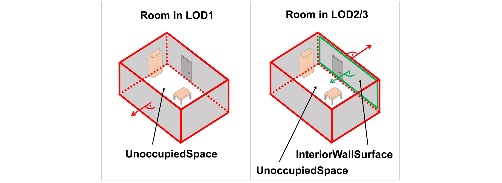
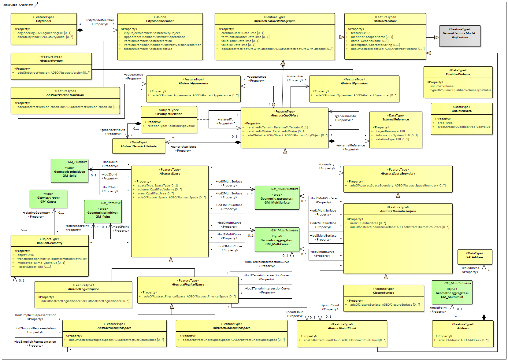

[[ug_model_core_section]]
=== Core

|===
^|*Contributors*
|TBD
|===

[[ug_core_synopsis_section]]
==== Synopsis

The CityGML Core module defines the basic concepts and components of city models. This rather large body of work is divided into six sections. These sections build on each other from the fundamental principles specified by the relevant ISO standards up to the full CityGML model. 

[[ug_core_concepts_section]]
==== Key Concepts

These sections are summarized in <<ug_citygml-core-table>>.

[[ug_citygml-core-table,Table {counter:table-num}]]
.CityGML Core Sections
[width="90%",cols="^2,6"]
|===
|<<ug_iso_dependencies_section,The Use of ISO Standards>> |Describes the use of the ISO 19100 series of International Standards to provide a foundation to the CityGML model.
|<<ug_city_objects_section,City Models and City Objects>>|Defines the basic building blocks of the CityGML model.
|<<ug_space_concepts_section,Space Concept>>|Defines the concepts of space as used in the CityGML model.
|<<ug_geometry_lod_section,Geometry and LOD>>|Defines the geometry and Levels Of Detail concepts.
|<<ig_citygml_section,CityGML Core Model>>|Presents the complete Core model.
|<<b-e-c-section,Types, Enumerations, and Codelist>> |Defines the little things which make this model work.
|===

[[ug_iso_dependencies_section]]
==== ISO Classes

CityGML builds on the ISO 19100 family of standards. The applicable standards are identified in the diagram in <<ISO-in-CityGML-diagram>>. 

[[ISO-in-CityGML-diagram,Figure {counter:figure-num}]]
.Use of ISO Standards in CityGML
image::../standard/figures/Core/ISOandOASISstandardsinCityGML.png[align="center"]

The ISO classes explicitly used in the CityGML UML model are introduced in <<iso-class-table>>. 

[[iso-class-table,Table {counter:table-num}]]
.ISO Classes used in CityGML
[cols="2,6",options="headers"]
|===
^|*Class Name* ^|*Description*
|<<AnyFeature-section,AnyFeature>> |A generalization of all feature types
|<<CV_DiscreteGridPointCoverage-section,CV_DiscreteGridPointCoverage>> |A coverage that returns the same feature attribute values for every direct position within any object in its domain.
|<<DirectPosition-section,Direct Position>> |The coordinates for a position within some coordinate reference system.
|<<GM_Object-section,GM_Object>> | root class of the geometric object taxonomy.
|<<GM_MultiCurve-section,GM_MultiCurve>> |An aggregate class containing only instances of GM_OrientableCurve.
|<<GM_MultiPoint-section,GM_MultiPoint>> |An aggregate class containing only points.
|<<GM_MultiSurface-section,GM_MultiSurface>> | An aggregate class containing only instances of GM_OrientableSurface.
|<<GM_Point-section,GM_Point>> |The basic data type for a geometric object consisting of one and only one point.
|<<GM_Solid-section,GM_Solid>> |The basis for 3-dimensional geometry. The extent of a solid is defined by the boundary surfaces.
|<<GM_Surface-section,GM_Surface>> |The basis for 2-dimensional geometry.
|<<GM_Tin-section,GM_Tin>> |A GM_TriangulatedSurface which uses the Delaunay or similar algorithm.
|<<GM_TriangulatedSurface-section,GM_TriangulatedSurface>> |A GM_PolyhedralSurface that is composed only of triangles
|<<SC_CRS-section,SC_CRS>> |Coordinate reference system which is usually single but may be compound.
|<<TM_Position-section,TM_Position>> |A union class that consists of one of the data types listed as its attributes.
|===

[[ug_city_objects_section]]
==== City Models and City Objects

[[ug_space_concepts_section]]
==== Space Concept

[[ug_geometry_lod_section]]
==== Geometry and LOD

<<core-boundaries-table>> lists the surfaces that are allowed as thematic surface boundaries of the space classes defined in the Core module:

[[core-boundaries-table,Table {counter:table-num}]]
.Core space classes and their allowed thematic surface boundaries
[cols="2,6",options="headers"]
|===
^|*Space class* ^|*Allowed space boundaries*
|AbstractLogicalSpace
a| * Core::AbstractSpaceBoundary and the subclasses: +
{nbsp}{nbsp}{nbsp}{nbsp}Core::AbstractThematicSurface, +
{nbsp}{nbsp}{nbsp}{nbsp}Core::ClosureSurface
   * Generics::GenericThematicSurface
   * possible classes from ADEs

|AbstractOccupiedSpace
a| * Core::AbstractSpaceBoundary and the subclasses: +
{nbsp}{nbsp}{nbsp}{nbsp}Core::AbstractThematicSurface, +
{nbsp}{nbsp}{nbsp}{nbsp}Core::ClosureSurface
   * Generics::GenericThematicSurface
   * possible classes from ADEs

|AbstractPhysicalSpace
a| * Core::AbstractSpaceBoundary and the subclasses: +
{nbsp}{nbsp}{nbsp}{nbsp}Core::AbstractThematicSurface, +
{nbsp}{nbsp}{nbsp}{nbsp}Core::ClosureSurface
   * Generics::GenericThematicSurface
   * possible classes from ADEs

|AbstractSpace
a| * Core::AbstractSpaceBoundary and the subclasses: +
{nbsp}{nbsp}{nbsp}{nbsp}Core::AbstractThematicSurface, +
{nbsp}{nbsp}{nbsp}{nbsp}Core::ClosureSurface
   * Generics::GenericThematicSurface
   * possible classes from ADEs

|AbstractUnoccupiedSpace
a| * Core::AbstractSpaceBoundary and the subclasses: +
{nbsp}{nbsp}{nbsp}{nbsp}Core::AbstractThematicSurface, +
{nbsp}{nbsp}{nbsp}{nbsp}Core::ClosureSurface
   * Generics::GenericThematicSurface
   * possible classes from ADEs
|===

[[family_tree,Table {counter:table-num}]]
.CityGML Class Family Tree
[cols="2,8"]
|====
Appearance |AbstractAppearance->AbstractFeatureWithLifespan->AbstractFeature
| |
|Bridge |AbstractBridge->AbstractConstruction->AbstractThematicSurface->AbstractSpaceBoundary->AbstractCityObject->AbstractFeatureWithLifespan->AbstractFeature
| |BridgeConstructiveElement->AbstractConstructiveElement->AbstractOccupiedSpace->AbstractPhysicalSpace->AbstractSpace->AbstractCityObject->AbstractFeatureWithLifespan->AbstractFeature
| |BridgeRoom->AbstractUnoccupiedSpace->AbstractPhysicalSpace->AbstractSpace->AbstractCityObject->AbstractFeatureWithLifespan->AbstractFeature
| |BridgeInstallation->AbstractInstallation->AbstractOccupiedSpace->AbstractPhysicalSpace->AbstractSpace->AbstractCityObject->AbstractFeatureWithLifespan->AbstractFeature
| |BridgeFurniture->AbstractFurniture->AbstractOccupiedSpace->AbstractPhysicalSpace->AbstractSpace->AbstractCityObject->AbstractFeatureWithLifespan->AbstractFeature
| |
|Building |AbstractBuilding->AbstractConstruction->AbstractThematicSurface->AbstractSpaceBoundary->AbstractCityObject->AbstractFeatureWithLifespan->AbstractFeature
| |AbstractBuildingSubdivision->AbstractLogicalSpace->AbstractSpace->AbstractCityObject->AbstractFeatureWithLifespan->AbstractFeature
| |BuildingConstructiveElement->AbstractConstructiveElement->AbstractOccupiedSpace->AbstractPhysicalSpace->AbstractSpace->AbstractCityObject->AbstractFeatureWithLifespan->AbstractFeature
| |BuildingRoom->AbstractUnoccupiedSpace->AbstractPhysicalSpace->AbstractSpace->AbstractCityObject->AbstractFeatureWithLifespan->AbstractFeature
| |BuildingInstallation->AbstractInstallation->AbstractOccupiedSpace->AbstractPhysicalSpace->AbstractSpace->AbstractCityObject->AbstractFeatureWithLifespan->AbstractFeature
| |BuildingFurniture->AbstractFurniture->AbstractOccupiedSpace->AbstractPhysicalSpace->AbstractSpace->AbstractCityObject->AbstractFeatureWithLifespan->AbstractFeature
| |
|City Furniture |CityFurniture->AbstractOccupiedSpace->AbstractPhysicalSpace->AbstractSpace->AbstractCityObject->AbstractFeatureWithLifespan->AbstractFeature
| |
|City Object Group |CityObjectGroup->AbstractLogicalSpace->AbstractSpace->AbstractCityObject->AbstractFeatureWithLifespan->AbstractFeature
| |
|Construction |AbstractConstruction->AbstractOccupiedSpace->AbstractPhysicalSpace->AbstractSpace->AbstractCityObject->AbstractFeatureWithLifespan->AbstractFeature
| |AbstractConstructiveElement->AbstractOccupiedSpace->AbstractPhysicalSpace->AbstractSpace->AbstractCityObject->AbstractFeatureWithLifespan->AbstractFeature
| |AbstractFillingElement->AbstractOccupiedSpace->AbstractPhysicalSpace->AbstractSpace->AbstractCityObject->AbstractFeatureWithLifespan->AbstractFeature
| |AbstractFurniture->AbstractOccupiedSpace->AbstractPhysicalSpace->AbstractSpace->AbstractCityObject->AbstractFeatureWithLifespan->AbstractFeature
| |AbstractInstallation->AbstractOccupiedSpace->AbstractPhysicalSpace->AbstractSpace->AbstractCityObject->AbstractFeatureWithLifespan->AbstractFeature
| |AbstractConstructionSurface->AbstractThematicSurface->AbstractSpaceBoundary->AbstractCityObject->AbstractFeatureWithLifespan->AbstractFeature
| |AbstractFillingSurface->AbstractThematicSurface->AbstractSpaceBoundary->AbstractCityObject->AbstractFeatureWithLifespan->AbstractFeature
| |
|Dynamizer |Dynamizer->AbstractDynamizer->AbstractFeatureWithLifespan->AbstractFeature
| |SensorConnection->AbstractCityObject->AbstractFeatureWithLifespan->AbstractFeature
| |AbstractTimeseries->AbstractFeature
| |
|Generics |GenericLogicalSpace->AbstractLogicalSpace->AbstractSpace->AbstractCityObject->AbstractFeatureWithLifespan->AbstractFeature
| |GenericOccupiedSpace->AbstractOccupiedSpace->AbstractPhysicalSpace->AbstractSpace->AbstractCityObject->AbstractFeatureWithLifespan->AbstractFeature
| |GenericUnoccupiedSpace->AbstractUnoccupiedSpace->AbstractPhysicalSpace->AbstractSpace->AbstractCityObject->AbstractFeatureWithLifespan->AbstractFeature
| |GenericThematicSurface->AbstractThematicSurface->AbstractSpaceBoundary->AbstractCityObject->AbstractFeatureWithLifespan->AbstractFeature
| |
|Land Use |LandUse->AbstractThematicSurface->AbstractSpaceBoundary->AbstractCityObject->AbstractFeatureWithLifespan->AbstractFeature
| |
|Point Cloud |PointCloud->AbstractPointCloud->AbstractFeature
| |
|Relief |ReliefFeature->AbstractSpaceBoundary->AbstractCityObject->AbstractFeatureWithLifespan->AbstractFeature
| |AbstractReliefComponent->AbstractSpaceBoundary->AbstractCityObject->AbstractFeatureWithLifespan->AbstractFeature
| |
|Trasportation |AbstractTransportationSpace->AbstractUnoccupiedSpace->AbstractPhysicalSpace->AbstractSpace->AbstractCityObject->AbstractFeatureWithLifespan->AbstractFeature
| |ClearanceSpace->AbstractUnoccupiedSpace->AbstractPhysicalSpace->AbstractSpace->AbstractCityObject->AbstractFeatureWithLifespan->AbstractFeature
| |AuxillaryTrafficSpace->AbstractUnoccupiedSpace->AbstractPhysicalSpace->AbstractSpace->AbstractCityObject->AbstractFeatureWithLifespan->AbstractFeature
| |Marking->AbstractThematicSurface->AbstractSpaceBoundary->AbstractCityObject->AbstractFeatureWithLifespan->AbstractFeature
| |AuxillaryTrafficArea->AbstractThematicSurface->AbstractSpaceBoundary->AbstractCityObject->AbstractFeatureWithLifespan->AbstractFeature
| |
|Tunnel |AbstractTunnel->AbstractThematicSurface->AbstractSpaceBoundary->AbstractCityObject->AbstractFeatureWithLifespan->AbstractFeature
| |TunnelConstructiveElement->AbstractConstructiveElement->AbstractOccupiedSpace->AbstractPhysicalSpace->AbstractSpace->AbstractCityObject->AbstractFeatureWithLifespan->AbstractFeature
| |HollowSpace->AbstractUnoccupiedSpace->AbstractPhysicalSpace->AbstractSpace->AbstractCityObject->AbstractFeatureWithLifespan->AbstractFeature
| |TunnelInstallation->AbstractInstallation>AbstractOccupiedSpace->AbstractPhysicalSpace->AbstractSpace->AbstractCityObject->AbstractFeatureWithLifespan->AbstractFeature
| |TunnelFurniture->AbstractFurniture>AbstractOccupiedSpace->AbstractPhysicalSpace->AbstractSpace->AbstractCityObject->AbstractFeatureWithLifespan->AbstractFeature
| |
|Vegetation |AbstractVegetationObject->AbstractOccupiedSpace->AbstractPhysicalSpace->AbstractSpace->AbstractCityObject->AbstractFeatureWithLifespan->AbstractFeature
| |
|Version |Version->AbstractVersion->AbstractFeatureWithLifespan->AbstractFeature
| |VersionTransition->AbstractVersionTransition->AbstractFeatureWithLifespan->AbstractFeature
| |
|Water Body |WaterBody->AbstractOccupiedSpace->AbstractPhysicalSpace->AbstractSpace->AbstractCityObject->AbstractFeatureWithLifespan->AbstractFeature
| |AbstractWaterBodySurface->AbstractThematicSurface->AbstractSpaceBoundary->AbstractCityObject->AbstractFeatureWithLifespan->AbstractFeature
|====

[[city-objects-section]]
==== City Models and City Objects

City models are virtual representations of real-world cities and landscapes. A city model aggregates different types of objects, which can be city objects, appearances, different versions of the city model, transitions between different versions of the city model, and feature objects. All objects defined in the CityGML CM are features with lifespan. This allows the optional specification of the real-world and database times for the existence of each feature, as is required by the Versioning module (cf. <<ug_model_versioning_section>>). Features that define thematic concepts related to cities and landscapes, such as building, bridge, water body, or land use, are referred to as city objects. All city objects define properties that describe the objects in more detail. These static properties can be overridden with time-varying data through Dynamizers (cf. <<ug_model_dynamizer_section>>).

[[city_model_and_objects,Figure {counter:figure-num}]]
.UML City Models and City Objects
image::../standard/figures/Core/Core-City_models_and_city_objects.png[align="center"]

[[space-concepts-section]]
==== Space Concept

All city objects are differentiated into spaces and space boundaries. Spaces are entities of volumetric extent in the real world. Buildings, water bodies, trees, rooms, and traffic spaces, for instance, have a volumetric extent. Spaces can be classified into physical spaces and logical spaces. Physical spaces, in turn, can be further classified into occupied spaces and unoccupied spaces.

Space boundaries, in contrast, are entities with areal extent in the real world. Space boundaries can be differentiated into different types of thematic surfaces, such as wall surfaces and roof surfaces.

A detailed introduction to the Space concept can be found in <<overview-section-coremodel>>.
In particular, the classification into OccupiedSpace and UnoccupiedSpace might not always be apparent at first sight. Carports, for instance, represent an OccupiedSpace, although they are not closed and most of the space is free of matter, see <<figure-carport>>. Since a carport is a roofed, immovable structure with the purpose of providing shelter to objects (i.e. cars), carports are frequently represented as buildings in cadastres. Thus, also in CityGML, a carport should be modelled as an instance of the class Building. Since Building is transitively a subclass of OccupiedSpace, a carport is an OccupiedSpace as well. However, only in LOD1, the entire volumetric region covered by the carport would be considered as physically occupied. In LOD1, the occupied space is defined by the entire carport solid (unless a room would be defined in LOD1 that would model the unoccupied part below the roof); whereas in LOD2 and LOD3, the solids represent more realistically the really physically occupied space of the carport. In addition, for all OccupiedSpaces, the normal vectors of the thematic surfaces like the RoofSurface need to point away from the solids, i.e. consistent with the solid geometry.

[[figure-carport,Figure {counter:figure-num}]]
.Representation of a carport as OccupiedSpace in different LODs. The red boxes represent solids, the green area represents a surface. In addition, the normal vectors of the roof solid (in red) and the roof surface (in green) are shown.
image::../standard/images/carport.png[align="center"]

In contrast, a room is a physically unoccupied space. In CityGML, a room is represented by the class BuildingRoom that is a subclass of UnoccupiedSpace. In LOD1, the entire room solid would be considered as unoccupied space, which can contain furniture and installations, though, as is shown in <<figure-room>>. In LOD2 and 3, the solid represents more realistically the really physically unoccupied space of the room (possibly somewhat generalized as indicated in the figure). For all UnoccupiedSpaces, the normal vectors of the bounding thematic surfaces like the InteriorWallSurface need to point inside the object, i.e. opposite to the solid geometry.

[[figure-room,Figure {counter:figure-num}]]
.Representation of a room as UnoccupiedSpace in different LODs. The red boxes represent solids, the green area represents a surface. In addition, the normal vectors of the room solid (in red) and the wall surface (in green) are shown.

The UML diagram of the Space concept classes is depicted in <<core-spaceconcept>>.

[[core-spaceconcept,Figure {counter:figure-num}]]
.UML Space Concepts
image::../standard/figures/Core/Core-Space_concepts.png[align="center"]

[[geometry-lod-section]]
==== Geometry and LOD

Spaces and space boundaries can have various geometry representations depending on the Levels of Detail (LOD). Spaces can be spatially represented as single points in LOD0, multi-surfaces in LOD0/2/3, solids in LOD1/2/3, and multi-curves in LOD2/3. Space boundaries can be represented as multi-surfaces in LOD0/2/3 and as multi-curves in LOD2/3. All Levels of Detail allow for the representation of the interior of city objects.

The different Levels of Detail are defined in the following way:

* LOD 0: Volumetric real-world objects (Spaces) can be spatially represented by a single point, by a set of curves, or by a set of surfaces. Areal real-world objects (Space Boundaries) can be spatially represented in LOD0 by a set of curves or a set of surfaces. LOD0 surface representations are typically the result of a projection of the shape of a volumetric object onto a plane parallel to the ground, hence, representing a footprint (e.g. a building footprint or a floor plan of the rooms inside a building). LOD0 curve representations are either the result of a projection of the shape of a vertical surface (e.g. a wall surface) onto a grounding plane or the skeleton of a volumetric shape of longitudinal extent such as a road or river segment.
* LOD 1: Volumetric real-world objects (Spaces) are spatially represented by a vertical extrusion solid, i.e. a solid created from a horizontal footprint by vertical extrusion. Areal real-world objects (Space Boundaries) can be spatially represented in LOD1 by a set of horizontal or vertical surfaces.
* LOD 2: Volumetric real-world objects (Spaces) can be spatially represented by a set of curves, a set of surfaces, or a single solid geometry. Areal real-world objects (Space Boundaries) can be spatially represented in LOD2 by a set of surfaces. The shape of the real-world object is generalized in LOD2 and smaller details (e.g. bulges, dents, sills, but also structures like e.g. balconies or dormers of buildings) are typically neglected. LOD2 curve representations are skeletons of volumetric shapes of longitudinal extent like an antenna or a chimney.
* LOD 3: Volumetric real-world objects (Spaces) can be spatially represented by a set of curves, a set of surfaces, or a single solid geometry. Areal real-world objects (Space Boundaries) can be spatially represented in LOD3 by a set of surfaces. LOD3 is the highest level of detail and respective geometries include all available shape details.

In addition, the geometry can also be represented implicitly. The shape is stored only once as a prototypical geometry, which then is re-used or referenced, wherever the corresponding feature occurs in the 3D city model.

The thematic classes, such as building, tunnel, road, land use, water body, or city furniture are defined as subclasses of the space and space boundary classes within the thematic modules. Since all city objects in the thematic modules represent subclasses of the space and space boundary classes, they automatically inherit the geometries defined in the Core module.

The UML diagram of the Geometry and LoD concept classes is depicted in <<core-geometry>>.

[[core-geometry,Figure {counter:figure-num}]]
.UML Geometry and LOD Concepts
image::../standard/figures/Core/Core-Geometry_and_LoD_concept.png[align="center"]

Of particular note is the Implicit Geometry concept. Many of the objects encountered in a city landscape have the same geometry. How many types of street lamps can there be? An Implicit Geometry captures that geometry once, and re-uses that one geometry for all similar street lamp objects.

NOTE: The following text needs to be reviewed and updated.

The CityGML Core module defines the basic concepts and components of the overall CityGML data model.  It forms the universal lower bound of the CityGML data model and, thus, is a dependency of all extension modules. Consequently, the core module has to be implemented by any conformant system. Primarily, the core module provides the abstract base classes from which thematic classes within extension modules are (transitively) derived. Besides abstract type definitions, the core also contains non-abstract content, for example basic data types and thematic classes that may be used by more than one extension module. The UML diagram in Fig. 21 illustrates CityGML’s core module, for the XML Schema definition see below and annex A.1.

[[figure-21]]
.UML diagram of CityGML’s core module. The bracketed numbers following the attribute names denote the attribute’s multiplicity: the minimal and maximal number of occurrences of the attribute per object. For example, a name is optional (0) in the class _Feature or may occur multiple times (star symbol), while a _CityObject has none or at most one creationDate. Prefixes are used to indicate XML namespaces associated with model elements. Element names without a prefix are defined within the CityGML Core module.
image::figures/Figure_21.png[]

The base class of all thematic classes within CityGML’s data model is the abstract class  _CityObject. _CityObject provides a creation and a termination date for the management of histories of features as well as the possibility to model external references to the same object in other data sets. Furthermore, two qualitative attributes relativeToTerrain and relativeToWater are provided which enable to specify the feature’s location with respect to the terrain and water surface. The possible topological relations are illustrated in Fig. 22. Both attributes facilitate simple and efficient queries like for the number of subsurface buildings (entirelyBelowTerrain) without the need for an additional digital terrain model or a model of the water body.

[[figure-22]]
image::figures/inwork/Figure_22_a.png[]
.Topological relations of a CityGML object with respect to a) the terrain and b) the water surface.

_CityObject is a subclass of the GML class _Feature, thus it inherits the metadata property (which can be e.g. information about the lineage, quality aspects, accuracy, local CRS) and name property from the superclass _GML. A _CityObject may have multiple names, which are optionally qualified by a codeSpace. This enables the differentiation between, for example, an official name and a popular name or of names in different languages (cf. the name property of GML objects, Cox et al. 2004). The generalisation property generalizesTo of _CityObject may be used to relate features, which represent the same real-world object in different Levels-of-Detail, i.e. a feature and its generalised counterpart(s). The direction of this relation is from the feature to the corresponding generalised feature.

Thematic classes may have further subclasses with relations, attributes and geometry. Features of the specialized subclasses of _CityObject may be aggregated to a single CityModel, which is a feature collection with optional metadata. Generally, each feature has the attributes class, function, and usage, unless it is stated otherwise. The class attribute can occur only once, while the attributes usage and function can be used multiple times. The class attribute allows for the classification of features beyond the thematic class hierarchy of _CityObject. For exam-ple, a building feature is represented by the thematic subclass bldg:Building of _CityObject in the first place (this subclass is defined within CityGML’s Building module, cf. chapter 10.3). A further classification, e.g. as resi-dential or administration building, may then be modelled using the class attribute of the class bldg:Building. The attribute function normally denotes the intended purpose or usage of the object, such as hotel or shopping centre for a building, while the attribute usage normally defines its real or actual usage. Possible values for the attrib-utes class, function, and usage can be specified in code lists which are recommended to be implemented as simple dictionaries following the Simple Dictionary Profile of GML 3.1.1 (cf. chapter 6.6 and 10.14). Annex C provides code lists proposed and maintained by the SIG 3D which contain feasible attribute values and which may be extended or redefined by users.

In addition to thematic content, the core module also provides the concept of implicit geometries as an enhance-ment of the geometry model of GML3. Since this concept is strongly related to the spatial model of CityGML it has already been introduced in chapter 8.2.

The top level class hierarchy of the thematic model in CityGML is presented in Fig. 23. The subclasses of _CityObject comprise the different thematic fields of a city model covered by separate CityGML extension modules: the terrain, buildings, bridges, tunnels, the coverage by land use objects, water bodies, vegetation, generic city objects, city furniture objects, city object groups, and transportation. To indicate the extension module defining a respective subclass of _CityObject, the class names in Fig. 23 are preceded by prefixes. Each prefix is associated with one CityGML extension module (see chapter 4.3 and chapter 7 for a list of CityGML’s extension modules and the corresponding prefixes).

[[figure-23]]
.CityGML’s top level class hierarchy. Prefixes are used to indicate XML namespaces associated with model elements. Element names without a prefix are defined within the CityGML Core module.
image::figures/Figure_23.png[]

The classes GenericCityObject and _genericAttribute defined within CityGML’s Generics module (cf. chapters 6.11 and 10.12) allow for modelling and exchanging of 3D objects which are not covered by any other thematic class or which require attributes not represented in CityGML. For example, in the future, sites derived from the abstract class _Site of the core module may be completed by further subclasses like excavation, city wall or embankment. At present, the class GenericCityObject should be used in order to represent and exchange these features. However, the concept of generic city objects and attributes may only be used if appropriate thematic classes or attributes are not provided by any other CityGML module.

If the Generics module is employed, each CityObject may be assigned an arbitrary number of generic attributes in order to represent additional properties of features. For this purpose, the Generics module augments the abstract base class _CityObject by the property element _genericAttribute. The additional property _genericAttribute is injected into _CityObject using CityGML’s Application Domain Extension mechanism (cf. chapter 10.13). By this means, each thematic subclass of _CityObject inherits this property and, thus, the possi-bility to contain generic attributes. Therefore, the Generics module has a deliberate impact on all CityGML extension modules defining thematic subclasses of _CityObject.

Appearance information about a feature’s surfaces can be represented by the class Appearance provided by CityGML’s Appearance module (cf. chapter 9). In contrast to the other thematic extensions to the core, Appear-ance is not derived from _CityObject but from the GML class _Feature. _CityObject features and Appearance features may be embraced within a single CityModel feature collection in an arbitrary or even mixed sequence using the cityObjectMember and appearanceMember elements, both being members of the substitution group gml:featureMember (cf. chapter 9 and chapter 10.1.1). Furthermore, feature appearances may be stored inline the _CityObject itself. In order to enable city objects to store appearance information, the Appearance module augments the abstract base class _CityObject by the property element appearance using CityGML’s Application Domain Extension mechanism (cf. chapter 10.13). Consequently, the appearance property is only available for _CityObject and its thematic subclasses if the Appearance module is supported. Therefore, like the Generics module, the Appearance module has a deliberate impact on any other extension module.

For sake of completeness, the class TexturedSurface is also illustrated in Fig. 23. This approach of appearance modelling of previous versions of CityGML has been deprecated and is expected to be removed in future CityGML versions. Since the information covered by TexturedSurface can be losslessly converted to the Ap-pearance module, the use of TexturedSurface is strongly discouraged.

==== Base elements

===== AbstractCityObjectType, _CityObject

===== AbstractCityObjectType, _CityObject

NOTE: insert AbstractCityObjectType, _CityObject UML

===== CityModelType, CityModel

NOTE: insert CityModelType, CityModel UML

===== cityObjectMember

NOTE: insert cityObjectMember UML

===== AbstractSiteType, _Site

NOTE: insert AbstractSiteType, _Site UML

The abstract class _Site is intended to be the superclass for buildings, bridges, tunnels, facilities, etc. Future extension of CityGML (e.g. excavations, city walls or embankments) would be modelled as subclasses of _Site. As subclass of _CityObject, a _Site inherits all attributes and relations, in particular the id, names, external references, and generalisation relations.

==== Generalisation relation, RelativeToTerrainType and RelativeToWaterType

===== GeneralizationRelationType

NOTE: insert GeneralizationRelationType UML

===== RelativeToTerrainType, RelativeToWaterType

NOTE: insert RelativeToTerrainType, RelativeToWaterType UML

==== External references

An ExternalReference defines a hyperlink from a _CityObject to a corresponding object in another information system, for example in the German cadastre (ALKIS), the German topographic information system (ATKIS), or the OS MasterMap®. The reference consists of the name of the external information system, represented by an URI, and the reference of the external object, given either by a string or by an URI. If the informationSystem element is missing in the ExternalReference, the ExternalObjectReference must be an URI.

===== ExternalReferenceType, ExternalObjectReferenceType

NOTE: insert ExternalReferenceType, ExternalObjectReferenceType UML

==== Address information

The CityGML core module provides the means to represent address information of real-world features within virtual city models. Since not every real-world feature is assigned an address, a correspondent address property is not defined for the base class _CityObject, but has to be explicitly modelled for a thematic subclass. For example, the building model declares address properties for its classes _AbstractBuilding and Door. Both classes are referencing the corresponding data types of the core module to represent address information (cf. chapter 10.3).

Addresses are modelled as GML features having one xalAddress property and an optional multiPoint property. For example, for a building feature the multiPoint property allows for the specification of the exact positions of the building entrances that are associated with the corresponding address. The point coordinates can be 2D or 3D. Modelling addresses as features has the advantage that GML3’s method of representing features by refer-ence (using XLinks) can be applied. This means, that addresses might be bundled as an address FeatureCollec-tion that is stored within an external file or that can be served by an external Web Feature Service. The address property elements within the CityGML file then would not contain the address information inline but only references to the corresponding external features.

The address information is specified using the xAL address standard issued by the OASIS consortium (OASIS 2003), which provides a generic schema for all kinds of international addresses. Therefore, child elements of the xalAddress property of Address have to be structured according to the OASIS xAL schema.

===== AddressPropertyType, AddressType, Address

NOTE: insert AddressPropertyType, AddressType, Address UML

The following two excerpts of a CityGML dataset contain examples for the representation of German and British addresses in xAL. The address information is attached to building objects (bldg:Building) according to the CityGML Building module (cf. chapter 10.3). Generally, if a CityGML instance document contains address information, the namespace prefix “xAL” should be declared in the root element and must refer to “urn:oasis:names:tc:ciq:xsdschema:xAL:2.0”. An example showing a complete CityGML dataset including a building with an address element is provided in annex G.1.

[[ug_core_uml_section]]
==== UML Model

The <<city-objects-section,City Model and City Object>> classes, the <<space-concepts-section,Space Concept>> classes, and the <<geometry-lod-section,Geometry and LOD>> classes define the majority of the CityGML Core module. In addition to these concepts, the Core module also specifies that city objects can have relations to other city objects and that they can have address information. All other modules defined in the CityGML model refer to the Core module.

The UML diagram of the complete Core module is depicted in <<core-uml>>.

[[core-uml,Figure {counter:figure-num}]]
.UML diagram of CityGML’s core module.

<<Core-city-model-class-table>>, <<Core-spatial-class-table>>, and <<Core-geometry-class-table>> introduce already most of the classes of the CityGML Core module. The additional classes required to complete this section of the standard are introduced in <<Core-class-table>>. 

[[b-e-c-section]]
==== Data types, Enumerations, and Code lists

The ADE data types provided for in the Core module are illustrated in <<core-uml-ade-types>>.

[[core-uml-ade-types,Figure {counter:figure-num}]]
.ADE classes of the CityGML Core module.
image::figures/Core/Core-ADE_Data_types.png[align="center"]

The Data Types, Basic Types, Enumerations, Unions, and Code Lists provided for the Core module are illustrated in <<core-uml-codelists>>.

[[core-uml-codelists,Figure {counter:figure-num}]]
.Basic Types, Enumerations, and Codelists from the CityGML Core module.
image::figures/Core/Core-Basic_Types_Enumerations_Codelists.png[align="center"]

[[ug_core_examples_section]]
==== Examples

