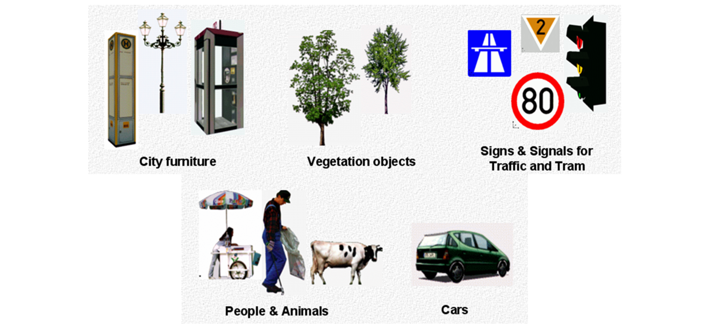

[[ug-representation-of-spatial-properties-section]]
=== Representation of Spatial Properties

[[ug-geometry-and-topology-section]]
==== Geometry and Topology

Spatial properties of all CityGML feature types are represented using the geometry classes defined in ISO 19107. Spatial representations can have 0-, 1-, 2-, or 3-dimensional extents depending on the respective feature type and Levels of Detail (LOD). The LOD concept is discussed in <<levels-of-detail-section>> and <<geometry-lod-section>>. With only a few exceptions, all geometries must use 3D coordinate values. Besides primitive geometries like single points, curves, surfaces, and solids, CityGML makes use of different kinds of aggregations of geometries like spatial aggregates (_MultiPoint_, _MultiCurve_, _MultiSurface_, _MultiSolid_) and composites (_CompositeCurve_, _CompositeSurface_, _CompositeSolid_). Volumetric shapes are represented in ISO 19107 according to the so-called _Boundary Representation_ (B-Rep). For further explanation see <<Foley2002>>.

The CityGML Conceptual Model does not put any restriction on the usage of specific geometry types as defined in ISO 19107. For example, 3D surfaces could be represented in a dataset using 3D polygons or 3D meshes such as triangulated irregular networks (TINS) or by non-uniform rational B-spline surfaces (NURBS). However, an encoding may restrict the usage of geometry types. For example, curved lines like B-splines or clothoids, or curved surfaces like NURBS could be disallowed by explicitly defining _null encodings_ for these concepts in the encoding specification (c.f. <<modularization-section>> above).

Note that the conceptual schema of ISO 19107 allows composite geometries to be defined by a recursive aggregation for every primitive type of the corresponding dimension. This aggregation schema allows the definition of nested aggregations (hierarchy of components). For example, a building geometry (_CompositeSolid_) can be composed of the house geometry (_CompositeSolid_) and the garage geometry (_Solid_), while the house’s geometry is further decomposed into the roof geometry (_Solid_) and the geometry of the house body (_Solid_). This is illustrated in <<figure-recursiveaggregation>>.

[[figure-recursiveaggregation,Figure {counter:figure-num}]]
.Recursive aggregation of objects and geometries in CityGML (graphic: IGG Uni Bonn).
image::../standard/images/RecursiveAggregation.png[align="center"]

While the CityGML Conceptual Model does not employ the topology classes from ISO 19107, topological relations between geometries can be established by sharing geometries (typically parts of the boundary) between different geometric objects. One part of real-world space can be represented only once by a geometry object and is referenced by all features or more complex geometries which are defined or bounded by this geometry object. Thus redundancy can be avoided and explicit topological relations between parts are maintained.

Basically, there are three cases for sharing geometries:

* First, two different semantic objects may be spatially represented by the same geometry object. For example, if a foot path is both a transportation feature and a vegetation feature, the surface geometry defining the path is referenced by both the transportation object and by the vegetation object.
* Second, a geometry object may be shared between a feature and another geometry. For example, a geometry defining a wall of a building may be referenced twice: By the solid geometry defining the geometry of the building, and by the wall feature.
* Third, two geometries may reference the same geometry, which is in the boundary of both. For example, a building and an adjacent garage may be represented by two solids. The surface describing the area where both solids touch may be represented only once and it is referenced by both solids. As it can be seen from <<figure-recursiveaggregation>>, this requires partitioning of the respective surfaces.

In general, B-Rep only considers visible surfaces. However, to make topological adjacency explicit and to allow the possibility of deletion of one part of a composed object without leaving holes in the remaining aggregate, touching elements are included. Whereas touching is allowed, permeation of objects is not in order to avoid the multiple representation of the same space.

Another example of sharing geometry objects that are members of the boundaries in different higher-dimensional geometry objects is the sharing of point geometries or curve geometries, which make up the outer and inner boundaries of a polygon. This means that each point is only represented once, and different polygons could reference this point geometry. The same applies to the representation of curves for transportation objects like roads, whose end points could be shared such as between different road segments to topologically connect them.

Note that the use of topology in CityGML datasets by sharing geometries is optional. Furthermore, an encoding of the CityGML conceptual model might restrict the usage of shared geometries. For example, it might only be allowed to share identical (support) points from different 3D polygons or only entire polygons can be shared between touching solids (like shown in <<figure-recursiveaggregation>>).

[[ug-prototypic-objects-section]]
==== Prototypic Objects / Scene Graph Concepts

In CityGML, objects of equal shape like trees and other vegetation objects, traffic lights and traffic signs can be represented as prototypes which are instantiated multiple times at different locations (see <<figure-prototypicshapes>>). The geometry of prototypes is defined in local coordinate systems. Every instance is represented by a reference to the prototype, a base point in the world coordinate reference system (CRS) and a transformation matrix that facilitates scaling, rotation, and translation of the prototype. The principle is adopted from the concept of scene graphs used in computer graphics standards. Since the ISO 19107 geometry model does not provide support for scene graph concepts, the CityGML class ImplicitGeometry has been introduced (for further description see <<geometry-lod-section>>). The prototype geometry can be represented using ISO 19107 geometry objects or by referencing an external file containing the geometry in another data format.

[[figure-prototypicshapes,Figure {counter:figure-num}]]
.Examples of prototypic shapes (source: Rheinmetall Defence Electronics).

[[ug-point-cloud-section]]
==== Point Cloud Representation

In addition to the spatial representations defined in the _Core_ module, the geometry of physical spaces and of thematic surfaces can now also be provided by 3D point clouds using MultiPoint geometry. This allows, for example, spatially representing the building hull, a room within a building or a single wall surface just by a point cloud. All thematic feature types including transportation objects, vegetation, city furniture, etc. can also be spatially represented by point clouds. In this way, the ClearanceSpace of a road or railway could, for instance, be modelled directly from the result of a mobile laser scanning campaign. Point clouds can either be included in a CityGML dataset or just reference an external file of some common types such as LAS or LAZ.

[[ug-coordinate-reference-system-section]]
==== Coordinate Reference Systems (CRS)

CityGML is about 3D city and landscape models. This means that nearly all geometries use 3D coordinates, where each single point and also the points defining the boundaries of surfaces and solids have three coordinate values (x,y,z) each. Coordinates always have to be given with respect to a coordinate reference system (CRS) that relates them unambiguously with a specific position on the Earth. In contrast to CAD or BIM, each 3D point is absolutely georeferenced, which makes CityGML especially suitable to represent geographically large extended structures like airports, railways, bridges, dams, where the Earth curvature has a significant effect on the object’s geometry (for further explanations see <<Kaden2017>>).

In most CRS, the (x,y) coordinates refer to the horizontal position of a point on the Earth’s surface. The z coordinate typically refers to the vertical height over (or under) the reference surface. Note that depending on the chosen CRS, x and y may be given as angular values like latitude and longitude or as distance values in meters or feet. According to ISO 19111, numerous 3D CRS can be used. This includes global as well as national reference systems using geocentric, geodetic, or projected coordinate systems.
